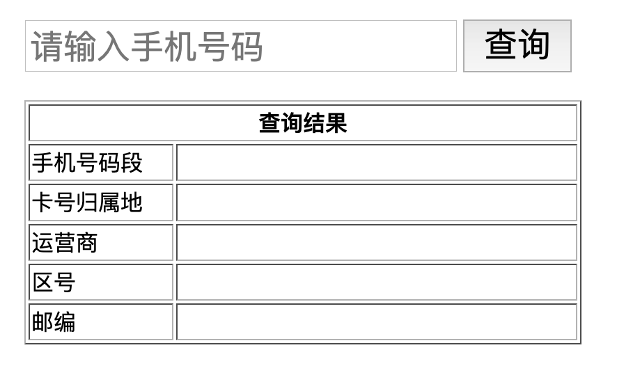
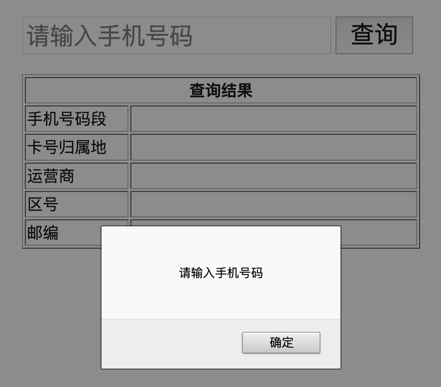
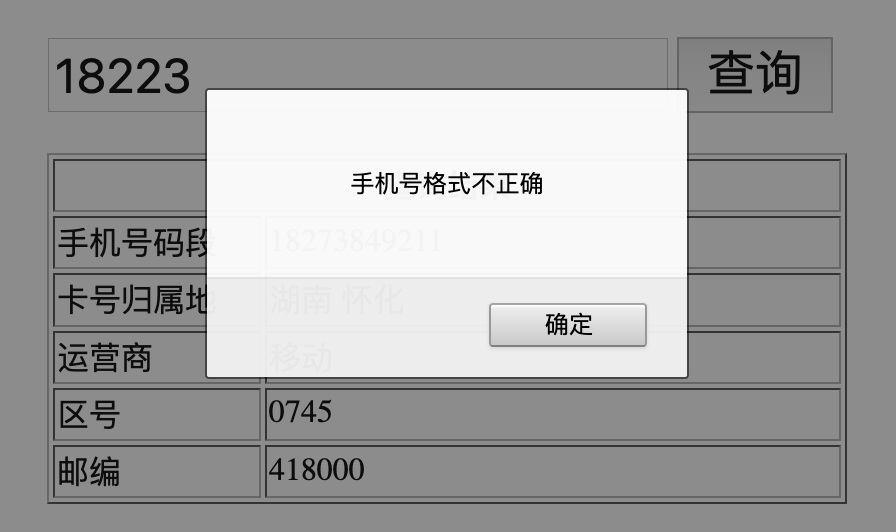
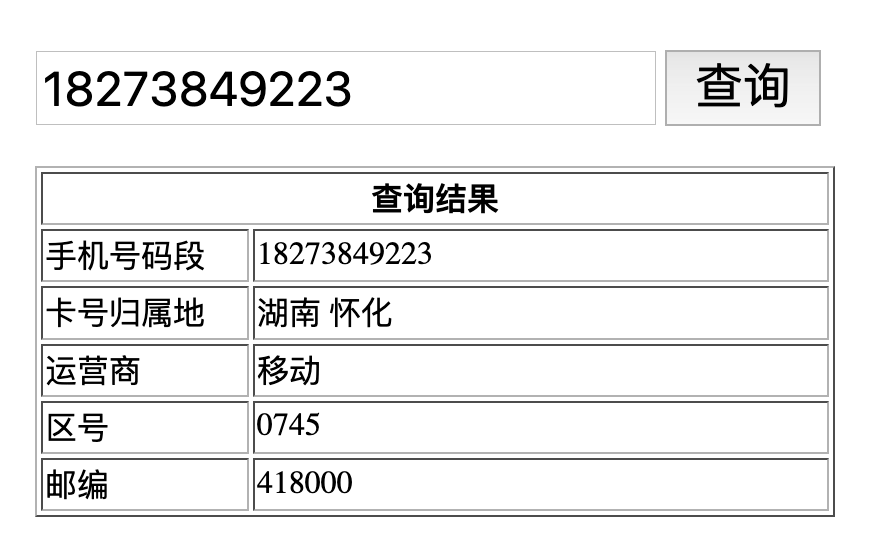

# 课后练习_ajax-day01

## 1. 题号：SHQS_cs_01

**训练目标**：强化对Ajax技术的理解；

**试题难度**：☆☆☆

**问题**：请说说Ajax有哪些优点以及缺点？

**参考答案**：

[01.请说说Ajax有哪些优点以及缺点_答案.zip]( /downloads/ajax/day01/02.after_class_material/01.请说说Ajax有哪些优点以及缺点_答案.zip)


## 2. 题号：CODE_01

### 手机号码归属地查询案例

**训练目标**：强化对$.Ajax方法的练习；

**试题难度**：☆☆☆

**案例效果**：









**案例素材**：

1. HTML文件模板：

   ```html
   <!DOCTYPE html>
   <html lang="en">
     <head>
       <meta charset="UTF-8" />
       <meta name="viewport" content="width=device-width, initial-scale=1.0" />
       <title>手机号码归属地查询案例</title>
       <style>
         body {
           padding: 0;
           margin: 0;
           margin-top: 50px;
           display: flex;
           justify-content: center;
         }
         body input {
           height: 30px;
           font-size: 24px;
         }
         body button {
           vertical-align: top;
           font-size: 24px;
         }
         body table {
           width: 400px;
           margin-top: 20px;
         }
       </style>
     </head>
     <body>
       <div>
         <input type="text" placeholder="请输入手机号码" id="phoneInput" />
         <button id="searchBtn">查询</button>
         <table border="1">
           <thead>
             <tr>
               <th colspan="2">查询结果</th>
             </tr>
           </thead>
           <tbody>
             <tr>
               <td width="100">手机号码段</td>
               <td id="phone"></td>
             </tr>
             <tr>
               <td>卡号归属地</td>
               <td id="addr"></td>
             </tr>
             <tr>
               <td>运营商</td>
               <td id="company"></td>
             </tr>
             <tr>
               <td>区号</td>
               <td id="areacode"></td>
             </tr>
             <tr>
               <td>邮编</td>
               <td id="zip"></td>
             </tr>
           </tbody>
         </table>
       </div>
   
       <script src="https://cdn.bootcdn.net/ajax/libs/jquery/3.5.1/jquery.min.js"></script>
       <script>
         $(function () {
           // show your code...
         });
       </script>
     </body>
   </html>
   
   ```

2. 接口地址：http://apis.juhe.cn/mobile/get

3. 请求方式：GET

4. 请求参数说明：

   | 名称  | 必填 | 类型   | 说明                                       |
   | ----- | ---- | ------ | ------------------------------------------ |
   | phone | 是   | int    | 需要查询的手机号码或手机号码前7位          |
   | key   | 是   | string | 固定写死：9e76dcf7eb24cd3a070a80f6e912c780 |

5. 返回参数说明：

   | 名称         | 类型   | 说明                                         |
   | ------------ | ------ | -------------------------------------------- |
   | error_code   | int    | 返回码                                       |
   | reason       | string | 返回说明                                     |
   | result       | string | 返回结果集                                   |
   | \|- province | string | 省份                                         |
   | \|- city     | string | 城市，(北京、上海、重庆、天津直辖市可能为空) |
   | \|- areacode | string | 区号，(部分记录可能为空)                     |
   | \|- zip      | string | 邮编，(部分记录可能为空)                     |
   | \|- company  | string | 运营商                                       |

6. 返回示例：

   ```javascript
   {
     "resultcode": "200",
     "reason": "Return Successd!",
     "result": {
         "province": "浙江",
         "city": "杭州",
         "areacode": "0571",
         "zip": "310000",
         "company": "中国移动",
         "card": ""
     }
   }
   ```

> Tips：素材在作业文件的根目录的 素材文件夹里面；文件的命名以标题二的内容来命名

**案例要求**：

1. 当用户在手机号码输入框中输入手机号码，点击查询按钮后发送 ajax 请求显示查询结果至表格中
2. 必须使用 $.ajax 方法发送 get 请求，不能直接使用 \$.get 方法
3. 需要校验手机号不能为空以及非法格式，并给出准确提示


**训练提示**：

1. 在发送 `$.ajax({ dataType: 'jsonp' })` 请求时，需要固定带上配置：`dataType: 'jsonp'`，原因详见之后的第四天课程揭晓

**参考方案**：获取元素监听事件发送请求渲染数据

**操作步骤**：

1. 获取提交按钮，添加点击事件
2. 在事件处理函数中获取手机号码输入框的值
3. 判断手机号是否为空
4. 判断手机号格式是否合法
5. 发送 $.ajax 请求
6. 在请求成功处理函数中获取响应数据并渲染到表格中

**参考答案**：

[02.手机号码归属地查询_答案.zip]( /downloads/ajax/day01/02.after_class_material/02.手机号码归属地查询_答案.zip)


