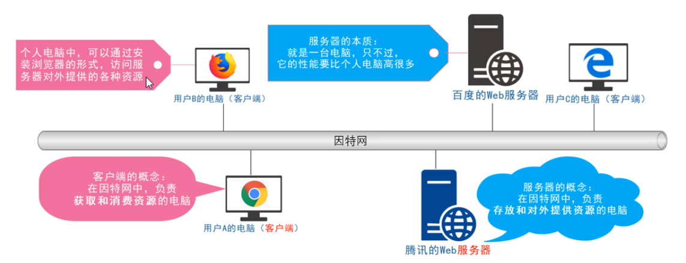
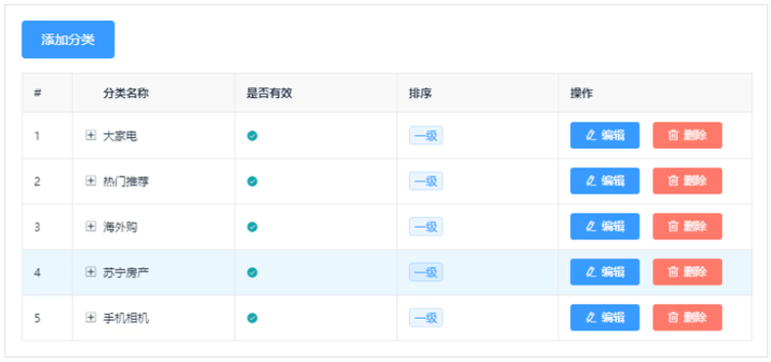
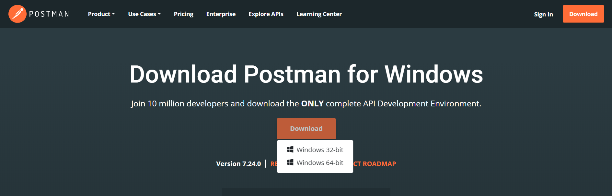
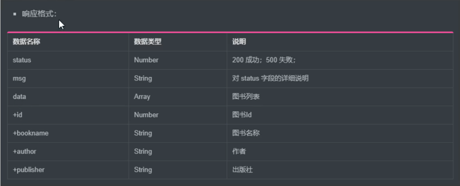

# Ajax第01天-Ajax基础

课程资料下载地址： [Ajax第01天](/downloads/ajax/day01/03.course_material/ajax-day01.zip)

## 能力目标

- 能够**说出**什么是客户端，什么是服务器，以及通讯的过程
- 能够**说出**常见的资源类型有几种，**理解**数据也是一种资源
- 能够**说出**什么是Ajax以及应用场景
- 能够**使用**jQuery中Ajax的三个函数请求数据
- 能够**说出**什么是接口，接口文档，以及常用的测试工具
- 能够**运用**jQuery的Ajax知识点**完成**淘宝案例和聊天机器人案例

## 1. 相关概念

### 1.1 客户端与服务器

> 第 1 节课 / 03'41''

#### 1.1.1「客户端与服务器」问题 

1. 问题 1：上网的本质？
2. 问题 2：什么是服务器？
3. 问题 3：什么是客户端？

#### 1.1.2「客户端与服务器」答案

1. 问题 1：上网的本质目的？

   - 通过互联网的形式来 **获取和消费资源**

   

2. 问题 2：什么是服务器？

   - 上网过程中，负责 **存放和对外提供资源** 的电脑，叫做服务器

     

3. 问题 3：什么是客户端？

   - 在上网过程中，负责 **获取和消费资源** 的电脑，叫做客户端

     

### ☆1.2 URL地址的概念及组成部分

> 第 1 节课 / 03'13''

#### 1.2.1「URL地址的概念及组成部分」问题

1. 问题 1：URL是什么及作用？
2. 问题 2：URL的组成部分？

#### 1.2.2「URL地址的概念及组成部分」答案

1. 问题 1：URL是什么及作用？

   1. URL（全称是 `UniformResourceLocator`） 中文叫 **统一资源定位符**
   2. 用于标识互联网上每个资源的唯一存放位置。浏览器只有通过URL地址，才能正确定位资源的存放位置，从而成功访问到对应的资源

2. 问题 2：URL的组成部分？

   1. URL地址一般由三部分组成

      - 客户端与服务器之间的 **通信协议**
      - 存有该资源的 **服务器名称**
      - 资源在服务器上 **具体的存放位置**

      

### ☆1.3 图解客户端与服务器通讯过程

> 第 1 节课 / 03'04''

#### 1.3.1「图解客户端与服务器通讯过程」问题

1. 问题 1：客户端与服务器通讯过程有几个步骤？

#### 1.3.2「图解客户端与服务器通讯过程」答案

1. 问题 1：客户端与服务器通讯过程有几个步骤？

   - 客户端与服务器之间的通讯过程，分为： **请求-处理-响应** 三个步骤

     

     > Tips：网页中每一个资源，都是通过 **请求-处理-响应** 的方式从服务器获取回来的

### ☆1.4 基于开发者工具查看客户端与服务器的通讯过程

#### 1.4.1 实现步骤

1. 打开`Chorme`浏览器
2. **Ctrl + Shift + I（F12）** 打开 Chrome 的开发者工具
3. 切换到 **Network** 面板
4. 选中 **Doc** 页签
5. 刷新页面，分析客户端与服务器的通讯过程


### ☆1.5 数据也是一种资源

> 第 1 节课 / 04'02''

#### 1.5.1「数据也是一种资源」问题 

1. 问题 1：常见的资源有哪些?
2. 问题 2：数据资源是谁来提供的？

#### 1.5.2「数据也是一种资源」答案

1. 问题 1：常见的资源有哪些?

   

2. 问题 2：数据资源是谁来提供的？

   - **网页中的数据，也是服务器对外提供的一种资源**，例如股票数据，各行业排行榜等

### 1.6 网页中如何请求数据

> 第 1 节课 / 02'47''

#### 1.6.1「网页中如何请求数据」问题

1. 问题 1：通过什么对象可以来发送请求获取数据？
2. 问题 2：这个对象是浏览器自带的还是需要引入第三方？

#### 1.6.2「网页中如何请求数据」答案

1. 问题 1：通过什么对象可以来发送请求获取数据？
   - 如果要在网页中请求服务器上的数据资源，需要用到 **XMLHttpRequest** 对象
2. 问题 2：这个对象是浏览器自带的还是需要引入第三方？
   - **XMLHttpRequest**（简称 xhr）是浏览器提供的 **JS** 成员

> Tips：数据，也是服务器对外提供的一种 **资源**，只要是**资源**，必然要通过 **请求 - 处理 - 响应** 的方式进行获取


### ☆1.7 资源的请求方式

> 第 1 节课 / 02'11

#### 1.7.1「资源的请求方式」问题

1. 问题 1：常见的请求方式有几种？
2. 问题 2：分别的应用场景？

#### 1.7.2「资源的请求方式」答案

1. 问题 1：常见的请求方式有几种？

   1. GET请求
   2. POST请求

2. 问题 2：分别的应用场景？

   1. GET 请求：通常用于 **获取服务器资源**（要资源）

      例如：根据 URL 地址，从服务器获取 HTML文件、css文件、js文件、图片文件、数据资源等

   2. POST 请求：通常用于 **向服务器提交数据**（送资源）

      例如：登录时，向服务器 **提交登录信息**、注册时向服务器 **提交注册信息**、添加用户时向服务器 **提交用户信息**等各种 **数据提交操作**

> 补充说明：客户端请求服务器时，请求的方式 **有很多种**，例如：
>
> 1. HEAD：类似于GET请求，只不过返回的响应中没有具体内容，用户获取报头
> 2. PUT：从客户端向服务器提交数据
> 3. DELETE：请求服务器删除数据
> 4. TRACE：回显服务器收到的情况，主要用户测试
> 5. OPTIONS：允许客户端查看服务器的性能
> 6. PATCH：对 PUT 方法的补充，用来进行局部更新
>
> 了解即可，**目前主要掌握** GET 和 POST

### ☆1.8 相关概念小结

1. 客户端与服务器相关概念
   1. 客户端：在上网过程中，负责 **获取和消费资源** 的电脑，叫做客户端
   2. 服务器：上网过程中，负责 **存放和对外提供资源** 的电脑，叫做服务器
2. URL的概念&组成
   1. URL概念：URL（全称是 `UniformResourceLocator`） 中文叫 **统一资源定位符**；浏览器只有通过URL地址，才能正确定位资源的存放位置，从而成功访问到对应的资源
   2. URL的组成：①客户端与服务器之间的 **通信协议**；②存有该资源的 **服务器名称**；③资源在服务器上 **具体的存放位置**
3. 客户端与服务器通讯的过程
   - **请求-处理-响应** 三个步骤；网页中每一个资源，都是通过 **请求-处理-响应** 的方式从服务器获取回来的
4. 常见的资源：文字内容、图片、音频、视频等
   - 数据也是一种资源
5. 常见网络请求的方式
   1. GET 请求：通常用于 **获取服务器资源**（要资源）
   2. POST请求：通常用于 **向服务器提交数据**（送资源）

## 2. Ajax入门使用

### ☆2.1 介绍Ajax的概念

> 第 1 节课 / 02'49''

#### 2.1.1「介绍Ajax的概念」问题

1. 问题 1：什么是Ajax？
2. 问题 2：Ajax带来的好处？

#### 2.1.2「介绍Ajax的概念」答案

1. 问题 1：什么是Ajax？

   - Ajax 的全称是 Asynchronous JavaScript And XML（异步 JavaScript 和 xml）
   - **在网页中利用 XMLHttpRequest 对象和服务器进行数据交互的方式，就是Ajax**

2. 问题 2：Ajax带来的好处？

   - 之前所学的技术，只能把网页做的更美观漂亮，或添加一些动画效果，但还是，`Ajax`能让我们轻松实现 **网页** 与 **服务器**之间的 **数据交互**

   - 说白了，从单机版，变成了网络版

     


### ☆2.2 Ajax的典型用场景

> 第 1 节课 / 03’00

#### 2.2.1「Ajax的典型用场景」问题

1. 问题 1：Ajax的典型应用场景有哪些?

#### 2.2.2「Ajax的典型用场景」答案

1. 问题 1：Ajax的典型应用场景有哪些?

   1. **场景一**：用户名检测

      - 注册用户时，通过 `ajax` 的形式，动态 **检测用户名是否被占用**

      

   2. **场景二**：搜索提示

      - 当输入搜索关键字时，通过 `ajax` 的形式，动态 **加载搜索提示列表**

      

   3. **场景三**：数据分页显示

      - 当点击页码值得时候，通过 ajax 的形式，**根据页码值动态刷新表格的数据**

      

   4. **场景四**：数据的增删改查

      - 数据的添加、删除、修改、查询操作，都需要通过 ajax 的形式，来实现数据的交互

      

### 2.3 了解jQuery中的Ajax

> 第 1 节课 / 02'02''

#### 2.3.1「了解jQuery中的Ajax」问题

1. 问题 1：jQuery中的Ajax是对XMLHttpRequest对象进行的封装吗？
2. 问题 2：为什么要使用jQuery中的Ajax？
3. 问题 3：jQuery中发起Ajax常用的方法有哪些?

#### 2.3.2「了解jQuery中的Ajax」答案

1. 问题 1：jQuery中的Ajax是对XMLHttpRequest进行的封装吗？
   - 是的，jQuery的Ajax对**XMLHttpRequest**进行了一层封装；换句话来说，jQuery中的Ajax底层的实现原理就是 **XMLHttpRequest**
2. 问题 2：为什么要使用jQuery中的Ajax？
   - jQuery对 **XMLHttpRequest** 进行了封装，提供了一系列Ajax相关的函数，极大地 **降低了Ajax的使用难度**
3. 问题 3：jQuery中发起Ajax常用的方法有哪些?
   1. `$.get()` GET 方式请求，用于获取数据
   2. `$.post()` POST 方式请求，用于提交数据
   3. `$.ajax()` 比较综合，既可以获取数据，又可以提交数据

### 2.4 `$.get()` 函数的语法

> 第 1 节课  / 02'26''

#### 2.4.1「 `$.get()` 函数的语法」问题

1. 问题 1：`$.get()` 一般用来提交数据还是获取数据？
2. 问题 2：`$.get()` 参数有哪些？

#### 2.4.2「 `$.get()` 函数的语法」答案

1. 问题 1：`$.get()` 一般用来提交数据还是获取数据？

   - 一般用来获取服务器的数据

2. 问题 2：`$.get()` 参数有哪些？

   - `$.get(url,[data],[callback])`

   

### ☆2.5 `$.get()`发起不带参数的请求

> 第 2 节课 / 06'54''

#### 2.5.1「`$.get()`发起不带参数的请求」问题

1. 问题 1：主要设置方法里面哪两个参数？

#### 2.5.2「`$.get()`发起不带参数的请求」答案

1. 问题 1：主要设置方法里面哪两个参数？

   - 直接提供给 **请求的 URL 地址** 和 **请求成功之后的回调函数** 即可

   

#### 2.5.3「`$.get()`发起不带参数的请求」练习

> 练习时长：5分钟

1. 练习目标：利用jQuery的发起不带参数的get请求，把服务器返回的数据打印在控制台，并且利用开发者工具查看请求和响应
2. 素材：
   1. 素材下载地址：[01.jQuery发起GET请求](/downloads/ajax/day01/01.class_room_material/01.jQuery发起GET请求.zip)
   2. 请求地址：`http://www.liulongbin.top:3006/api/getbooks`
3. 参考步骤：
   1. 点击下载素材，在index.js里面先引入 jQuery，文件在对应的lib目录下
   2. 调用 `$.get()` 方法，传递请求的URL地址和回调函数
   3. 打印回调函数的参数

### ☆2.6 `$.get()`发起带参数的请求

> 第 2 节课 / 04'22

#### 2.6.1「`$.get()`发起带参数的请求」问题

1. 问题 1：请求参数放在方法里面第几个参数的问题？

#### 2.6.2「`$.get()`发起带参数的请求」答案

1. 问题 1：请求参数放在方法里面第几个参数的问题？

   - 使用`$.get()` 发起携带参数的请求，那么携带的参数应该写在**第二个参数**的位置

   

#### 2.6.3「`$.get()`发起带参数的请求」练习

> 练习时长：5分钟

1. 练习目标：利用jQuery的发起带参数的get请求，把服务器返回的数据打印在控制台，并且利用开发者工具查看请求和响应
2. 素材：
   1. 素材下载地址：[02.jQuery发起GET请求-携带参数](/downloads/ajax/day01/01.class_room_material/02.jQuery发起GET请求-携带参数.zip)
   2. 请求地址：`http://www.liulongbin.top:3006/api/getbooks`
3. 参考步骤：
   1. 点击下载素材，在index.js里面先引入 jQuery，文件在对应的lib目录下
   2. 调用 $.get(请求URL, 请求参数, 回调函数) 方法；请求参数 id 为 1
   3. 打印回调函数的参数

### 2.7 `$.post()` 函数的语法

> 第 2 节课 / 01'56''

#### 2.7.1「`$.post()` 函数的语法」问题

1. 问题 1：POST请求通常用来提交数据还是获取数据？
2. 问题 2：语法格式是怎样？

#### 2.7.2「`$.post()` 函数的语法」答案

1. 问题 1：POST请求通常用来提交数据还是获取数据？

   - 通常用来提交数据给服务器

2. 问题 2：语法格式是怎样？

   - `$.post(url,[data],[callback])`

   

### ☆2.8 `$.post()` 向服务器提交数据

> 第 2 节课 / 05'16''

#### 2.8.1「`$.post()` 向服务器提交数据」问题

1. 问题 1：`$.post()` 发送请求是否与 `$.get()` 发起带参请求类似？

#### 2.8.2「`$.post()` 向服务器提交数据」答案

1. 问题 1：`$.post()` 发送请求是否与 `$.get()` 发起带参请求类似？

   - 是类似的，第一个参数写请求的URL地址，第二个参数是请求携带参数，第三个参数是回调函数

   

#### 2.8.3「`$.post()` 向服务器提交数据」练习

> 练习时长： 5分钟

1. 练习目标：利用jQuery的发起POST请求，把服务器返回的数据打印在控制台，并且利用开发者工具查看请求和响应

2. 素材：

   1. 素材下载地址：[03.jQuery发起POST请求](/downloads/ajax/day01/01.class_room_material/03.jQuery发起POST请求.zip)
   2. 请求地址：`http://www.liulongbin.top:3006/api/addbook`

3. 参考步骤：

   1. 点击下载素材，在index.js里面先引入 jQuery，文件在对应的lib目录下

   2. 调用 $.post(请求URL地址, 传递参数, 回调函数) 方法

      ```js
      // 参数形式：
      {
          bookname: '水浒传',
          author: '施耐庵',
          publisher: '长沙出版社',
      }
      ```

   3. 打印回调函数的参数

### 2.9 `$.ajax()` 函数介绍

> 第 2 节课 / 02'35''

#### 2.9.1「 `$.ajax()` 函数介绍」问题

1. 问题 1： `$.ajax()` 相比之前的 `$.get()` 和 `$.post()` 有什么区别？
2. 问题 2： `$.ajax()` 的语法格式是怎样的？

#### 2.9.2「 `$.ajax()` 函数介绍」答案

1. 问题 1： `$.ajax()` 相比之前的 `$.get()` 和 `$.post()` 有什么区别？

   - 相比于 `$.get()` 和 `$.post()` 函数，`jQuery` 中提供的 `$.ajax()` 函数，是一个功能比较综合的函数，它允许我们对 `Ajax` 请求进行更详细的配置

2. 问题 2： `$.ajax()` 的语法格式是怎样的？

   - `$.ajax()` 函数的基本语法如下：

   

### ☆2.10 `$.ajax()` 发起 GET 请求

> 第 3 节课 / 04'52''

#### 2.10.1「 `$.ajax()` 发起 GET 请求」问题

1. 问题 1：发起GET请求，需要设置哪个属性？
2. 问题 2：如果省略type属性，能发送成功吗？
3. 问题 3：发起请求成功会回调哪个函数？

#### 2.10.2「 `$.ajax()` 发起 GET 请求」答案

1. 问题 1：发起GET请求，需要设置哪个属性？

   - 使用 `$.ajax()` 发起 `GET` 请求时，只需要将 `type` 属性 的值设置为 ‘`GET`’ 即可

   

2. 问题 2：如果省略type属性，能发送成功吗？

   - 如果省略type属性，默认发送的就是GET请求

> Tips：还可以通过method属性来指定请求方式，在 jQuery1.9 以后出来的

3. 问题 3：发起请求成功会回调哪个函数？
   - 请求发送成功会回调 **success** 函数

#### 2.10.3「 `$.ajax()` 发起 GET 请求」练习

> 练习时长：5分钟

1. 练习目标：利用jQuery的的ajax方法发起GET请求，把服务器返回的数据打印在控制台，并且利用开发者工具查看请求和响应
2. 素材：
   1. 素材下载地址：[04.jQuery的ajax方法发起GET请求](/downloads/ajax/day01/01.class_room_material/04.jQuery的ajax方法发起GET请求.zip)
   2. 请求地址：`http://www.liulongbin.top:3006/api/getbooks`
3. 参考步骤：
   1. 点击下载素材，在index.js里面先引入 jQuery，文件在对应的lib目录下
   2. 调用 $.ajax() 方法
      - type *设置请求类型*
      - url 设置请求路径
      - data 设置请求参数
      - success 成功之后的回调
   3. 打印回调函数的参数

### ☆2.11 `$.ajax` 发起 POST 请求

> 第 3 节课 / 04'27''

#### 2.11.1「 `$.ajax()` 发起 POST 请求」问题

1. 问题 1：发起post请求需要修改什么属性？

#### 2.11.2「 `$.ajax()` 发起 POST 请求」答案

1. 问题 1：发起post请求需要修改什么属性？

   - 使用 `$.ajax()` 发起 POST请求，只需要把 `type`属性的值 设置为POST即可

   

#### 2.11.3「 `$.ajax()` 发起 POST 请求」练习

> 练习时长：5分钟

1. 练习目标：利用jQuery的的ajax方法发起POST请求，把服务器返回的数据打印在控制台，并且利用开发者工具查看请求和响应
2. 素材：
   1. 素材下载地址：[05.jQuery的ajax方法发起POST请求](/downloads/ajax/day01/01.class_room_material/05.jQuery的ajax方法发起POST请求.zip)
   2. 请求地址：`http://www.liulongbin.top:3006/api/addbook`
3. 参考步骤：
   1. 点击下载素材，在index.js里面先引入 jQuery，文件在对应的lib目录下
   2. 调用 $.ajax() 方法
      - type *设置请求类型*
      - url 设置请求路径
      - data 设置请求参数
      - success 成功之后的回调
   3. 打印回调函数的参数

### ☆2.12 Ajax入门小结

1. 什么是Ajax&好处

   1. **在网页中利用 XMLHttpRequest 对象和服务器进行数据交互的方式，就是Ajax**
   2. `Ajax`能让我们轻松实现 **网页** 与 **服务器**之间的 **数据交互**

2. Ajax的应用场景

   1. **场景一**：用户名检测
   2. **场景二**：搜索提示
   3. **场景三**：数据分页显示
   4. **场景四**：数据的增删改查

3. jQuery中的Ajax

   1. 底层实现是通过对**XMLHttpRequest**进行了一层封装，从而简化了代码

   2. `$.get()` 发送GET请求

      ```js
      //url：请求路径  必填
      //data：请求参数 选填
      //callback：回调函数 选填
      $.get(url,[data],[callback])
      ```

   3. `$.post()` 发送POST请求

      ```js
      //url：请求路径  必填
      //data：请求参数 选填
      //callback：回调函数 选填
      $.post(url,[data],[callback])
      ```

   4. `$.ajax()` 既可以发送GET请求又可以发送POST请求

      ```js
      $.ajax({
        type:'',//请求的方式，例如POST 或 GET
        url:'',//请求的URL地址
        data:{},//这次请求需要携带的数据
        success:function(res){} // 请求成功之后的回调函数
      })
      ```

## 3. 接口

### ☆3.1 接口的概念

> 第 3 节课 / 01'44''

#### 3.1.1「接口的概念」问题

1. 问题 1：什么叫接口？
2. 问题 2：每个接口必须要有什么？

#### 3.1.2「接口的概念」答案

1. 问题 1：什么叫接口？

   - 使用 Ajax 请求数据时，被请求的 URL 地址，就叫做 数据接口（简称**接口**）

2. 问题 2：每个接口必须要有什么？

   - 每个接口必须有**请求方式**，例如：

     ```
     http://www.liulongbin.top:3006/api/getbooks 获取图书列表的接口（get请求）
     http://www.liulongbin.top:3006/api/addbook  添加图书的接口（post请求）
     ```

### 3.2 分析接口的请求过程

过渡视频，分析GET方式和POST方式请求接口的过程

#### 3.2.1 GET方式请求接口的过程


#### 3.2.2 POST方式请求接口的过程


### 3.3 了解接口测试工具

> 第 3 节课 / 03'10''

#### 3.3.1「了解接口测试工具」问题

1. 问题 1：什么是接口测试工具？
2. 问题 2：好处在于哪？
3. 问题 3：我们常用的是哪个测试工具？

#### 3.3.2「了解接口测试工具」答案

1. 问题 1：什么是接口测试工具？

   - 为了验证接口是否被正常被访问，我们常常需要使用接口测试工具，来对数据接口进行检测

2. 问题 2：好处在于哪？

   - 接口测试工具能让我们在 **不写任何代码** 的情况下，对接口进行 **调用** 和 **测试**

3. 问题 3：我们常用的是哪个测试工具？

   - [PostMan](https://www.getpostman.com/downloads/)

   

#### 3.3.3  Postman 界面结构


### ☆3.4 使用 PostMan 测试GET接口

> 第 3 节课 / 02'28''

#### 3.4.1 实现步骤

1. 选中请求方式 GET
2. 输入请求的URL地址
3. 在Params选项卡里面配置请求参数
4. 点击 Send 按钮发送请求
5. 在Body里面查看请求返回的结果


### ☆3.5 使用 PostMan 测试POST接口

> 第 3 节课 / 03'19''

#### 3.2.1 实现步骤

1. 选中请求方式 POST
2. 输入请求的URL地址
3. 在Body选项卡里面配置请求参数
4. 设置请求的数据类型为 x-www-form-urlencoded
5. 点击 Send 按钮发送请求
6. 在Body里面查看请求返回的结果


#### 3.2.2「使用 PostMan 测试POST接口」练习

> 练习时长：5分钟

1. 练习目标：利用PostMan来测试一下GET请求和POST请求
2. 素材：
   1. GET请求地址：`http://www.liulongbin.top:3006/api/getbooks`
   2. POST请求地址：`http://www.liulongbin.top:3006/api/addbook`
3. 参考步骤：
   1. 开打PostMan接口测试工具
   2. 新建请求选项卡
   3. 按照之前学习的步骤操作一下GET请求和POST请求

### ☆3.6 接口文档

> 第 3 节课 / 04'40''

#### 3.6.1「接口文档」问题

1. 问题 1：什么是接口文档？
2. 问题 2：接口文档的组成部分？

#### 3.6.2「接口文档」答案

1. 问题 1：什么是接口文档？
   - 接口文档，顾名思义就是 **接口的说明文档**，**它是我们调用接口的依据**。好的接口文档包含了对 **接口URL**，**参数** 以及 **输出内容** 的说明，我们参照接口文档就能方便的知道接口的作用，以及接口如何进行调用
2. 问题 2：接口文档的组成部分？
   1. **接口名称**：用来标识各个接口的简单说明，如 **登录接口**，**获取图书列表接口**等
   2. **接口URL**：接口的调用地址
   3. **调用方式**：接口的调用方式，如 **GET** 或者 **POST**
   4. **参数格式**：接口需要传递的参数，每个参数必须包含 **参数名称**、**参数类型**、**是否必选**、**参数说明** 这4项内容
   5. **响应格式**：接口的返回值的详细描述，一般包含**数据名称**、**数据类型**、**说明**3项内容
   6. **返回示例（可选）**：通过对象的形式，列举服务器返回数据的结构

#### 3.6.3 接口文档示例





### ☆3.7 接口小结

1. 什么是接口&每个接口必须要什么？

   1. 使用 Ajax 请求数据时，被请求的 URL 地址，就叫做 数据接口（简称**接口**）

   2. 每个接口必须有**请求方式**，**请求地址**

2. PostMan的作用

   - PostMan是接口测试工具，能让我们在 **不写任何代码** 的情况下，对接口进行 **调用** 和 **测试**

3. 什么是接口文档

   - 接口文档，顾名思义就是 **接口的说明文档**，**它是我们调用接口的依据**。好的接口文档包含了对 **接口URL**，**参数** 以及 **输出内容** 的说明，我们参照接口文档就能方便的知道接口的作用，以及接口如何进行调用

4. 接口文档组成部分

   1. **接口名称**：用来标识各个接口的简单说明，如 **登录接口**，**获取图书列表接口**等
   2. **接口URL**：接口的调用地址
   3. **调用方式**：接口的调用方式，如 **GET** 或者 **POST**
   4. **参数格式**：接口需要传递的参数，每个参数必须包含 **参数名称**、**参数类型**、**是否必选**、**参数说明** 这4项内容
   5. **响应格式**：接口的返回值的详细描述，一般包含**数据名称**、**数据类型**、**说明**3项内容
   6. **返回示例（可选）**：通过对象的形式，列举服务器返回数据的结构

## 4. 案例-图书列表

### 4.1 基于Bootstrap渲染页面UI结构

> 第 4 节课 / 09'06''

#### 4.1.1「基于Bootstrap渲染页面UI结构」问题

1. 问题 1：实现的项目效果是怎样？
2. 问题 2：使用到的库和插件？
3. 问题 3：搭建步骤是怎样？

#### 4.1.2「基于Bootstrap渲染页面UI结构」答案

1. 问题 1：实现的项目效果是怎样？

   

2. 问题 2：使用到的库和插件？

   1. 用到的 css 库 `bootstrap.css`
   2. 用到的 javascript 库 `jquery.js`
   3. 用到 vs code 插件 `Bootstrap 3 Snippets`

3. 问题 3：搭建步骤是怎样？

   1. Panel面板搭建
      1. 创建panel板 （快捷键：`bs3-panel:primary`）
      2. 在 panel-body 里面，创建3个对应的输入框 （快捷键：`bs3-input:addon:text`），对应修改标题
      3. 在 panel-body 最后面，创建 `button`按钮 （快捷键：`bs3-button:primary`）,修改内容
   2. 图书的表格
      1. 创建 table（快捷键：`bs3-table:bordered`）
      2. 在里面创建对应5个`td`，填写里面内容

### 4.2 了解渲染图书列表的实现思路

> 第 4 节课 / 03'19''

#### 4.2.1「了解渲染图书列表的实现思路」问题

1. 问题 1：渲染图书列表的大致思路是怎样？
2. 问题 2：查阅接口文档主要关注什么？

#### 4.2.2「了解渲染图书列表的实现思路」答案

1. 问题 1：渲染图书列表的大致思路是怎样？
   1. 查阅资料中的接口文档，找到获取图书列表的接口
   2. 定义 script 标签，创建入口函数
   3. 利用 `$.get()` 方法，传入相应的URL，和成功之后的回调函数
   4. 在回调函数中获取到请求成功的数据
2. 问题 2：查阅接口文档主要关注什么？
   1. 关注请求的URL
   2. 关注请求方法
   3. 关注请求的参数
   4. 关注响应结果以及响应数据的格式

### 4.3 获取图书列表数据

> 第 4 节课 / 02'34''

#### 4.3.1 实现思路

1. 定义 `getBookList()`函数
2. 函数里面调用 `$.get()` 方法，传递请求的URL和回调函数

```javascript
// 获取图书列表数据
function getBookList() {
   $.get('http://www.liulongbin.top:3006/api/getbooks', function(res) {
         console.log(res)
   })
}
```

### ☆4.4 渲染图书列表

> 第 4 节课 / 07'41''

#### 4.4.1「 渲染图书列表」问题

1. 问题 1：渲染图书列表的步骤？
2. 问题 2：渲染列表核心步骤在哪里？

#### 4.4.2「 渲染图书列表」答案

1. 问题 1：渲染图书列表的步骤？
   1. 根据返回状态码来判断是否成功请求到数据
   2. 创建数组，用来存放**行**数据（rows）
   3. 遍历服务器返回的数组，每遍历一次，利用数组（rows）去`push`  `<tr></tr>`
   4. 每一行 tr 里面包含了5个td
   5. 给每一个 td 设置对应内容即可
   6. 遍历循环完毕之后，找到内容容器，先清空当前内容（以免有重复数据），然后添加 rows
2. 问题 2：渲染列表核心步骤在哪里？
   1. 遍历服务器返回的数据
   2. 在循环体里面通过拼接字符串的方式拼接HTML结构

#### 4.4.3 示例代码

```javascript
var rows = []
$.each(res.data, function(i, item) {
     rows.push('<tr><td>' + item.id + '</td><td>' + item.bookname + '</td><td>' + item.author + '</td><td>' + item.publisher + '</td><td><a href="javascript:;" class="del" data-id="' + item.id + '">删除</a></td></tr>')
})
$('#tb').empty().append(rows.join(''))
```

#### 4.4.4「 渲染图书列表」练习

> 练习时长：12分钟

1. 练习目标：练习获取图书列表数据，在页面上渲染出来

2. 素材：

   1. 素材下载地址：[06.图书列表案例](/downloads/ajax/day01/01.class_room_material/06.图书列表案例.zip)
   2. 接口下载地址：[接口地址](/downloads/ajax/day01/01.class_room_material/图书管理-接口文档.zip)

3. 参考步骤：

   1. 下载好素材，找到对应页面

      1. 查阅 接口文档
      2. 关注请求的路径，请求方式，请求参数，响应结果

   2. 利用$.get() 请求后台服务器，在回调函数里面接收结果

   3. 根据返回状态码来判断是否成功请求到数据

   4. 创建数组，用来存放行数据（rows）

   5. 遍历服务器返回的数组，每遍历一次，利用数组（rows）去push `<tr></tr>`

      - 注意： 每一个 tr 中包含了 5 个 td

      ```js
       `<tr><td>${内容1}</td><td>${内容1}</td><td>${内容1}</td><td>${内容1}</td><td>${内容1}</td></tr>`
      ```

   6. 遍历循环完毕之后，找到内容容器，先清空当前内容（以免有重复数据），然后添加 rows

### 4.5 为删除链接绑定单机事件处理函数

> 第 5 节课 / 06'37''

#### 4.5.1「 为删除链接绑定单机事件处理函数」问题

1. 问题 1：如何给动态创建出来的删除按钮绑定事件？
2. 问题 2：如何知道用户点击的是哪一条数据？

#### 4.5.2「 为删除链接绑定单机事件处理函数」答案

1. 问题 1：如何给动态创建出来的删除按钮绑定事件？
   - 利用 tbody 容器，通过jQuery**事件委派**的方式，给动态创建的`a`标签绑定事件
2. 问题 2：如何知道用户点击的是删除哪一条记录？
   - 只要获取到当前图书的id就知道删除的哪一条记录，所以我们需要得到对应的id，我们利用自定义属性的方式，传递过来相应的`id`

### ☆4.6 实现删除图书的功能

#### 4.6.1 实现步骤

1. 查阅**删除**的接口文档
2. 在a标签点击事件处理函数里面利用`$.get()`方法，请求服务器，传入要删除的对应`id`
3. 删除成功之后，调用 `getBookList()` 刷新页面

```javascript
$('tbody').on('click', '.del', function() {
  var id = $(this).attr('data-id')
  $.get('http://www.liulongbin.top:3006/api/delbook', {
    id: id
  }, function(res) {
    if (res.status !== 200) return alert('删除图书失败！')
    getBookList()
   })
})
```

### 4.7 实现添加图书的功能

> 第 5 节课 / 04'45''

#### 4.7.1 实现步骤

1. 给按钮绑定点击事件
   1. 获取三个输入框的内容
   2. 判断三个输入框是否输入了内容，如果没有进行提示
2. 实现图书添加功能
   1. 查阅接口文档
   2. 注意接口文档需要提交的参数名，我们需要保持一致
   3. 调用`$.post()` 方法，传入请求路径，然后组拼需要提交的参数
   4. 在成功回调里面判断返回值是否是201，如果是201代表成功，反之没有成功，进行提示
   5. 请求成功之后，调用`gettBookList()` 方法刷新页面，同时把输入框里面值清空

#### 4.7.2 示例代码

```javascript
$('#btnAdd').on('click', function() {
     // 获取三个输入框内容
     var bookname = $('#iptBookname').val().trim()
     var author = $('#iptAuthor').val().trim()
     var publisher = $('#iptPublisher').val().trim()
     // 判断是否合法
     if (bookname.length <= 0 || author.length <= 0 || publisher.length <= 0) {
         return alert('请填写完整的图书信息！')
     }
     // 调用post请求接口，添加数据，关注请求参数的名称是什么
     $.post('http://www.liulongbin.top:3006/api/addbook', {
         bookname: bookname,
         author: author,
         publisher: publisher
     }, function(res) {
         // 判断返回的状态码
         if (res.status !== 201) return alert('添加图书失败！')
         // 添加成功重新获取最新数据
         getBookList()
         // 清空输入框内容
         $('#iptBookname').val('')
         $('#iptAuthor').val('')
         $('#iptPublisher').val('')
     })
})
```

### ☆4.8 图书列表小结

1. 基于 Bootstrap 渲染UI结构
2. 获取图书列表，渲染图书列表
3. 图书的删除功能
   - 利用jQuery的事件委派给动态创建的按钮绑定事件
   - 通过自定义属性传递图书id
4. 图书的添加功能

## 5. 案例-聊天机器人

### 5.1 演示案例完成的效果

> 第 5 节课 / 03'37''

过渡视频，展示效果，讲解要实现的功能点

1. 梳理案例代码结构
2. 将用户输入的内容渲染到聊天窗口
3. 发起请求获取聊天消息
4. 将机器人的聊天内容转为语音
5. 通过 `<audio>` 播放语音
6. 使用回车发送消息


### 5.2 梳理案例的代码结构

> 第 5 节课 / 05'10''

#### 5.2.1「 梳理案例的代码结构」问题

1. 问题 1：结构主要分为几块？
2. 问题 2：我们关注点在哪一块？
3. 问题 3：`resetui()`函数有什么作用？

#### 5.2.2「 梳理案例的代码结构」答案

1. 问题 1：结构主要分为几块？

   - 一共分为三大块：header 头部、main 聊天内容区域、footer 消息编辑区域

   

2. 问题 2：我们关注点在哪一块？

   - 我们需要关注的是 main 聊天内容区域、footer 消息编辑区域
   - main 聊天内容区域：我们需要渲染聊天的信息
   - footer 消息编辑区域：我们需要得到用户输入的内容，并且发送给服务器

3. 问题 3：`resetui()`函数有什么作用？

   - 让聊天框区域自动滚动到底部

### 5.3 将用户输入的内容渲染到聊天窗口

> 第 6 节课 / 10'43''

#### 5.3.1 实现思路

1. 为发送按钮绑定点击事件
2. 在点击事件函数里面判断一下用户输入内容是否为空，注意：如果为空，我们清除一下输入框内容
3. 获取到对应的`ul`容器，调用 `append` 函数来追加 `li`，注意：追加`li`的类名叫做 `right_word`
4. 清除文本输入框的值
5. 最后调用一下 `resetui()`，让聊天框区域自动滚动到底部

#### 5.3.2 示例代码

```javascript
// 为发送按钮绑定鼠标点击事件
$('#btnSend').on('click', function () {
    var text = $('#ipt').val().trim()
    if (text.length <= 0) {
      return $('#ipt').val('')
    }
    // 如果用户输入了聊天内容，则将聊天内容追加到页面上显示
    $('#talk_list').append('<li class="right_word"> <span>' + text + '</span></li>')
    $('#ipt').val('')
    // 重置滚动条的位置
    resetui()
})
```

### 5.4 发起请求获取聊天信息

> 第 6 节课 / 07'08''

#### 5.4.1 实现思路

1. 定义一个函数 `getMsg()` 接收一个参数，参数就是用户发送的信息
2. 利用 `$.ajax()` 发送一个 GET 方式请求，传入请求地址 `http://ajax.frontend.itheima.net:3006/api/robot`
3. 定义请求数据 `spoken：value`
4. 定义`success`成功的回调，在回调函数里面判断返回数据的 `message` 是否等于 `success`
5. 给容器动态添加返回的内容

#### 5.4.2 示例代码

```javascript
 // 获取聊天机器人发送回来的消息
  function getMsg(text) {
    $.ajax({
      method: 'GET',
      url: 'http://www.escook.cn:3006/api/robot',
      data: {
        spoken: text
      },
      success: function (res) {
        // console.log(res)
        if (res.message === 'success') {
          // 接收聊天消息
          var msg = res.data.info.text
          $('#talk_list').append('<li class="left_word"> <span>' + msg + '</span></li>')
          // 重置滚动条的位置
          resetui()
        }
      }
    })
  }
```

#### 5.4.3「 发起请求获取聊天信息」练习

> 练习时长：12分钟

1. 练习目标：获取用户输入的内容，渲染到聊天区域，并且发送给服务器

2. 素材：

   1. 素材下载地址：[07.聊天机器人案例](/downloads/ajax/day01/01.class_room_material/07.聊天机器人案例.zip)
   2. 请求URL地址：`http://www.escook.cn:3006/api/robot`

3. 参考步骤：

   1. 下载好素材，找到对应页面

      - `index.html` 是入口页面
      - `chat.js` 是同学们代码编写区域

   2. 找到发送按钮，注册点击事件

   3. 点击事件处理函数里面判断用户输入内容合法性

   4. 获取到聊天区域的对应的ul容器，调用 `append()` 方法来追加li

      - 注意：追加的 li 我们需要设置类名叫 right_word

   5. 清除文本框的值，并且调用 `resetui()` 来让聊天框区域自动滚动到底部

   6. 定义函数 `getMsg()` 接收用户发送的信息参数

   7. 利用 $.ajax() 发送 GET 请求，请求的参数是 `spoken: 用户输入的内容`

   8. 在 success 成功回调中，获取返回数据，判断是否请求成功，如果成功，把返回的数据渲染到聊天区域

      ```js
      $('#talk_list').append('<li class="left_word"> <span>' + msg + '</span></li>')
      ```

### 5.5 将机器人聊天内容转成语音

> 第 6 节课 / 07'21''

#### 5.5.1 实现思路

1. 封装函数 `getVoice()` 接收一个参数，机器人的聊天信息
2. 利用 `$.ajax()` 发送一个 GET 方式请求，传入请求地址 `http://ajax.frontend.itheima.net:3006/api/synthesize`
3. 定义请求数据 `text：value`
4. 定义`success`成功的回调，判断返回的状态码是否是200，如果是代表成功
5. 在页面上定义 `audio` 标签，设置隐藏，等数据返回之后，利用这个 `audio` 来进行播放。设置 `autoplay` 属性来进行自动播放

#### 5.5.2 示例代码

```javascript
// 把文字转化为语音进行播放
  function getVoice(text) {
    $.ajax({
      method: 'GET',
      url: 'http://ajax.frontend.itheima.net:3006/api/synthesize',
      data: {
        text: text
      },
      success: function (res) {
        // console.log(res)
        if (res.status === 200) {
          // 播放语音
          $('#voice').attr('src', res.voiceUrl)
        }
      }
    })
  }
```

### 5.6 通过回车键发送消息

> 第 6 节课 / 05'57''

#### 5.6.1 实现思路

1. 给文本输入框注册 `keyup` 事件，按键弹起的事件监听
2. 在事件函数里面，通过`keycode` 来获取对应的按键的 机器码
3. 判断 `keycode` 是否等于 13（不需要去记忆，开发时候打印调试一下就行了），如果是，代表是回车键
4. 如果是回车键，模拟用户点击：  `$('#btnSend').click()`

#### 5.6.2 示例代码

```javascript
 // 为文本框绑定 keyup 事件
  $('#ipt').on('keyup', function (e) {
    // console.log(e.keyCode)
    if (e.keyCode === 13) {
      // console.log('用户弹起了回车键')
      $('#btnSend').click()
    }
  })
```

### ☆5.7 聊天机器人小结

1. 获取用户输入信息，渲染到页面
   - 动态创建li元素，给li元素设置 right_word 类名
2. 发送聊天信息，获取服务器返回的聊天内容
   - 动态创建li元素，给li元素设置 left_word 类名
3. 把服务器返回的文字信息重新发给后台，生成语音的链接
4. 绑定keyup事件来监听用户按下回车键

## 6. 课后拓展阅读

### 6.1 常见面试题

**常见的面试题**：假如我们采用get方式请求一个资源，发现老是被浏览器缓存，如何处理？

**考察知识点**：对HTTP协议的理解、浏览器缓存的理解、ajax的具体应用

**什么是浏览器缓存**

浏览器缓存（Browser Caching）是为了节约网络的资源加速浏览，浏览器在用户磁盘上对最近请求过的文档进行存储，当访问者再次请求这个页面时，浏览器就可以从本地磁盘读取显示文档，这样就可以加速页面的阅览

**参考答案**：

```js
1、URL通过 Math.Random(）函数传递一个随机数 或者 通过 Date.now() 传递一个时间戳。
2、$.ajax({ headers: { 'If-Modified-Since': '0' } });
3、$.ajax({ cache:false });
4、设置全局参数 $.ajaxSetup({ cache: false });
```

**解析**：

1. URL通过 Math.Random(）函数传递一个随机数 或者 通过 Date.now() 传递一个时间戳。

   - 问题的产生

     由于在发起GET请求的时候，**浏览器会用完整的url地址去标识资源**， 如下面的两个url地址就分别代表了两个不同的资源

     - 搜索黑马程序员：  `"https://www.search.com/s?wd=黑马程序员"`
     - 搜索传智教育：`"https://www.search.com/s?wd=传智教育"`

     我们在搜索完“黑马程序员”，之后再去搜“传智教育”， 这时候并不会存在缓存的问题。

     但如果我们再次搜索黑马程序员，就可能出现缓存的问题。

     由于再次搜索的请求url地址和之前相同，这时候浏览器可能可以从缓存中读取到url地址标识的那块数据，进而使用缓存中的资源而不是拿取服务器的最新资源。

     如果资源更新慢，缓存中的内容和服务器一致，那还没什么问题。

     但如果资源更新快，可能缓存中的内容和服务器存在差异，这时候就有问题了。

   - 问题的解决

     依旧利用**浏览器会用完整的url地址去标识资源**的原理， 我们可以使用 Date.now() 函数生成一个当前的时间戳，附在url的后方

     搜索黑马程序员：  `"https://www.search.com/s?wd=黑马程序员&randstr=" + Date.now()`   

     这样

     - 第一次搜索：`“https://www.search.com/s?wd=黑马程序员&randstr=1609565668888”`
     - 第二次搜索：`https://www.search.com/s?wd=黑马程序员&randstr=1609565669999`

     虽然都是搜索黑马程序员，但第一次和第二次搜索的url地址不相同，因此并不会存在缓存的问题。

2. 设置HTTP请求头：`$.ajax({ headers: { 'If-Modified-Since': '0' } });`

   参考博客：[https://www.cnblogs.com/zh2000g/archive/2010/03/22/1692002.html](https://www.cnblogs.com/zh2000g/archive/2010/03/22/1692002.html)

3. 在发起get请求的时候把cache设置为false: `$.ajax({ cache:false });`

   > ajax缓存只对GET方式的请求有效，因为浏览器认为POST请求提交的内容必定有变化，所以不走缓存。

   cache参数的作用：是否在缓存中读取数据的读取。

   - true：在第一次请求完成之后，如果地址和参数不变化，第二次去请求，会默认获取缓存中的数据，不去读取服务器端的最新数据。

   - flase：每次读取的最新的数据。

4. 设置全局参数 $.ajaxSetup({ cache: false });

   进行完全局设置之后，相当于修改了jquery中ajax系列函数的默认行为，把cache默认设置为false。往后如果不显示的指定cache参数的值，默认就是false。

   

## 7. 课后练习

[课后练习(共二道题)]( ./day01-afterclass.md)

