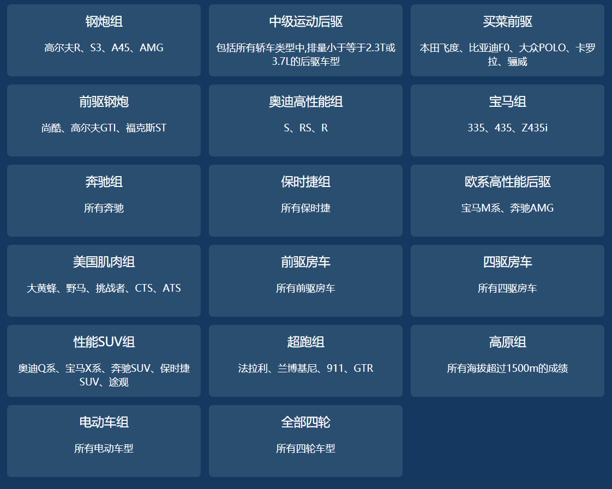

# 课后练习_ajax-day02

## 1. 题号：CODE_01

### 表单域的数据采集

**训练目标**：熟练使用jQuery的方法来获取表单域的数据

**训练效果**：按照要求完成用户数据的采集---使用基础班做过的一个案例-“青春不常在，抓紧谈恋爱”，完成里面的用户信息的收集

**试题难度**：☆☆

**案例素材**：

>   [01.表单域的数据采集.zip](/downloads/ajax/day02/02.after_class_material/01.表单域的数据采集_素材.zip)

1. 收集数据格式：

| 名称       | 字段名称       | 传入数据内容     | 说明                 |
| ---------- | -------------- | ---------------- | -------------------- |
| 性别       | sex            | 0或1             | 0代表女、1代表男     |
| 出身年     | birthday_year  | 数字             | 例如：1960-2020      |
| 出身月     | birthday_month | 数字             | 例如：1-12           |
| 出身日     | birthday_day   | 数字             | 例如：1-31           |
| 所在地     | location       | 字符串           | 例如：北京           |
| 婚姻状况   | marry          | 未婚、已婚、离婚 |                      |
| 学历       | education      | 字符串           | 例如：博士后         |
| 喜欢的类型 | love           | 字符串           | 例如：妩媚的         |
| 个人简介   | introduce      | 字符串           | 例如：我是砖石王老五 |

**案例要求**：

一次性获取所有表单内容

**训练提示**：

1. 通过jquery的serialize方法来获取表单数据更加方便

2. 表单域的收集一定要配合name属性

**参考方案**：

1. form表单主要用于收集用户数据的表格，点击submit来触发事件

**操作步骤**：

1. 给所有表单元素加上一个表单域form标签
2. 给每一个表单加上对应的name属性
3. submit按钮，来触发提交
4. submit按钮提交时，需要阻止默认事件
5. 通过jquery的serialize方法一次性获取所有表单数据

**参考答案**：

**html**

```html
<form name="register" id="register">
        <h4>青春不常在，抓紧谈恋爱</h4>
        <table width="600">
            <!-- 第一行 -->
            <tr>
                <td>性别:</td>
                <td>
                    <input type="radio" name="sex" value="0" id="nan"> <label for="nan">  男 </label>
                    <input type="radio" name="sex" value="1" id="nv"> <label for="nv"> 女</label>
                </td>
            </tr>
            <!-- 第二行等略 -->
        </table>
    </form>
```

**js**

```javascript
$(function () {
        $('#submit').on('click', function (e) {
            e.preventDefault()
            let formData = $('#register').serialize()
            formData = decodeURIComponent(formData,true);//解码
            console.log(formData);
        })
    })
```


## 2. 题号：CODE_02

### 请求获取数据，并且渲染页面

**训练目标**：

锻炼模板引擎的使用

**案例效果**：

通过请求接口，完成如下页面：



**试题难度**：☆☆☆

**案例素材**：

> [02.请求数据并渲染_素材](/downloads/ajax/day02/02.after_class_material/02.请求数据并渲染_素材.zip)

1. 接口如下：

```json
汽车数据接口：
接口地址： http://api.pocketgear360.com/api/v1.0/categories
请求方式： get
请求参数： 无
JSON返回示例：
{
    categories: [{
        cate_id: "1",
        description: "高尔夫R、S3、A45、AMG",
        description_en: "Golf R、S3、A45、AMG",
        is_motor: 0,
        tag: "钢炮组",
        tag_code: "A1",
        tag_en: "Hot Hatches",
    }]
}
```

2. 接口说明

| 名称           | 类型 | 说明                 |
| -------------- | ---- | -------------------- |
| categories     | 数组 | 机车数组             |
| cate_id        | id   | 唯一id               |
| description    | str  | 车型                 |
| description_en | str  | 车型（英文）         |
| is_motor       | 数字 | 0四轮机车、1两轮机车 |
| tag            | str  | 机车组               |

**案例要求**：

​	获取接口数据，并且渲染至页面上

**训练提示**：

1. 通过接口获取机车

2. 通过模板引擎渲染页面

3. 页面过滤掉两轮机车的数据

4. 页面模板已经完成，是响应式的网页

**参考方案**：

1. jquery的`$.ajax({})`方法获取接口数据

2. 模板引擎使用循环语法循环数据

   ```html
   {{each}}{{/each}}
   ```

3. 模板引擎使用if语法判断数据状态是否为0

   ```html
   {{if value.is_motor==0}}{{/if}}
   ```

**操作步骤**：

1. 按照要求引入模板引擎和jquery
2. 通过jquery的ajax获取机车接口的数据
3. 通过页面结构制作渲染模板（页面过滤掉两轮机车的数据）
4. 通过 template方法把页面模板和数据完成拼接，渲染至页面中（响应式的网页）

**参考答案**：

**模板引擎**

```html
<script id="car_type" type="text/html">
		<ul class="clearfix">
			{{each categories as value i}}
				{{if value.is_motor==0}}
				<li class="col-xs-6 col-sm-4 col-md-3 col-lg-2"><a href="#">
					<p class="type">{{value.tag}}</p>
					<p class="name txt">
						{{value.description}}
					</p>
				</a></li>
				{{/if}}
			{{/each}}
		</ul>
	</script>
```

**js**

```javascript
$(function(){
		$.ajax({
			url:"http://api.pocketgear360.com/api/v1.0/categories",
			type:"get",
			success:function(data){
				console.log(data)
				var html = template('car_type', data);
				$(".content-tab .row").html(html);
			}
		})
	})
```


