# Ajax第02天-Ajax基础

课程资料下载地址： [Ajax第02天](/downloads/ajax/day02/03.course_material/ajax-day02.zip)

## 能力目标

- 能够**说出**Form表单常用的4个属性及其**应用场景**
- 能够**说出**Form表单同步提交的**缺点**以及**解决方案**
- 能够**说出**Ajax提交表单数据的步骤并通过代码**完成**评论列表案例的**发布评论功能**
- 能够**使用**art-template模板引擎并通过代码**完成**名言大全的课程案例
- 能够**说出**新闻列表案例**注意事项**并通过代码**完成**这个案例

## 1. Form表单的基本使用

### 1.1 什么是表单

> 第 1 节课 / 02'48''

#### 1.1.1 「什么是表单」问题

1. 问题 1：表单的主要功能？
2. 问题 2：如何定义一个表单？

#### 1.1.2 「什么是表单」答案

1. 问题 1：表单的主要功能？
   - 表单在网页中主要负责 **数据采集功能**。
2. 问题 2：如何定义一个表单？
   - HTML中`<form>`标签，就是用于采集用户输入的信息，并通过 `<form> `标签的提交操作，把采集的信息提交到服务器端进行处理

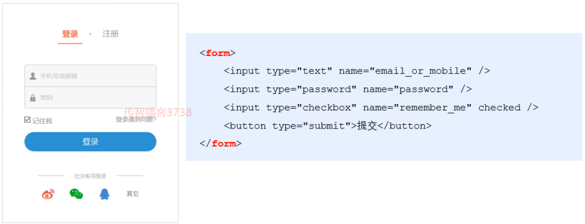

### 1.2 表单的组成部分

> 第 1 节课 / 01'58''

#### 1.2.1 「表单的组成部分」问题

1. 问题 1：表单由几部分构成？分别是什么？

#### 1.2.2 「表单的组成部分」答案

1. 问题 1：表单由几部分构成？分别是什么？

   1. 由 **3** 部分构成
   2. 表单域： `<form></form>`
   3. 表单标签：包含了文本框，密码框，隐藏域，都行文本框，复选框，单选框，下拉选择框和文件上传框等等
   4. 表单按钮：通过设置`type`属性为`submit`来触发`form`表单的提交

   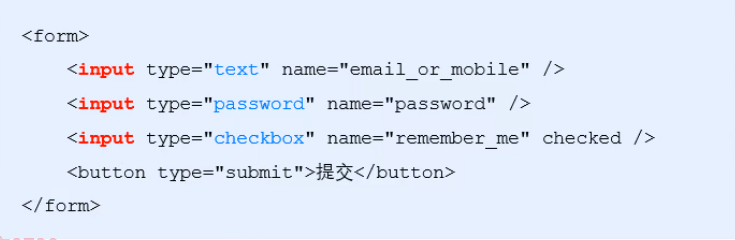

### ☆1.3 form标签的属性-action

>  第 1 节课 / 05'25''

#### 1.3.1「form标签的属性-action」问题

1. 问题 1：action属性的作用？
2. 问题 2：如果没有设置action属性会有什么效果？
3. 问题 3：当提交表单后，会有什么效果？

#### 1.3.2「form标签的属性-action」答案

1. 问题 1：action属性的作用？
   1. action 属性用来规定当提交表单时，**向何处发送表单数据**
   2. action 属性的值应该是**后端提供**的一个**URL地址**，这个URL地址专门负责接收表单提交过来的数据
2. 问题 2：如果没有设置`action`属性会有什么效果？
   - 当 `<form>`表单在**未指定** action 属性值的情况下，action的**默认值**为当前页面的 URL 地址
3. 问题 3：当提交表单后，会有什么效果？
   - 当提交表单后，会**立即跳转**到 action 属性指定的 URL 地址

### 1.4 form标签的属性-target

> 第 1 节课 / 02'56''

#### 1.4.1「form标签的属性-target」问题

1. 问题 1：target属性的作用？
2. 问题 2：target属性可选值有几个？默认情况下是什么值？我们重点掌握哪个值？

#### 1.4.2「form标签的属性-target」答案

1. 问题 1：target属性的作用？

   - target 属性用来规定 在何处打开 action URL，用白话表示就是在什么地方打开这个**地址**

2. 问题 2：target属性可选值有几个？默认情况下是什么值？我们重点掌握哪个值？

   1. 可选值有 **5** 个
   2. 默认情况下target属性的值是 _self；表示在相同的框架中打开 action URL
   3. 重要掌握的是：**_blank** 和 **_self**
      - _blank：在新窗口中打开

   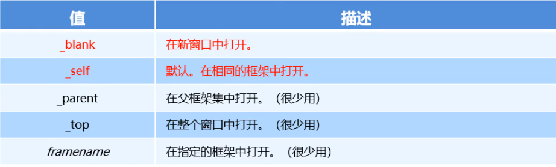

### ☆1.5 form标签的属性-method

> 第 1 节课 / 07'56''

#### 1.5.1「form标签的属性-method」问题

1. 问题 1：method属性的作用？
2. 问题 2：可选择值有几个？
3. 问题 3：两个值分别有什么特点？

#### 1.5.2「form标签的属性-method」答案

1. 问题 1：method属性的作用？
   - method 属性用来规定 **以何种方式** 把表单数据提交到 action URL
2. 问题 2：可选择值有几个？默认值是？
   1. 它的可选值有两个，分别是 GET 和 POST
   2. 默认情况下，method的值为 GET， 表示通过URL地址的形式，把表单数据提交到 action URL
3. 问题 3：两个值分别有什么特点？
   - GET 方式适合用来提交**少量的**，**简单的**数据
   - POST 方式适合用来提交**大量的**，**复杂的**，或包含**文件上传**的数据

### ☆1.6 form标签的属性-enctype

> 第 1 节课 / 02'52''

#### 1.6.1「form标签的属性-enctype」问题

1. 问题 1：enctype属性的作用？
2. 问题 2：可选值有几个？默认情况下是哪个值?

#### 1.6.2「form标签的属性-enctype」答案

1. 问题 1：enctype属性的作用？

   - enctype属性用来规定在 **发送表单数据之前如何对数据进行编码**

2. 问题 2：可选值有几个？默认情况下是哪个值?

   1. 可选值有 **3** 个

   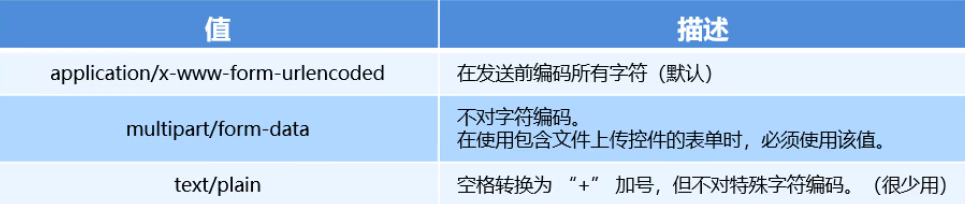

   2. 默认情况下，`enctype`的值为 `application/x-www-form-urlencoded`，表示在发送前编码的所有字符
   3. 如果要上传文件的话，就必须把`enctype`的值改为`multipart/form-data`

### ☆1.7 表单的同步提交及缺点

> 第 1 节课 / 03'28''

#### 1.7.1「表单的同步提交及缺点」问题

1. 问题 1：什么是表单同步提交？
2. 问题 2：表单同步提交有什么缺点？
3. 问题 3：有没有解决方式呢？

#### 1.7.2「表单的同步提交及缺点」答案

1. 问题 1：什么是表单同步提交？
   - 通过点击 submit 按钮，触发表单提交的操作，从而使页面跳转到 action URL 的行为，叫做表单的同步提交
2. 问题 2：表单同步提交有什么缺点？
   1. `<form>` 表单同步提交后，整个页面会发生跳转，**跳转到 action URL 所指向的地址**，用户体验很差
   2. `<form>` 表单同步提交后，页面之前的状态和数据会丢失
3. 问题 3：有没有解决方式呢？
   - 利用Ajax技术来实现，**表单只复杂采集数据，Ajax负责将数据提交到服务器**

### ☆1.8 Form表单基本使用小结

1. 说出表单4个属性的作用
   1. action： 定义表单内容提交的地址
   2. target： 定义提交时候打开页面的方式
   3. method：定义提交的方式，GET还是POST
   4. enctype：定义提交的数据类型
2. 说出表单同步提交的缺点
   1. `<form>` 表单同步提交后，整个页面会发生跳转，**跳转到 action URL 所指向的地址**，用户体验很差
   2. `<form>` 表单同步提交后，页面之前的状态和数据会丢失

## ☆2. 通过Ajax提交表单数据

### 2.1 监听表单提交事件

> 第 2 节课 / 05'03''

#### 2.1.1「监听表单提交事件」问题

1. 问题 1：监听提交事件有哪两种方式？

#### 2.1.2「监听表单提交事件」答案

1. 问题 1：监听提交事件有哪两种方式？

   1. 利用 jQuery 对象提供的 submit 方法来绑定
   2. 利用 jQuery 绑定事件的 on 方法来实现

   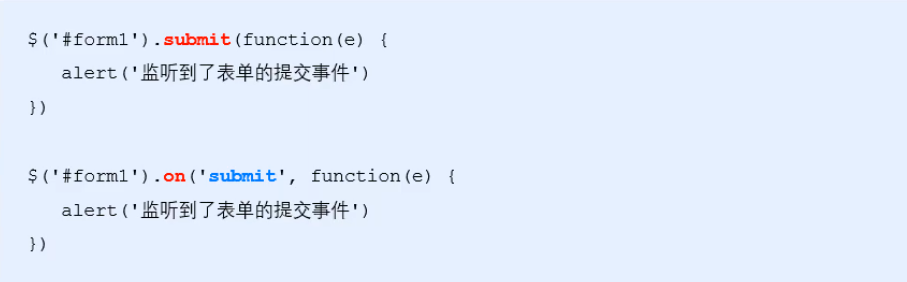

### 2.2 阻止表单默认提交行为

> 第 2 节课 / 03'35''

#### 2.2.1「阻止表单默认提交行为」问题

1. 问题 1：阻止默认行为是 `e.stopPropagation()`还是 `e.preventDefault()`?

#### 2.2.2「阻止表单默认提交行为」答案

1. 问题 1：阻止默认行为是 `e.stopPropagation()`还是 `e.preventDefault()`?

   1.  `e.stopPropagation()` 是阻止事件冒泡
   2. `e.preventDefault()` 阻止默认行为，就能阻止表单提交和页面的跳转

   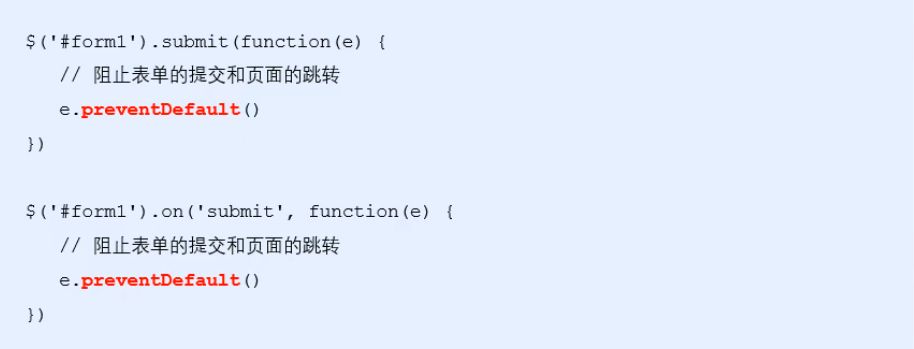

### 2.3 如何快速获取表单数据

> 第 2 节课 / 08'04''

#### 2.3.1「如何快速获取表单数据」问题

1. 问题 1：通过什么方法能够快速获取数据？
2. 问题 2：快速获取数据需要注意什么？

#### 2.3.2「如何快速获取表单数据」答案

1. 问题 1：通过什么方法能够快速获取数据？

   - jQuery 提供了 `serialize()` 函数，能够快速获取到表单的数据；**可以一次性全部获取哦**

   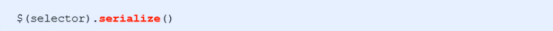

2. 问题 2：快速获取数据需要注意什么？

   1. 在使用 `serialize()` 函数快速获取表单数据时，**必须为每个表单元素添加 `name` 属性**
   2. 获取到的值是字符串格式： `key1=value1&key2=value2`

   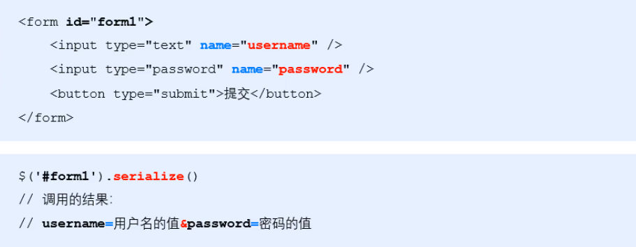

#### 2.3.3「如何快速获取表单数据」练习

> 练习时长：5分钟

1. 练习目标：运行jQuery的监听事件、阻止表单默认行为、快速获取表单数据来实现用户输入框的内容获取
2. 素材：
   1. 素材下载地址：[01.如何快速获取表单数据](/downloads/ajax/day02/01.class_room_material/01.如何快速获取表单数据.zip)
   2. 接口文档地址：[接口文档](/downloads/ajax/day02/01.class_room_material/接口文档.zip)
3. 参考步骤：
   1. 利用jQuery给form表单绑定submit事件
   2. 获取到事件处理对象，取消默认行为
   3. 通过 jQuery 的`serialize()` 函数快速获取到用户输入内容，利用 `alert()` 进行弹框

### ☆2.4 通过Ajax提交表单数据小结

1. 如何监听表单提交事件
   1. 用 jQuery 对象提供的 submit 方法来绑定
   2. 利用 jQuery 绑定事件的 on 方法来实现
   3. 两者熟练使用一种即可
2. 阻止表单默认提交行为
   1. `e.preventDefault()` 阻止默认行为
   2. `e.stopPropagation()` 是阻止事件冒泡
3. 快速获取表单内容
   1. jQuery 提供了 `serialize()` 函数
   2. **注意：**需要给对应的表单元素设置name属性

## 3. 案例-评论列表

### 3.1 基于bootstrap渲染评论列表的UI结构

> 第 2 节课 / 11'14''

#### 3.1.1 实现步骤

1. 评论面板结构
   1. 创建panel （快捷键：`bs3-panel:primary`）
   2. 修改title里面的标题
   3. 在body 里面 创建两个输入框，加上对应的文本提示
   4. 最下面加上一个 button（快捷键：`bs3-button:primary`）
   5. 评论列表结构

2. 构建一个`list`列表（快捷键：`bs3-list-group`）
3. 在第一个`li`里面放两个 `span`，写入 **评论时间**和**评论人**

#### 3.1.2 示例代码

```html
<body style="padding: 15px;">

  <!-- 评论面板 -->
  <div class="panel panel-primary">
    <div class="panel-heading">
      <h3 class="panel-title">发表评论</h3>
    </div>
    <form class="panel-body" id="formAddCmt">
      <div>评论人：</div>
      <input type="text" class="form-control" name="username" autocomplete="off" />
      <div>评论内容：</div>
      <textarea class="form-control" name="content"></textarea>

      <button type="submit" class="btn btn-primary">发表评论</button>
    </form>
  </div>

  <!-- 评论列表 -->
  <ul class="list-group" id="cmt-list">
    <li class="list-group-item">
      <span class="badge" style="background-color: #F0AD4E;">评论时间：</span>
      <span class="badge" style="background-color: #5BC0DE;">评论人：</span>
      Item 1
    </li>
  </ul>

</body>
```

#### 3.1.3「基于bootstrap渲染评论列表的UI结构」练习

> 练习时长：5分钟

1. 练习目标：利用bootstrap渲染页面的结构
2. 素材：
   1. 素材下载地址：[02.基于bootstrap渲染评论列表的UI结构](/downloads/ajax/day02/01.class_room_material/02.基于bootstrap渲染评论列表的UI结构.zip)
3. 参考步骤：
   1. 评论面板结构
      1. 创建panel （快捷键：`bs3-panel:primary`）
      2. 修改title里面的标题
      3. 在body 里面 创建两个输入框，加上对应的文本提示
      4. 最下面加上一个 button（快捷键：`bs3-button:primary`）
      5. 评论列表结构
   2. 构建一个`list`列表（快捷键：`bs3-list-group`）
   3. 在第一个`li`里面放两个 `span`，写入 **评论时间**和**评论人**

### 3.2 获取评论列表数据

> 第 3 节课 / 07'08''

#### 3.2.1 实现步骤

1. 定义函数来获取评论列表数据 `getCommentList()`
2. 查阅接口文档，关注请求 URL，是否需要携带参数，请求方式
3. 利用 `$.ajax()` 来进行请求
4. 在 `success` 回调函数中，判断请求数据是否成功，如果状态码不是200，提示用户

#### 3.2.2 示例代码

```javascript
function getCommentList() {
  $.ajax({
    method: 'GET',
    url: 'http://www.liulongbin.top:3006/api/cmtlist',
    success: function (res) {
      if (res.status !== 200) return alert('获取评论列表失败！')
    }
  })
}
getCommentList()
```

### ☆3.3 渲染评论列表

> 第 3 节课 / 04`41''

#### 3.3.1 实现步骤

1. 创建一个空数组（`rows`），用来存放每一个元素的`html`字符串结构 

2. 遍历服务器返回的数据，每遍历一次，拼接一个对应的`html`字符串结构，然后放入到数组中

3. 找到list容器，先清空一下里面内容，然后利用 append 添加新的数据

#### 3.3.2 示例代码

```javascript
function getCommentList() {
  $.ajax({
    method: 'GET',
    url: 'http://www.liulongbin.top:3006/api/cmtlist',
    success: function (res) {
      if (res.status !== 200) return alert('获取评论列表失败！')
      var rows = []
      $.each(res.data, function (i, item) {
        var str = '<li class="list-group-item"><span class="badge" style="background-color: #F0AD4E;">评论时间：' + item.time + '</span><span class="badge" style="background-color: #5BC0DE;">评论人：' + item.username + '</span>' + item.content + '</li>'
        rows.push(str)
      })
      $('#cmt-list').empty().append(rows.join(''))
    }
  })
}
```

#### 3.3.3「渲染评论列表」练习

> 练习时长：7分钟

1. 练习目标： 运行ajax知识点获取服务器的列表数据，通过字符串拼接拼接模板字符串，来实现列表的渲染
2. 素材：
   1. 请求URL地址：`http://www.liulongbin.top:3006/api/cmtlist`
   2. 素材下载地址：[03.评论列表](/downloads/ajax/day02/01.class_room_material/03.评论列表.zip)
3. 参考步骤：
   1. 定义函数来获取评论列表数据 `getCommentList()`，在页面加载完毕进行调用
   2. 调用 `$.ajax()` 发起请求
   3. 在 `success` 回调函数中，判断请求数据是否成功，如果状态码不是200，提示用户
   4. 创建一个空数组（`rows`），用来存放每一个元素的 html 字符串结构 
   5. 遍历服务器返回的数据，每遍历一次，拼接一个对应的 html 字符串结构，然后放入到数组中
   6. 找到list容器，先清空一下里面内容，然后利用 `append()` 添加新的数据

### 3.4 改造form表单

> 第 3 节课 / 05'31''

#### 3.4.1 实现步骤

1. 把之前`panel-body`的标签改成 `form` 标签
2. 给每一个输入框设置 `name` 属性，**`name`属性的值最好与接口文档定义的参数名称一致**
3. 注册 `sumbit` 事件，阻止表单提交的默认行为
4. 获取用户输入内容（利用 `serialize()` ）

#### 3.4.2 示例代码

```javascript
$(function () {
  $('#formAddCmt').submit(function (e) {
    e.preventDefault()
    var data = $(this).serialize()
    })
  })
})
```

### ☆3.5 完成发表功能

> 第 3 节课 / 06'25''

#### 3.5.1 实现步骤

1. 查阅接口文档，关注请求的路径

2. 利用 `$.post()` 发送请求，传入数据

3. 在成功回调函数里面判断 返回的 `status` 是否是201，如果是代表成功，失败进行提示

4. 刷新页面（调用 `getCommentList()`），清空表单内容（`$('#formAddCmt')[0].reset()`）

#### 3.5.2 示例代码

```javascript
$(function () {
  $('#formAddCmt').submit(function (e) {
    e.preventDefault()
    var data = $(this).serialize()
    $.post('http://www.liulongbin.top:3006/api/addcmt', data, function (res) {
      if (res.status !== 201) {
        return alert('发表评论失败！')
      }
      getCommentList()
      $('#formAddCmt')[0].reset()
    })
  })
})
```

#### 3.5.3「完成发表功能」练习

> 练习时长：5分钟

1. 练习目标： 运行ajax知识点获取服务器的列表数据，通过字符串拼接拼接模板字符串，来实现列表的渲染
2. 素材：
   1. 素材下载地址：[04.完成发表功能](/downloads/ajax/day02/01.class_room_material/04.评论列表-发表评论功能.zip)
   2. 接口文档地址：[接口文档](/downloads/ajax/day02/01.class_room_material/接口文档.md)
3. 参考步骤：
   1. 把之前`panel-body`的标签改成 `form` 标签；给每一个输入框设置 name 属性，**name属性的值最好与接口文档定义的参数名称一致**
   2. 注册 `sumbit` 事件，阻止表单提交的默认行为；获取用户输入内容（利用 `serialize()` ）
   3. 利用 `$.post()` 发送请求，传入数据
   4. 在成功回调函数里面判断 返回的 `status` 是否是201，如果是代表成功，失败进行提示
   5. 刷新页面（调用 `getCommentList()`），清空表单内容（`$('#formAddCmt')[0].reset()`）

### ☆3.6 评论列表小结

1. 主要完成的功能点：
   1. 利用bootstrap渲染UI页面
   2. 获取评论数据，并且渲染到页面
   3. 获取用户输入的表单数据，完成发表评论功能
2. 主要练习的技能有：
   1. bootstrap的使用
   2. Ajax 请求获取数据
   3. 拼接好列表的HTML字符串
   4. form表单数据的获取&提交

## 4. 模板引擎

### ☆4.1 模板引擎的基本概念

> 第 3 节课 / 04'40''

#### 4.1.1「模板引擎的基本概念」问题

1. 问题 1：模板引擎的作用？
2. 问题 2：模板引擎有什么好处？

#### 4.1.2「模板引擎的基本概念」答案

1. 问题 1：为什么需要模板引擎？模板引擎的作用？

   1. 之前在渲染UI结构时候，**拼接字符串是比较麻烦的，而且很容易出现问题**
   2. 根据程序员指定的 **模板结构** 和 **数据**，自动生成一个完整的HTML页面

   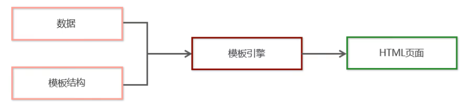

2. 问题 2：模板引擎有什么好处？

   1. 减少了字符串的拼接操作
   2. 使代码结构更清晰
   3. 使代码更易于阅读与维护

### 4.2 了解并安装art-template

> 第 4 节课 / 02'59''

#### 4.2.1「了解并安装art-template」问题

1. 问题 1：什么是art-template？
2. 问题 2：我们如果需要使用它，需要做什么操作？

#### 4.2.2「了解并安装art-template」答案

1. 问题 1：什么是art-template？

   - art-template 是一个简约，超快的模板引擎，中文官首页：[http://aui.github.io/art-template/zh-cn/index.html](http://aui.github.io/art-template/zh-cn/index.html)

2. 问题 2：我们如果需要使用它，需要做什么操作？

   - art-template是第三方的模板引擎，我们如果要使用，首要步骤需要进行下载

   - 下载步骤：

     1. 浏览器访问  [http://aui.github.io/art-template/zh-cn/docs/installation.html](http://aui.github.io/art-template/zh-cn/docs/installation.html)
     2. 找到 **安装** 导航栏，找到下载链接，右键下载即可

     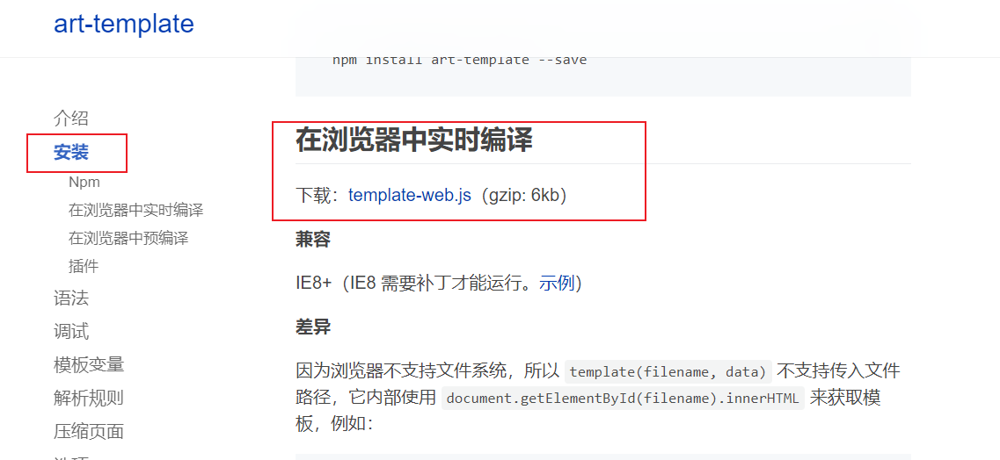

### 4.3 使用传统方式渲染UI结构

> 第 4 节课 / 10'25''

过渡视频，体会一下利用传统方式动态去渲染 UI 的时候需要大量去拼接字符串，比较的麻烦，而且复用性也不是很好

### ☆4.4 介绍模板引擎的使用步骤

> 第 4 节课 / 13'29''

#### 4.4.1「介绍模板引擎的使用步骤」问题

1. 问题 1：模板引擎的使用步骤有几步？每一步都需要做什么？

#### 4.4.2「介绍模板引擎的使用步骤」答案

1. 问题 1：模板引擎的使用步骤有几步？每一步都需要做什么？

   想使用模板引擎一共分为5个步骤：

   1. 导入 art-template

      - 在window全局，就多了一个函数，叫做 `template('模板id'，需要渲染的数据对象)`

      ```html
      <script src="./lib/template-web.js"></script>
      ```
   2. 定义数据

      ```js
   var data = { name: 'zs', age: 20}
      ```

   3. 定义模板

      1. 模板的 HTML 结构，必须定义到 `script` 标签中，**注意**：需要把`type`属性改成  `text/html`
   2. 给 模板 添加一个 `id`
      3. 模板里面如果需要使用到传入的数据，利用 `{{}}` 来实现

      ```html
      <!-- 例如：{{name}}，那么就会去找 我们调用 template() 函数 第二个参数里面对应的name属性的值 -->
      <script type="text/html" id="tpl-user">  
          <h1>{{name}}    ------    {{age}}</h1>
   </script>
      ```

   4. 调用 `template()` 函数

      - 函数的返回值就是拼接好的模板字符串

        ```js
        var htmlStr = template('tpl-user', data)
        ```


   5. 渲染HTML结构

      - 最后我们需要把`template()`返回的模板字符串设置到页面容器中

        ```js
        $('#container').html(htmlStr)
        ```


### ☆4.5 模板引擎小结

1. 介绍了 art-template 模板引擎，好处在于：
   1. 减少了字符串的拼接操作
   2. 使代码结构更清晰
   3. 使代码更易于阅读与维护
2. 使用模板引擎的步骤：
   1. 下载并且引入 art-template
   2. 定义好数据
   3. 定义好模板结构
      - `script` 标签需要给定 `type` 属性为 `text/html`；同时还需要指定 id
      - 渲染数据我们利用 mustache 语法
      - **注意**：mustache 语法需要渲染什么内容，就写上对应的属性名即可
   4. 调用 `template()` 函数，得到拼接好的HTML字符串
   5. 渲染到页面

## 5. 标准语法

### ☆5.1 输出

> 第 4 节课 / 02'55''

#### 5.1.1「输出」问题

1. 问题 1：art-template 的标准语法格式是怎样？
2. 问题 2：art-template 的输出语法格式是怎样？

#### 5.1.2「输出」答案

1. 问题 1：art-template 的标准语法格式是怎样？

   - art-template 提供了 `{{}}` 这种语法格式，在 `{{}}` 内可以进行 **变量输出** 或 **循环数组** 等操作，这种 `{{}}` 语法在 `art-template` 中被称为标准语法；也称为 **mustache** 语法

2. 问题 2：art-template 的输出语法格式是怎样？可以输出什么内容？

   1. 输出的语法格式就是利用 `{{}}`

   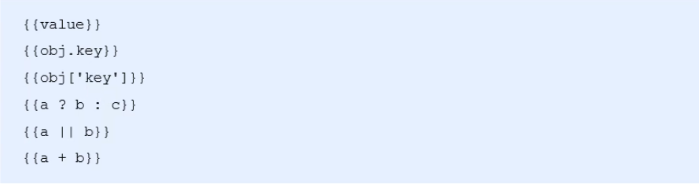

   2. 可以进行 **变量** 的输出，**对象属性**的输出，**三元表达式**输出，**逻辑或**输出，**加减乘除等表达式**输出

#### 5.1.3「输出」练习

> 练习时长： 7分钟

1. 练习目标：运用模板引擎知识点完成 **接头暗号** 的案例

   > Tips: 把对应的暗号利用模板引擎知识点渲染在括号里面

   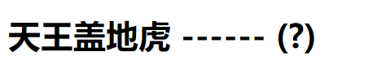

2. 素材：

   1. 素材下载地址：[05.接头暗号]( /downloads/ajax/day02/01.class_room_material/05.接头暗号.zip)

3. 参考步骤：

   1. 引入 art-template 模板引擎（下载素材里面的lib文件夹下）

   2. 定义好数据

      ```js
      let data = {cipher: '小鸡炖蘑菇'}
      ```

   3. 定义好模板

      1. 利用`script`标签包裹模板内容；注意：需要设置 `type` 属性 和 `id` 属性

      ```html
      <script type="text/html" id="tpl-user">
          <!-- 注意，这里的?号要替换成 mustache 语法 {{}} 需要渲染什么数据，写上对应的属性名即可-->
          <h1>天王盖地虎   ------    (?)</h1>
      </script>
      ```

   4. 调用 `template()` 函数，传入模板id和要渲染的对象

      ```js
      // 第一个参数要与模板id一直，第二个参数是传入的数据
      var htmlStr = template('tpl-user', data)
      ```

   5. 渲染HTML结构

### 5.2 原文输出

> 第 5 节课 / 02'34''

#### 5.2.1「原文输出」问题

1. 问题 1：原文输出的格式？
2. 问题 2：原文输出应用场景？

#### 5.2.2「原文输出」答案

1. 问题 1：原文输出的格式？

   - 利用 `{{}}`，在变量前面加上 `@` 符号

   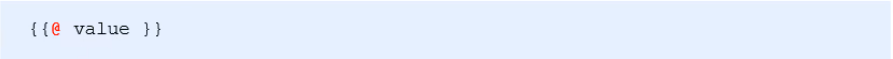

2. 问题 2：原文输出应用场景？

   - 如果输出的 value 值中，**包含了 HTML 标签结构**，则需要使用**原文输出**语法，才能保证HTML标签被正常渲染

### ☆5.3 条件输出

> 第 5 节课 / 03'09''

#### 5.3.1「条件输出」问题

1. 问题 1：条件输出的语法格式？

#### 5.3.2「条件输出」答案

1. 问题 1：条件输出的语法格式？

   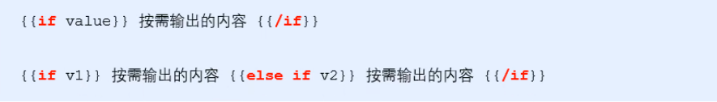

> Tips: 条件输出 注意 要有**闭合**

### ☆5.4 循环输出

> 第 5 节课 / 03'19''

#### 5.4.1「循环输出」问题

1. 问题 1：循环输出的语法格式？
2. 问题 2：在循环体里面如何获取对应索引以及对应的item项？

#### 5.4.2「循环输出」答案

1. 问题 1：循环输出的语法格式？

   - 可以在`{{}}` 内，通过 each 语法循环数组

   ```
   {{each 数组}}
   
   {{/each}}
   ```

2. 问题 2：在循环体里面如何获取对应索引以及对应的item项？

   - 当前循环的索引使用 `$index` 进行访问，当前循环项使用 `$value` 进行访问；注意：都需要用 `{{}}` 包裹

   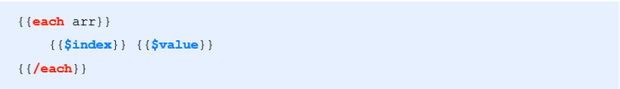

> Tips: 循环输出 注意 要有**闭合**

#### 5.4.3「循环输出」练习

> 练习时长：7分钟

1. 练习目标：运用模板的输出语法，条件，循环来实现下面列表的隔行变色效果

   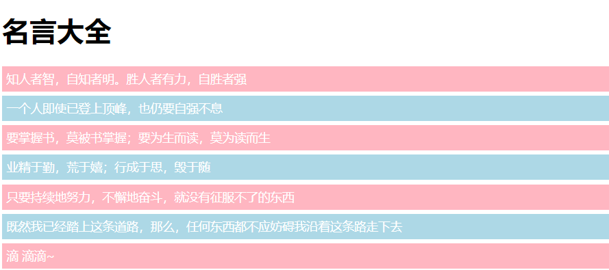

2. 素材

   1. 素材下载地址：[06.隔行变色]( /downloads/ajax/day02/01.class_room_material/06.隔行变色.zip)

3. 参考步骤：

   1. 素材准备，点击上方下载素材，引入 art-template 模板库（在素材的lib目录下）
   2. 定义好数组（素材已经准备好）

   ```js
   let data = {
       array: [
       '知人者智，自知者明。胜人者有力，自胜者强',
       '一个人即使已登上顶峰，也仍要自强不息',
       '要掌握书，莫被书掌握；要为生而读，莫为读而生',
       '业精于勤，荒于嬉；行成于思，毁于随',
       '只要持续地努力，不懈地奋斗，就没有征服不了的东西',
       '既然我已经踏上这条道路，那么，任何东西都不应妨碍我沿着这条路走下去',
       '滴 滴滴~',
       ],
   };
   ```

   3. 定义模板结构，在模板里面利用索引跟2取余来判断奇偶行
      - 如果是偶数行，设置类名为 **even**
      - 如果是奇数行，设置类名为 **odd**

   ```html
   <script type="text/html" id="listTemp">
       <!-- 注意：以下是伪代码 -->
       {{each 数组}}
           {{if 索引 % 2 ===0}}
           	<div class="even">值</div>
           {{else if 索引 % 2 !==0}}
           	<div class="odd">值</div>
           {{/if}}
       {{/each}}
   </script>
   ```

   4. 调用 template() 函数，获取到模板引擎拼接好的HTML字符串，渲染到 `container` 容器里面

### ☆5.5 什么是过滤器

> 第 5 节课 / 02'05''

#### 5.5.1「什么是过滤器」问题

1. 问题 1：过滤器的本质是什么？
2. 问题 2：过滤器在什么时候触发？

#### 5.5.2「什么是过滤器」答案

1. 问题 1：过滤器的本质是什么？

   - 过滤器本质就是一个 `function` 函数

2. 问题 2：过滤器在什么时候触发？

   - 大家对比现实中的例子，把自来水当成数据的输入，纯净水当成数据的输出

   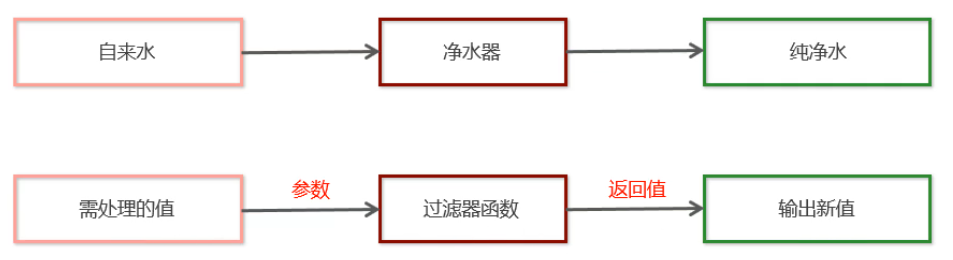

   - 过滤器的触发时机： 在给模板引擎**设置数据之后**，**显示在页面之前**进行的调用

### ☆5.6 定义过滤器和调用过滤器的基本语法

> 第 5 节课 / 03'43''

#### 5.6.1「定义过滤器和调用过滤器的基本语法」问题

1. 问题 1：如何定义一个过滤器？
2. 问题 2：如何使用过滤器？

#### 5.6.2「定义过滤器和调用过滤器的基本语法」答案

1. 问题 1：如何定义一个过滤器？

   - 定义过滤器，调用如下代码，函数里面的参数就是我们在使用的时候需要过滤的数据
   - 函数里面需要`return`，`return`什么，最终页面上显示的就是什么

   ```js
   template.defaults.imports.过滤器名称 = function(value){
       return 最终显示的值
   }
   ```

2. 问题 2：如何使用过滤器？

   - 过滤器语法类似于 **管道操作符**，它的上一个**输出**作为下一个**输入**

   ```html
   <script type="text/html" id="xxx">
      {{ value | 过滤器名称}}
   </script>
   ```

### 5.7 定义格式化时间的过滤器

#### 5.7.1 实现思路

1. 定义数据

```javascript
var data = { regTime: new Date() }
```

2. 定义过滤器

```javascript
// 定义处理时间的过滤器
template.defaults.imports.dateFormat = function (date) {
      var y = date.getFullYear()
      var m = date.getMonth() + 1
      var d = date.getDate()

      return y + '-' + m + '-' + d
}
```

3. 在模板引擎中使用过滤器

```html
  <script type="text/html" id="tpl-user">
    <h3>{{regTime | dateFormat}}</h3>
  </script>
```

#### 5.7.2「定义格式化时间的过滤器」练习

> 练习时长：5分钟

1. 练习目标：定义一个时间过滤器来格式化日期

2. 素材：

   1. 素材下载地址：[07.时间过滤器]( /downloads/ajax/day02/01.class_room_material/07.时间过滤器.zip)

3. 参考步骤：

   1. 下载好素材，找到注释里面有 TODO 的，开始编写自己代码

   2. 定义好过滤器，实现日期的格式化

      ```js
      template.defaults.imports.dateFormat = function(date) {
          // 获取年
          var y = date.getFullYear();
          // 获取月
          var m = date.getMonth() + 1;
          // 获取日
          var d = date.getDate();
          // 拼接好日期格式返回到页面
          return y + '-' + m + '-' + d;
      };
      ```

   3. 在模板里面利用 管道符 来使用过滤器

### ☆5.8 标准语法小结

1. 模板引擎的语法格式利用 `{{}}`，也称之为 **mustache** 语法

2. 输出语法：

   1. 普通输出

      ```html
      {{ value }}
      ```

   2. 原文输出

      ```html
      {{@ value }}  
      ```

      > Tips: 如果内容有html结构需要被渲染出来的就需要用到原文输出

   3. 条件输出

      ```html
      {{if 条件表达式 }}...{{/if}}  {{if 条件表达式 }}...{{/else if 条件表达式}}...{{/if}}
      ```

   4. 循环输出：

      ```html
      {{each array}}
         {{ $index }} 获取索引
         {{ $value }} 获取元素
      {{/each}}
      ```

3. 过滤器使用

   1. 定义过滤器

   ```js
   template.defaults.imports.过滤器名称 = function(date) {
      return 最终显示的值
   }
   ```

   2. 使用过滤器，利用管道符，前面的内容**输出**作为后面内容的**输入**传递到过滤器中

   ```html
   <script type="text/html" id="xxx">
      {{ value | 过滤器名称}}
   </script>
   ```

## 6. 案例-新闻列表

### 6.1 介绍新闻列表案要实现的效果

> 第 5 节课 / 03'13''

过渡视频，讲解项目效果，引入素材


### ☆6.2 获取新闻列表数据

> 第 6 节课 / 03'46''

#### 6.2.1 实现思路

1. 定义函数，获取新闻列表数据 `getNewsList()`
2. 查阅接口文档，关注 请求URL，请求方式，请求参数，响应数据
3. 利用 `$.get()` 发起请求
4. 在回调函数中，判断请求是否成功

#### 6.2.2 示例代码

```js
// 获取新闻列表的函数
function getNewsList() {
	$.get('http://www.liulongbin.top:3006/api/news', function (res) {
		if (res.status !== 200) {
			return alert('获取新闻列表数据失败！')
		}
		...
	})
}
getNewsList()
```

### ☆6.3 定义新闻列表item项的模板

> 第 6 节课 / 02'21''

#### 6.3.1 实现思路

1. 创建 script 标签，更改type属性值为 `text/html`，给模板定义id

2. 找到静态页面中 item 的结构，拷贝到模板里面

#### 6.3.2 示例代码

```html
  <!-- 定义模板 -->
<script type="text/html" id="tpl-news">
    <div class="news-item">
        
        <div class="right-box">
          <h1 class="title">5G商用在即，三大运营商营收持续下降</h1>
          <div class="tags">
            <span>三大运营商</span>
            <span>中国移动</span>
            <span>5G商用</span>
          </div>
          <div class="footer">
            <div>
              <span>胡润百富</span>&nbsp;&nbsp;
              <span>2019-10-28 10:14:38</span>
            </div>
            <span>评论数：66</span>
          </div>
        </div>
    </div>
</script>
```

#### 6.3.3「定义新闻列表item项的模板」练习

> 练习时长：5分钟

1. 练习目标：获取新闻列表数据，定义好模板的item项
2. 素材：
   1. 请求URL地址：`http://www.liulongbin.top:3006/api/news`
   2. 接口文档下载：[接口文档]( /downloads/ajax/day02/01.class_room_material/接口文档.zip)
   3. 素材下载地址：[08.新闻列表案例]( /downloads/ajax/day02/01.class_room_material/08.新闻列表案例.zip)
3. 参考步骤：
   1. 下载对应素材，点击上面素材下载地址进行下载
   2. 定义 `getNewsList()` 函数，在函数内部调用 `$.get()` 进行数据的请求
   3. 在`success`回调函数中，判断请求是否成功
   4. 在页面定义 `script` 标签，更改type属性值为 `text/html`，给模板定义id
   5. 找到静态页面中 item 的结构，拷贝到模板里面

### ☆6.4 编译模板渲染新闻列表结构

> 第 6 节课 / 10'22''

#### 6.4.1 实现思路

1. 在请求成功的回调里面，调用 `template()` 方法，传入`id`和返回的数据，把函数的返回值添加到页面容器中

```js
// 获取新闻列表的函数
function getNewsList() {
	$.get('http://www.liulongbin.top:3006/api/news', function (res) {
		...
		var htmlStr = template('tpl-news', res)
		$('#news-list').html(htmlStr)
	})
}
```

2. 在模板中利用 `each` 遍历列表

```html
<!-- 定义模板 -->
<script type="text/html" id="tpl-news">
	{{each data}}
		<div class="news-item">
		  ...
		</div>
	{{/each}}
</script>
```

3. 利用 `$value` 能够拿到每一个item项
4. 设置图片 img，**注意**：需要拼接请求根路径

```html
 
 <!-- 定义模板 -->
<script type="text/html" id="tpl-news">
	{{each data}}
		<div class="news-item">
		  
		  ...
		</div>
	{{/each}}
</script>
```

5. 设置标题 title

```html
 <!-- 定义模板 -->
<script type="text/html" id="tpl-news">
	{{each data}}
		<div class="news-item">
		  
		  <div class="right-box">
          		<h1 class="title">{{$value.title}}</h1>
                ...
           </div>
		</div>
	{{/each}}
</script>
```

6. 展示的标签和返回的数据格式不一样（tag标签是分开的，而返回的是一个字符串），所以先对返回数据进行改造，对返回的tags需要分割成数组

```js
// res.data就是服务器返回的数据
for (var i = 0; i < res.data.length; i++) {
   // 把每一项的 tags 属性，从字符串改造成字符串的数组
   res.data[i].tags = res.data[i].tags.split(',')
}
```

7. 设置标签；**注意**：标签在之前改造成数组了，这里又需要进行遍历

```html
<!-- 定义模板 -->
<script type="text/html" id="tpl-news">
	{{each data}}
		<div class="news-item">
		  
		  <div class="right-box">
          		<h1 class="title">{{$value.title}}</h1>
          		<div class="tags">
          		     <!-- 遍历tags -->
   					{{each $value.tags}}
      					<span>{{$value}}</span>
   					{{/each}}
			   </div>
                ...
           </div>
		</div>
	{{/each}}
</script>
```

8. 设置剩下的来源，时间，和评论数

#### 6.4.2 示例代码

```html
<!-- 定义模板 -->
<script type="text/html" id="tpl-news">
   {{each data}}
   <div class="news-item">
     
     <div class="right-box">
       <h1 class="title">{{$value.title}}</h1>
       <div class="tags">
         {{each $value.tags}}
         <span>{{$value}}</span>
         {{/each}}
       </div>
       <div class="footer">
         <div>
           <span>{{$value.source}}</span>&nbsp;&nbsp;
           <span>{{$value.time}}</span>
         </div>
         <span>评论数：{{$value.cmtcount}}</span>
       </div>
     </div>
   </div>
   {{/each}}
</script>
```

#### 6.4.3「编译模板渲染新闻列表结构」练习

> 练习时长：10分钟

1. 练习目标： 利用模板语法完成新闻列表数据的渲染

2. 素材：

   1. 请求URL路径：`http://www.liulongbin.top:3006/api/news`
   2. 接口文档下载：[接口文档]( /downloads/ajax/day02/01.class_room_material/接口文档.zip)
   3. 素材下载地址：[09.编译模板渲染新闻列表结构]( /downloads/ajax/day02/01.class_room_material/09.编译模板渲染新闻列表结构.zip)

3. 参考步骤：

   1. 在请求成功的回调里面，调用 `template()` 方法，传入相应数据

   2. 通过`template()`方法返回值生成HTML字符串，渲染在页面

   3. 在html页面，利用 each 语法遍历模板

   4. 通过 $value 获取每一项数据进行设置

      > Tips：注意图片需要添加根路径 `http://www.liulongbin.top:3006`

   5. 回到news.js 文件对返回的tags进行截取处理

      > Tips：在调用`template()`方法之前对返回的tags进行截取处理

   6. 回到html页面定义模板的地方，通过`each`对tags进行遍历

### 6.4 定义时间过滤器

> 第 5 节课 / 05'21''

#### 6.4.1 实现思路

1. 定义格式化时间的过滤器

```js
// 定义格式化时间的过滤器
template.defaults.imports.dateFormat = function (dtStr) {
  var dt = new Date(dtStr)

  var y = dt.getFullYear()
  var m = padZero(dt.getMonth() + 1)
  var d = padZero(dt.getDate())

  var hh = padZero(dt.getHours())
  var mm = padZero(dt.getMinutes())
  var ss = padZero(dt.getSeconds())

  return y + '-' + m + '-' + d + ' ' + hh + ':' + mm + ':' + ss
}
```

2. 在模板语法里面找到日期这一项利用管道符进行使用

```html
<span>{{$value.time | dateFormat}}</span>
```

### 6.5 定义补零函数

> 第 5 节课 / 02'56''

#### 6.5.1 实现思路

1. 定义函数 `padZero()` 接收`number`类型的参数
2. 判断传递过来的参数是否小于10，如果小于，前面加一个 字符串格式的 0

#### 6.5.2 示例代码

```javascript
$(function () {
  // 给时间补零的函数
  function padZero(n) {
    if (n < 10) {
      return '0' + n
    } else {
      return n
    }
  }
...
})
```

### ☆6.6 新闻列表小结

1. 主要练习了通过 Ajax 进行网络请求，然后通过模板引擎来进行渲染，用到过滤器来对日期进行格式化处理
2. 注意的事项：
   1. 在设置图片地址的时候，我们需要添加根路径
   2. UI效果展示tags是分开的，而服务器返回的是一个字符串，所以我们需要在设置之前对tags进行切割处理，然后把切割好的数组重新赋值进去
   3. 在模板引擎里面用到了双层each循环，因为每一个新闻项都会有多个tags标签，这里一定要注意

## 7. 课后练习

[课后练习(共两道题)]( ./day02-afterclass.md)

