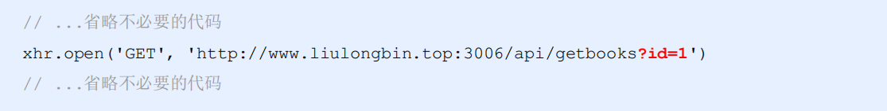

# Ajax第03天-Ajax高级

课程资料下载地址： [Ajax第03天](/downloads/ajax/day03/03.course_material/ajax-day03.zip)

## 能力目标

- 能够**说出**模板引擎的**实现原理**
- 能够**说出**XMLHttpRequest请求的步骤并**通过代码实现**GET和POST请求
- 能够**说出**封装Ajax函数的大致**思路**并通过**代码实现**
- 能够**说出** XMLHttpRequest Level2中提供的**新特性**
- 能够**说出**  XMLHttpRequest Level2 中**文件上传**的**步骤**并通过**代码实现**

## 1. 模板引擎的实现原理

### 1.1 介绍正则的exec函数

> 第 1 节课 / 04'09''

#### 1.1.1「介绍正则的exec函数」问题

1. 问题 1：`exec()`函数的作用？
2. 问题 2：`exec()`函数的返回值是什么？

#### 1.1.2「介绍正则的exec函数」答案

1. 问题 1：`exec()`函数的作用？

   - 用于 **检索字符串** 中的正则表达式的匹配，说白了就是看我们定义的正则是否能在目标字符串中匹配到

   

2. 问题 2：`exec()`函数的返回值是什么？

   - 如果字符串中有匹配的值，**则返回该匹配值**，否则返回 **null**

   

### ☆1.2 提取分组

> 第 1 节课 / 03'54''

#### 1.2.1「提取分组」问题

1. 问题 1：分组的语法？
2. 问题 2：分组的作用？

#### 1.2.2「提取分组」答案

1. 问题 1：分组的语法？

   - 正则表达式中 `()` 包起来的内容表示一个分组

2. 问题 2：分组的作用？

   - 可以通过分组来 **提取自己想要的内容**
   - 返回的数组中索引为0的 是匹配到的完整内容
   - 返回的数组中索引为1的 是匹配到的**分组**中的内容

   

### ☆1.3 字符串的 replace 函数

> 第 1 节课 / 05'33''

#### 1.3.1「字符串的 replace 函数」问题

1. 问题 1：`replace()` 的作用？
2. 问题 2：`replace()` 参数可以放正则表达式吗？

#### 1.3.2「字符串的 replace 函数」答案

1. 问题 1：`replace()` 的作用？

   - `replace()` 函数用于在字符串中 用一些字符 替换 另一些字符的

   

2. 问题 2：`replace()` 参数可以放正则表达式吗？

   - 可以的，`replace()`的第一个参数可以放字符串，也可以放正则表达式

   

### 1.4 对字符串进行多次replace操作

> 第 1 节课 / 07'16''

#### 1.4.1「对字符串进行多次replace操作」问题

1. 问题 1：对字符串进行多次replace操作有什么弊端?

#### 1.4.2「对字符串进行多次replace操作」答案

1. 问题 1：对字符串进行多次replace操作有什么弊端?

   - 会造成很多的**冗余**代码，如果动态在字符串里面多加了一项,那么js代码里面还需要多`replace()`一次，**不够灵活**

   > 思考：如何解决这个问题呢？

   


### ☆1.5 使用while循环来进行字符串的replace操作

> 第 1 节课 / 05'08''

#### 1.5.1「使用while循环来进行字符串的replace操作」问题

1. 问题 1：使用循环来实现，有什么好处呢？
2. 问题 2：如何实现呢？

#### 1.5.2「使用while循环来进行字符串的replace操作」答案

1. 问题 1：使用循环来实现，有什么好处呢？

   - 我们如果while循环来进行replace，首先减少了冗余代码，再者不管用户输入多少字符串，我们都能动态匹配

2. 问题 2：如何实现呢？

   - 在while循环的条件判断里面，判断还能不能通过 `exec()` 匹配到需要的内容，
   - 如果匹配不到了，返回的是null，那么隐式转换成false跳出了循环
   - 如果能够匹配到，返回的是匹配的内容，那么隐式转换成ture，继续执行循环体的代码

   

### 1.6 将正则匹配到的内容替换成真值

> 第 1 节课 / 02'58''

#### 1.6.1「将正则匹配到的内容替换成真值」问题

1. 问题 1：`patternResult[1]` 取的什么内容？

#### 7.6.2「将正则匹配到的内容替换成真值」答案

1. 问题 1：`patternResult[1]` 取的什么内容？

   ```
   patternResult[1] 取到的是 {{ name }} 里面分组的 name
   而这个 name 刚好就是对象 data 中的属性名，所以我们可以通过 data[属性名] 的方式取到值
   ```

   

### ☆1.7 实现简易的模板引擎

> 第 1 节课 / 10'52''

#### 1.7.1 实现思路

1. 定义模板结构

   ```html
   <script type="text/html" id="tpl-user">
     <div>姓名：{{name}}</div>
     <div>年龄：{{ age }}</div>
     <div>性别：{{  gender}}</div>
     <div>住址：{{address  }}</div>
   </script>
   ```

2. 预调用模板引擎

   ```js
   // 定义数据
   var data = { name: 'zs', age: 28, gender: '男', address: '长沙东方红大厦' }
   
   // 调用模板引擎
   var htmlStr = template('tpl-user', data)
   
   // 渲染HTML结构
   document.getElementById('user-box').innerHTML = htmlStr
   ```

3. 封装 template 函数

   1. 根据id找到script标签，拿到里面模板字符串内容
   2. 定义正则表达式
   3. 利用循环来进行replace的操作，判断条件是是否还能匹配到内容
   4. 利用 replace进行替换

   ```
   1. pattResult[0]取到的是完整字符串；例如传递过来的内容是： 我是{{ name }},那么取到的就是： {{ name }}
   2. pattResult[1]取到的是分组的内容；例如传递过来的内容是： 我是{{ name }},那么取到的就是： name
   ```

```js
function template(id, data) {
  // 根据id找到script标签，拿到里面模板字符串内容
  var str = document.getElementById(id).innerHTML
  // 定义正则表达式
  var pattern = /{{\s*([a-zA-Z]+)\s*}}/

  var pattResult = null
  // 利用循环来进行replace的操作，判断条件是是否还能匹配到内容
  while (pattResult = pattern.exec(str)) {
      // 利用 replace进行替换
      // pattResult[0]取到的是完整字符串；例如传递过来的是 我是{{ name }},那么取到的就是 {{ name }}
      // pattResult[1]取到的是分组的内容；例如传递过来的是 我是{{ name }},那么取到的就是 name
    str = str.replace(pattResult[0], data[pattResult[1]])
  }

  return str
}
```

4. 导入并使用自定义的模板引擎

### ☆1.8 模板引擎的实现原理小结

1. 正则的 `exec()` 函数

   1. 用于 **检索字符串** 中的正则表达式的匹配
   2. 如果字符串中又匹配的值，**则返回该匹配值**，否则返回 **null**

2. 正则的提取分组

   1. 正则表达式中 `()` 包起来的内容表示一个分组
   2. 可以通过分组来 **提取自己想要的内容**
   3. 返回的数组中索引为0的 是匹配到的完整内容
   4. 返回的数组中索引为1的 是匹配到的**分组**中的内容

3. 利用while循环来`replace()`真实内容

4. 模板引擎实现原理：

   > 主要的核心思路利用了正则，首先通过正则定义好匹配的模板语法格式，利用提取分组的方式通过 `exec()` 方法获取到模板语法内容，然后通过 字符串的 `replace()` 函数来进行替换；

## 2. XMLHttpRequest的基本使用

### 2.1 什么XMLHttpRequest

> 第 2 节课 / 02'13''

#### 2.1.1 「什么XMLHttpRequest」 问题

1. 问题 1：XMLHttpRequest简称什么？
2. 问题 2：作用是什么？

#### 2.1.2 「什么XMLHttpRequest」 问题

1. 问题 1：XMLHttpRequest简称什么？

   - XMLHttpRequest（简称 **xhr**），是浏览器提供的 Javascript 对象

2. 问题 2：作用是什么？

   - 通过 xhr，可以**请求服务器上的数据资源**。之前所学的 jQuery 中的 Ajax 函数，就是基于 xhr 对象封装出来的

   

### ☆2.2 使用xhr发起GET请求

> 第 2 节课 / 08'48''

#### 2.2.1 实现步骤

1. 创建 `xhr` 对象

   ```js
   var xhr = new XMLHttpRequest()
   ```

2. 调用 `xhr.open()` 函数

   ```js
   xhr.open('GET', 'http://www.liulongbin.top:3006/api/getbooks')
   ```

3. 调用 `xhr.send()` 函数

   ```js
   xhr.send()
   ```

4. 监听 `xhr.onreadystatechange` 事件

   ```js
   xhr.onreadystatechange = function () {
     if (xhr.readyState === 4 && xhr.status === 200) {
        // 获取服务器响应的数据
        console.log(xhr.responseText)
      }
   }
   ```

#### 2.2.2 示例代码

```javascript
// 1. 创建 XHR 对象
var xhr = new XMLHttpRequest()
// 2. 调用 open 函数
xhr.open('GET', 'http://www.liulongbin.top:3006/api/getbooks')
// 3. 调用 send 函数
xhr.send()
// 4. 监听 onreadystatechange 事件
xhr.onreadystatechange = function () {
  if (xhr.readyState === 4 && xhr.status === 200) {
     // 获取服务器响应的数据
     console.log(xhr.responseText)
   }
}
```

#### 2.2.3 「使用xhr发起GET请求」 练习

> 练习时长：7分钟

1. 练习目标：利用 xhr 发起 `GET` 请求，把服务器返回的数据打印在控制台里
2. 素材：
   1. 请求地址：`http://www.liulongbin.top:3006/api/getbooks`
   2. 素材下载地址： [01.使用xhr发起GET请求]( /downloads/ajax/day03/01.class_room_material/01.使用xhr发起GET请求.zip)
3. 参考步骤：
   1. 创建 `xhr` 对象
   2. 调用 `xhr.open()` 函数，第一个参数设置请求方式，第二个参数设置请求路径
   3. 调用 `xhr.send()` 函数
   4. 监听 `xhr.onreadystatechange` 事件，通过 `xhr.readyState` 和  `xhr.status` 来判断请求是否成功

### 2.3 了解xhr对象的`readyState`属性

> 第 2 节课 / 01'42''

#### 2.3.1 「了解xhr对象的`readyState`属性」 问题

1. 问题 1：readyState 作用是什么？有几种状态？

#### 2.3.2 「了解xhr对象的`readyState`属性」 答案

1. 问题 1：`readyState` 作用是什么？有几种状态？

   1. XMLHttpRequest 对象的 `readyState` 属性，用来表示**当前 Ajax 请求所处的状态**
   2. 对应一共有5个状态，分别是： `UNSENT、OPENED、HEADERS_RECEIVED、LOADING、DONE`，如图：

   

### 2.4 使用xhr发起带参数的GET请求

> 第 2 节课 / 04'10''

#### 2.4.1 「使用xhr发起带参数的GET请求」 问题

1. 问题 1： get方式发起带参请求在哪里设置参数？

#### 2.4.2 「使用xhr发起带参数的GET请求」 答案

1. 问题 1： get方式发起带参请求在哪里设置参数？

   - 在调用 `xhr.open()` 设置请求`URL`的时候，**携带get参数**即可

   

> **补充说明**：
>
> 这种在 `URL` 地址后面拼接的参数，叫做**查询字符串**。

#### 2.4.3 示例代码

```javascript
var xhr = new XMLHttpRequest()
xhr.open('GET', 'http://www.liulongbin.top:3006/api/getbooks?id=1')
xhr.send()
xhr.onreadystatechange = function () {
  if (xhr.readyState === 4 && xhr.status === 200) {
     console.log(xhr.responseText)
  }
}
```

### 2.5 了解查询字符串的概念

> 第 2 节课 / 02'25''

#### 2.5.1  「了解查询字符串的概念」 问题

1. 问题 1：什么是查询字符串？
2. 问题 2：查询字符串的格式是怎样？

#### 2.5.2 「了解查询字符串的概念」 答案

1. 问题 1：什么是查询字符串？

   - 查询字符串（URL 参数）是指在 URL 的末尾加上用于向服务器发送信息的字符串（变量）

2. 问题 2：查询字符串的格式是怎样？

   - 将英文的 **?** 放在`URL` 的末尾，然后再加上 **参数＝值** ，想加上多个参数的话，使用 **&** 符号进行分隔。以

     这个形式，可以将想要发送给服务器的数据添加到 `URL` 中。

   

### 2.6 GET请求携带参数的本质

> 第 3 节课 / 04'29''

#### 2.6.1 「GET请求携带参数的本质」 问题

1. 问题 1：只要发起 `GET` 方式的请求，参数的携带方式是怎样？

#### 2.6.3 「GET请求携带参数的本质」 问题

1. 问题 1：只要发起 GET 方式的请求，参数的携带方式是怎样？

   - 无论使用 `$.ajax()`，还是使用 `$.get()`，又或者直接使用 xhr 对象发起 GET 请求，当需要携带参数的时候，本质上，都是直接将参数以查询字符串的形式，追加到 URL 地址的后面，发送到服务器的。

   

### 2.7 什么是URL编码

> 第 3 节课 / 03'12''

#### 2.7.1 「什么是URL编码」 问题

1. 问题 1：什么是URL编码？
2. 问题 2：在什么情况下需要URL编码？
3. 问题 3：URL编码的原则？

#### 2.7.2 「什么是URL编码」 答案

1. 问题 1：什么是URL编码？

   - URL编码是一种浏览器用来打包表单输入的格式，通俗来说：而格式中，只允许出现英文相关的字母、标点符号、数字

2. 问题 2：在什么情况下需要URL编码？

   - 如果 URL 中需要包含中文这样的字符，则必须对中文字符进行**编码**（转义）。

3. 问题 3：URL编码的原则？

   - 使用安全的字符（没有特殊用途或者特殊意义的可打印字符）去表示那些不安全的字符。
   - URL编码原则的**通俗**理解：使用英文字符去表示非英文字符

   

### 2.8 如何对URL进行编码与解码

> 第 3 节课 / 03'59''

#### 2.8.1 「如何对URL进行编码与解码」 问题

1. 问题 1：如何进行 URL 编码？什么情况下用到编码?
2. 问题 2：如何进行 URL 解码？什么情况下用到解码?

#### 2.8.2 「如何对URL进行编码与解码」 答案

1. 问题 1：如何进行 URL 编码？什么情况下用到编码?
   1. 调用浏览器提供的 `encodeURI()` 编码的函数
   2. 如果**中文参数**需要通过 URL 请求发送给后台服务器就需要进行 URL 的编码
2. 问题 2：如何进行 URL 解码？什么情况下用到解码?
   1. 调用浏览器提供的`decodeURI()` 解码的函数
   2. 如果获取的数据是通过了 `encodeURI` 进行编码的，就需要通过 `decodeURI` 进行解码


> **补充说明**：
>
> **由于浏览器会自动对 URL 地址进行编码操作，因此，大多数情况下，程序员不需要关心 URL 地址的编码**
>
> **与解码操作**
>
> 更多关于 URL 编码的知识，请参考如下博客：
>
> https://blog.csdn.net/Lxd_0111/article/details/78028889


### ☆2.9 使用xhr发起POST请求

> 第 3 节课 / 07'41''

#### 2.9.1 实现步骤

- 创建 `xhr` 对象

  ```js
  var xhr = new XMLHttpRequest()
  ```

- 调用 `xhr.open()` 函数

  ```js
  xhr.open('POST', 'http://www.liulongbin.top:3006/api/addbook')
  ```

- **设置 Content-Type 属性**（固定写法）

  ```js
  xhr.setRequestHeader('Content-Type', 'application/x-www-form-urlencoded')
  ```

- 调用 `xhr.send()` 函数，**同时指定要发送的数据**

  ```js
  xhr.send('bookname=水浒传&author=施耐庵&publisher=上海图书出版社')
  ```

- 监听 `xhr.onreadystatechange` 事件

  ```js
  xhr.onreadystatechange = function () {
    if (xhr.readyState === 4 && xhr.status === 200) {
      console.log(xhr.responseText)
    }
  }
  ```

#### 2.9.2 示例代码

```javascript
// 1. 创建 xhr 对象
var xhr = new XMLHttpRequest()
// 2. 调用 open 函数
xhr.open('POST', 'http://www.liulongbin.top:3006/api/addbook')
// 3. 设置 Content-Type 属性（固定写法）
xhr.setRequestHeader('Content-Type', 'application/x-www-form-urlencoded')
// 4. 调用 send 函数
xhr.send('bookname=水浒传&author=施耐庵&publisher=上海图书出版社')
// 5. 监听事件
xhr.onreadystatechange = function () {
  if (xhr.readyState === 4 && xhr.status === 200) {
    console.log(xhr.responseText)
  }
}
```

#### 2.9.3 「使用xhr发起POST请求」 练习

> 练习时长：7分钟

1. 练习目标：利用 xhr 发起 POST 请求，把服务器返回的数据打印在控制台中
2. 素材
   1. 请求地址：`http://www.liulongbin.top:3006/api/addbook`
   2. 素材下载地址：[02.使用xhr发起POST请求]( /downloads/ajax/day03/01.class_room_material/02.使用xhr发起POST请求.zip)
3. 参考步骤：
   1. 创建 `xhr` 对象
   2. 调用 `xhr.open()` 函数，第一个参数设置请求方式，第二个参数设置请求 `URL` 路径
   3. **设置 Content-Type 属性**（固定写法），告诉服务器，我们发送的是什么类型的数据
   4. 调用 `xhr.send()` 函数，在`send`方法里面传递提交的数据，参数格式： `bookname=水浒传&author=施耐庵&publisher=上海图书出版社`
   5. 监听 `xhr.onreadystatechange` 事件

### ☆2.10 XMLHttpRequest的基本使用小结

1. XMLHttpRequest（简称 **xhr**），可以**请求服务器上的数据资源**
2. 查询字符串（URL 参数）是指在 URL 的末尾加上用于向服务器发送信息的字符串（变量）；
   - 格式： **参数＝值** 多个参数用  **&** 隔开
3. URL编码：是一种浏览器用来打包表单输入的格式，通俗来说：而格式中，只允许出现英文相关的字母、标点符号、数字
4. 利用 `xhr` 发送请求
   1. 初始化 xhr 对象  `var xhr = new XMLHttpRequest()`
   2. 调用 `xhr.open()`，第一个参数设置请求方式，第二个参数设置请求 URL
      - 如果是GET请求携带参数，直接拼接在 URL 地址后面
   3. 如果是POST方式请求，设置 Content-Type属性，告知后台服务器我们发送的数据类型
   4. 调用 `xhr.send()` 函数
      - 如果是 POST 请求携带参数，参数携带在`send()` 函数中，格式是 **key=value** 多个用 **&** 隔开
   5. 监听 `xhr.onreadystatechange` 事件
      - 判断 xhr 状态是否是DONE状态(`xhr.readyState === 4`)
      - 判断返回的状态码是否是200(`xhr.status === 200`)
      - 获取服务器返回的数据(`xhr.responseText`)

## 3. 数据交换格式

### 3.1 什么是数据交换格式

> 第 3 节课 / 01'29''

#### 3.1.1 「什么是数据交换格式」 问题

1. 问题 1：什么是数据交换格式？
2. 问题 2：常见的数据交换格式有哪几种?

#### 3.1.2 「什么是数据交换格式」 答案

1. 问题 1：什么是数据交换格式？

   - 是**服务器端**与**客户端**之间进行**数据传输与交换的格式**

2. 问题 2：常见的数据交换格式有哪几种?

   - 前端领域，经常提及的两种数据交换格式分别是 XML 和 JSON。其中 XML 用的非常少，所以，我们重点要学习的数据交换格式就是 JSON

   

### 3.2 XML

> 第 3 节课 / 04'55''

#### 3.2.1 「XML」 问题

1. 问题 1：什么是XML？
2. 问题 2：XML 与 HTML 的区别？
3. 问题 3：XML的缺点？

#### 3.2.2 「XML」 答案

1. 问题 1：什么是XML？

   - `XML` 的英文全称是 **EXtensible Markup Language**，即**可扩展标记语言**。因此，XML 和 ``HTML`` 类似，也是一种标记语言。

   

2. 问题 2：XML 与 HTML 的区别？

   - XML 和 HTML 虽然都是标记语言，但是，它们两者之间没有任何的关系。
   - HTML 被设计用来描述网页上的**内容**，是网页内容的载体
   - XML 被设计用来**传输和存储数据**，是数据的载体

   

3. 问题 3：XML的缺点？

   1. XML 格式臃肿，和数据无关的代码多，体积大，传输效率低
   2. 在 Javascript 中解析 XML 比较麻烦

   

### ☆3.3 什么是JSON

> 第 3 节课 / 02'06''

#### 3.3.1 「什么是JSON」 问题

1. 问题 1：什么是JSON？
2. 问题 2：JSON的作用？
3. 问题 3：JSON的现状？

#### 3.3.2  「什么是JSON」 答案

1. 问题 1：什么是JSON？JSON的本质是？

   - JSON 的英文全称是 **JavaScript Object Notation**，即“**JavaScript 对象表示法**”。

   - 简单来讲，JSON 就是 Javascript 对象和数组的字符串表示法，它使用文本表示一个 JS 对象或数组的信息，因此，

     **JSON 的本质是字符串**。

2. 问题 2：JSON的作用？

   - JSON 是一种轻量级的文本数据交换格式，在作用上类似于 XML，专门用于存储和传输数据，但

     是 JSON 比 XML 更小、更快、更易解析。

3. 问题 3：JSON的现状？

   - JSON 是在 2001 年开始被推广和使用的数据格式，到现今为止，JSON 已经成为了主流的数据交

     换格式

### ☆3.4 JSON的两种结构

> 第 3 节课 / 05'41''

#### 3.4.1 「JSON的两种结构」 问题

1. 问题 1：JSON对象结构是如何表示的？
2. 问题 2：JSON数组结构式如何表示的？

#### 3.4.2 「JSON的两种结构」 问题

> Tips：JSON 就是用字符串来表示 Javascript 的对象和数组。所以，JSON 中包含**对象**和**数组**两种结构，通过这
>
> 两种结构的相互嵌套，可以表示各种复杂的数据结构。

1. 问题 1：JSON对象结构是如何表示的？

   1. 对象结构在 JSON 中表示为 `{ }` 括起来的内容。数据结构为 `{ key: value, key: value, … }` 的键

      值对结构

   2. `key` 必须是使用英文的双引号包裹的字符串，value 的数据类型可以是**数字、字符串、布尔值、null、数组、对象**6种类型。

   

2. 问题 2：JSON数组结构式如何表示的？

   1. 数组结构在 JSON 中表示为 `[ ]` 括起来的内容。数据结构为 `[ "java", "javascript", 30, true … ]` 。
   2. 数组中数据的类型可以是**数字、字符串、布尔值、null、数组、对象**6种类型。

   

###  ☆3.5 JSON语法注意事项

> 第 4 节课 / 01'54''

#### 3.5.1 注意事项

1.  属性名必须使用双引号包裹
2.  字符串类型的值必须使用双引号包裹
3.  JSON 中不允许使用单引号表示字符串
4.  JSON 中不能写注释
5.  JSON 的最外层必须是对象或数组格式
6.  不能使用 `undefined` 或函数作为 JSON 的值

> Tips：
>
> **JSON 的作用**：在计算机与网络之间存储和传输数据。
>
> **JSON 的本质**：用字符串来表示 Javascript 对象数据或数组数据

### 3.6 JSON和JS对象的关系

> 第 4 节课 / 01'58''

过渡视频：介绍 JSON和JS对象的关系

1. JSON 是 JS 对象的字符串表示法
2. 它使用文本表示一个 JS 对象的信息，本质是一个字符串


### ☆3.7 JSON和JS对象的互转

> 第 4 节课 / 09'41''

#### 3.7.1 「 JSON和JS对象的互转」 问题

1. 问题 1：JSON字符串如何转成JS对象？
2. 问题 2：JS对象如何转成JSON字符串？

#### 3.7.2 「 JSON和JS对象的互转」 答案

1. 问题 1：JSON字符串如何转成JS对象？

   - 要实现从 JSON 字符串转换为 JS 对象，使用 `JSON.parse()` 方法：

   

2. 问题 2：JS对象如何转成JSON字符串？

   - 要实现从 JS 对象转换为 JSON 字符串，使用 `JSON.stringify()` 方法：

   

#### 3.7.3 应用场景 -xhr请求

```javascript
var xhr = new XMLHttpRequest()
xhr.open('GET', 'http://www.liulongbin.top:3006/api/getbooks')
xhr.send()
xhr.onreadystatechange = function () {
  if (xhr.readyState === 4 && xhr.status === 200) {
    console.log(xhr.responseText)
    console.log(typeof xhr.responseText)
    var result = JSON.parse(xhr.responseText)
    console.log(result)
  }
}
```

#### 3.7.4「 JSON和JS对象的互转」 练习

> 练习时长：5分钟

1. 练习目标：利用JSON对象，把服务器返回的json字符串转成对象，打印在控制台
2. 素材
   1. 请求地址：`http://www.liulongbin.top:3006/api/addbook`
   2. 素材下载地址：[03.JSON与JS对象的互转]( /downloads/ajax/day03/01.class_room_material/03.JSON与JS对象的互转.zip)
3. 参考步骤：
   1. 在 xhr 的 onreadystatechange 监听里面获取到服务器返回的json字符串
   2. 利用 JSON.parse() 方法转成JS对象，打印在控制台

### 3.8 序列化和反序列化

> 第 4 节课 / 01'21''

#### 3.8.1 「序列化和反序列化」 问题

1. 问题 1：序列号和反序列化分别是谁转成谁？

#### 3.8.2 「序列化和反序列化」 答案

1. 问题 1：序列号和反序列化分别是谁转成谁？
   1. 把**数据对象** **转换为** **字符串**的过程，叫做**序列化**，例如：调用 `JSON.stringify()` 函数的操作，叫做 `JSON` 序列化。
   2. 把**字符串** **转换为** **数据对象**的过程，叫做**反序列化**，例如：调用 `JSON.parse()` 函数的操作，叫做 `JSON` 反序列化。

### ☆3.9 数据交换格式小结

1. 常见的数据交换格式两种：
   1. XML：**可扩展标记语言**，类似于HTML；HTML是存放页面展示内容，XML是存放数据的
   2. JSON：本质就是字符串，分为了**对象结构**和**数组结构**
      - **JSON 的作用**：在计算机与网络之间存储和传输数据。
      - **JSON 的本质**：用字符串来表示 ``Javascript`` 对象数据或数组数据
2. `JSON`语法的注意事项
   1.  属性名必须使用双引号包裹
   2.  字符串类型的值必须使用双引号包裹
   3.  JSON 中不允许使用单引号表示字符串
   4.  JSON 中不能写注释
   5.  JSON 的最外层必须是对象或数组格式
   6.  不能使用 `undefined` 或函数作为 JSON 的值
3. 序列号和反序列化
   1. 序列化：把**数据对象** **转换为** **字符串**的过程；例如：`JSON.stringify()` 函数的操作
   2. 反序列化：把**字符串** **转换为** **数据对象**的过程；例如：调用 `JSON.parse()` 函数的操作

## ☆4. 封装自己的Ajax函数

### 4.1 介绍要实现的效果以及options参数选项

> 第 4 节课 / 02'32''

#### 4.1.1 「介绍要实现的效果以及options参数选项」 问题

1. 问题 1：我们需要封装成怎样的效果？
2. 问题 2：options 参数选项有几项？

#### 4.1.2 「介绍要实现的效果以及options参数选项」 答案

1. 问题 1：我们需要封装成怎样的效果？
   - 参照 `$.ajax()` 封装一个简易的 `itheima()` 函数
2. 问题 2：options 参数选项有几项？
   - 请求对象里面属性包含：
     1. `method`：类型
     2. `url`：请求地址
     3. `data`：请求参数对象
     4. `success`：请求成功回调

#### 4.1.3 示例


### 4.2 处理data参数

> 第 4 节课 / 05'00''

#### 4.3 「处理data参数」 问题

1. 问题 1：需要对data参数进行什么处理？

#### 4.4 「处理data参数」 答案

1. 问题 1：需要对data参数进行什么处理？
   - 需要把传递过来的对象拼接成 查询字符串的格式，从而提交给服务器，例如：`name=zs&age=10`

#### 4.5 示例代码

```javascript
/*** 处理 data 参数
* @param {data} 需要发送到服务器的数据
* @returns {string} 返回拼接好的查询字符串 name=zs&age=10
*/
function resolveData(data) {
  var arr = []
  for (var k in data) {
    var str = k + '=' + data[k]
    arr.push(str)
  }

  return arr.join('&')
}
```

### 4.3 定义`itheima()`函数

> 第 4 节课 / 04'38''

#### 4.3.1 步骤

1. 在 `itheima()` 函数中，创建xhr对象
2. 调用 `resolveData()` 函数，对传递过来数据进行处理
3. 监听 `onreadystatechange` 事件

#### 4.3.2 示例代码

```javascript
function itheima(options) {
  var xhr = new XMLHttpRequest()

  // 把外界传递过来的参数对象，转换为 查询字符串
  var qs = resolveData(options.data)
  // 注册监听
  xhr.onreadystatechange = function () {
  // 注册监听
    if (xhr.readyState === 4 && xhr.status === 200) {
      // 把服务器的json字符串转成js对象
      var result = JSON.parse(xhr.responseText)
      options.success(result)
    }
  }
}
```

### 4.4 判断请求的类型

> 第 5 节课 / 05'37''

#### 4.4.1 「判断请求的类型」 问题

1. 问题 1：根据传递过来什么参数来进行判断？

#### 4.4.2 「判断请求的类型」 答案

1. 问题 1：根据传递过来什么参数来进行判断？
   - 根据传递进来options里面的`method`属性来判断
   - 如果是GET请求，参数直接拼接到 URL 地址后面
   - 如果是POST请求，参数写在`xhr.send()`方法中，并且在 `xhr.send()` 方法之前设置 `Content-Type`

```javascript
if (options.method.toUpperCase() === 'GET') {
  // 发起GET请求
  xhr.open(options.method, options.url + '?' + qs)
  xhr.send()
} else if (options.method.toUpperCase() === 'POST') {
  // 发起POST请求
  xhr.open(options.method, options.url)
  xhr.setRequestHeader('Content-Type', 'application/x-www-form-urlencoded')
  xhr.send(qs)
}
```

#### 4.4.3 「封装自己的Ajax函数」 练习

> 练习时长：7分钟

1. 练习目标：自己封装Ajax函数，把服务器返回的数据打印在控制台中
2. 素材：
   1. 请求地址：
      -  get测试地址：http://www.liulongbin.top:3006/api/getbooks
      - post测试地址：http://www.liulongbin.top:3006/api/addbook
   2. 素材下载地址：[04.自己封装的Ajax函数]( /downloads/ajax/day03/01.class_room_material/04.自己封装Ajax函数.zip)
3. 参考步骤：
   1. 封装 `resolveData` 函数，对传递过来的请求参数对象转成字符串，例如： `name=zs&age=18`
      - 遍历对象，拼接对象的 `key` 和 `value`
   2. 定义 `itheima` 函数，接收 `options` 参数，里面包含 `URL，method，data，success`4个成员
      - 初始化 xhr
      - 调用 `resolveData` 函数，传递进去 `options.data` 请求参数对象
      - 监听 `onreadystatechange` 函数，通过 `xhr.readyState === 4 && xhr.status === 200`判断是否成功，成功之后利用 `JSON.parse()` 把服务器返回的数据转成`JS`对象
   3. 判断请求方式
      - 根据传递过来的参数 options 里面的 `method` 属性来判断是 `GET` 请求 还是 `POST` 请求
      - 如果是 GET 请求，直接把参数拼接在 URL 地址后面
      - 如果是 POST 请求，先设置 `Content-Type` 为 `application/x-www-form-urlencoded`，再调用 xhr.send() 方法，把请求参数携带进去

### 4.5 测试`itheima`函数可用性

> 第 5 节课 / 03'28''

过渡视频，测试封装好的函数

## 5. XHR Level2 的新特性

### 5.1 了解新版xhr中支持的新功能

> 第 5 节课 / 02'23''

#### 5.1.1 「了解新版xhr中支持的新功能」 问题

1. 问题 1：旧版 xhr 的缺点？
2. 问题 2：新版 xhr 的新功能？

#### 5.1.2 「了解新版xhr中支持的新功能」 答案

1. 问题 1：旧版 xhr 的缺点？
   1. 只支持文本数据的传输，无法用来读取和上传文件
   2. 传送和接收数据时，没有进度信息，只能提示有没有完成
2. 问题 2：新版 xhr 的新功能？
   1. 可以设置 HTTP 请求的时限
   2. 可以使用 `FormData` 对象管理表单数据
   3. 可以上传文件
   4. 可以获得数据传输的进度信息

### ☆5.2 设置`HTTP`请求时限

> 第 5 节课 / 06'07''

#### 5.2.1 「设置`HTTP`请求时限」 问题

1. 问题 1：为什么需要设置HTTP请求时限？
2. 问题 2：如何设置？

#### 5.2.2 「设置`HTTP`请求时限」 答案

1. 问题 1：为什么需要设置HTTP请求时限？

   - 有时，Ajax 操作很耗时，而且无法预知要花多少时间。如果网速很慢，用户可能要等很久

2. 问题 2：如何设置？

   1. 新版本的 XMLHttpRequest 对象，增加了 `timeout` 属性，可以设置 `HTTP` 请求的时限：以下是设置最长等待时间为3000毫秒，一旦过了这个时限，就会自动停止`HTTP`请求

   

   2. 我们可以通过 `timeout` 事件，来监听到是否超时

   

#### 5.2.3 示例代码

```html
<script>
  var xhr = new XMLHttpRequest()
  // 设置 超时时间
  xhr.timeout = 30
  // 设置超时以后的处理函数
  xhr.ontimeout = function () {
    console.log('请求超时了！')
  }
  xhr.open('GET', 'http://www.liulongbin.top:3006/api/getbooks')
  xhr.send()
  xhr.onreadystatechange = function () {
    if (xhr.readyState === 4 && xhr.status === 200) {
      console.log(xhr.responseText)
    }
  }
</script>
```

### ☆5.3 使用FormData对象管理表单数据

> 第 5 节课 / 06'35''

#### 5.3.1「使用FormData对象管理表单数据」 问题

1. 问题 1：FormData的作用？
2. 问题 2：如何向FormData中添加数据？
3. 问题 3：如果是FormData方式提交数据，还需要设置`Content-Type`的请求头吗?

#### 5.3.2「使用FormData对象管理表单数据」 答案

1. 问题 1：FormData的作用？

   - Ajax 操作往往用来提交表单数据。为了方便表单处理，HTML5 新增了一个 FormData 对象，可以模拟表单操作

2. 问题 2：如何向FormData中添加数据？

   1. FormData是一个对象，所以我们可以直接 new 对象的方式进行初始化

   2. 利用 `FormData`里面 `append`方法来添加数据

      ```js
       // 1. 新建 FormData 对象
       var fd = new FormData()
       // 2. 为 FormData 添加表单项
       fd.append('uname', 'zs')
       fd.append('upwd', '123456')
      ```

3. 问题 3：如果是FormData方式提交数据，还需要设置`Content-Type`的请求头吗?
  
   - **不需要**

#### 5.3.3 示例代码

```javascript
 // 1. 新建 FormData 对象
 var fd = new FormData()
 // 2. 为 FormData 添加表单项
 fd.append('uname', 'zs')
 fd.append('upwd', '123456')
 // 3. 创建 XHR 对象
 var xhr = new XMLHttpRequest()
 // 4. 指定请求类型与URL地址
 xhr.open('POST', 'http://www.liulongbin.top:3006/api/formdata')
 // 5. 直接提交 FormData 对象，这与提交网页表单的效果，完全一样
 xhr.send(fd)
```

### 5.4 使用FormData对象快速获取表单中数据

> 第 6 节课 / 08'44

#### 5.4.1「使用FormData对象快速获取表单中数据」 问题

1. 问题 1：利用FormData如何快速获取到表单数据？

#### 5.4.2「使用FormData对象快速获取表单中数据」 答案

1. 问题 1：利用FormData如何快速获取到表单数据？

   - 在初始化 FormData 的时候，我们可以把form表单的元素对象传递进去，这样将会自动把表单数据填充在FormData对象中

   ```js
   // 根据 form 表单创建 FormData 对象，会自动将表单数据填充到 FormData 对象中
   var fd = new FormData(form)
   ```

#### 5.4.3 示例代码

```javascript
// 获取表单元素
var form = document.querySelector('#form1')
// 监听表单元素的 submit 事件
form.addEventListener('submit', function(e) {
 e.preventDefault()
 // 根据 form 表单创建 FormData 对象，会自动将表单数据填充到 FormData 对象中
 var fd = new FormData(form)
 var xhr = new XMLHttpRequest()
 xhr.open('POST', 'http://www.liulongbin.top:3006/api/formdata')
 xhr.send(fd)
 xhr.onreadystatechange = function() {}
})
```

#### 5.4.4 「使用FormData对象快速获取表单中数据」 练习

> 练习时长：5分钟

1. 练习目标：利用FormData来管理表单中数据，并且提交给服务器
2. 素材：
   1. 素材下载地址：[05.FormData来管理表单数据]( /downloads/ajax/day03/01.class_room_material/05.FormData来管理表单数据.zip)
      - `index-手动管理方式.html`  需要利用 append方式进行追加数据
      - `index-自动获取数据.html`  需要利用快速获取form表单数据方式
3. 参考步骤：
   1. 如果是手动管理方式，初始化 FormData，利用 `append` 添加数据
   2. 如果是快速获取方式，初始化 FormData 时候，把`Form`元素对象传递进去

### 5.5 定义上传文件页面的UI结构

> 第 6 节课 / 03'17''

#### 5.5.1「定义上传文件页面的UI结构」 问题

1. 问题 1：文件上传大致实现步骤？

#### 5.5.2「定义上传文件页面的UI结构」 答案

1. 问题 1：文件上传大致实现步骤？
   1. 定义 UI 结构
   2. 验证是否选择了文件
   3. 向 FormData 中追加文件
   4. 使用 xhr 发起上传文件的请求
   5. 监听 `onreadystatechange` 事件

#### 5.5.3 UI结构

```html
 <!-- 1. 文件选择框 -->
 <input type="file" id="file1" />
 <!-- 2. 上传按钮 -->
 <button id="btnUpload">上传文件</button>
 <br />
 <!-- 3. 显示上传到服务器上的图片 -->
 
```

### ☆5.6 验证是否选择了待上传文件

> 第 6 节课 / 05'07''

#### 5.6.1 「验证是否选择了待上传文件」 问题

1. 问题 1：如何判断用户是否选择了文件？

#### 5.6.2 「验证是否选择了待上传文件」 答案

1. 问题 1：如何判断用户是否选择了文件？

   - 在用户点击上传按钮的时候，通过 file 文件域对象来判断选中的 files 长度

   ```js
   // 点击事件
   btnUpload.addEventListener('click', function() {
    	// 获取到选择的文件列表
    	var files = document.querySelector('#file1').files
    	if (files.length <= 0) {
    	return alert('请选择要上传的文件！')
    }
   ```

#### 5.6.3 示例代码

```javascript
// 1. 获取上传文件的按钮
var btnUpload = document.querySelector('#btnUpload')
// 2. 为按钮添加 click 事件监听
btnUpload.addEventListener('click', function() {
 	// 3. 获取到选择的文件列表
 	var files = document.querySelector('#file1').files
 	if (files.length <= 0) {
 	return alert('请选择要上传的文件！')
 }
 // ...后续业务逻辑
})
```

### 5.7 向`FormData`中追加文件

> 第 6 节课 / 01'37''

#### 5.7.1 实现步骤

1. 创建 `FormData` 对象
2. 利用 `append` 方法添加文件对象

#### 5.7.2 示例代码

```javascript
// 1. 创建 FormData 对象
var fd = new FormData()
// 2. 向 FormData 中追加文件
fd.append('avatar', files[0])
```

### 5.8 使用 `xhr` 发起上传文件的请求

> 第 6 节课 / 01'52''

#### 5.8.1 实现步骤

1. 创建 `xhr` 对象
2. 调用 `open` 函数，指定请求方式和请求的URL地址，请求方式必须是`POST`
3. 调用 `send` 函数，发起请求

#### 5.8.2 示例代码

```javascript
// 1. 创建 xhr 对象
var xhr = new XMLHttpRequest()
// 2. 调用 open 函数，指定请求类型与URL地址。其中，请求类型必须为 POST
xhr.open('POST', 'http://www.liulongbin.top:3006/api/upload/avatar')
// 3. 发起请求
xhr.send(fd)
```

###  5.9 完成上传文件的功能

> 第 6 节课 / 07'12''

#### 5.9.1 实现步骤

1. 监听 `onreadystatechange` 函数
2. 判断 `readyState` 状态是否是 DONE ，返回的状态码是否是200
3. 判断服务器返回的状态如果是成功，把返回的图片地址设置给img标签
4. 如果上传失败，打印错误日志在控制台

#### 5.9.2 示例代码

```javascript
xhr.onreadystatechange = function() {
 if (xhr.readyState === 4 && xhr.status === 200) {
 	 var data = JSON.parse(xhr.responseText)
     if (data.status === 200) { // 上传文件成功
     // 将服务器返回的图片地址，设置为  标签的 src 属性
        document.querySelector('#img').src = 'http://www.liulongbin.top:3006' + data.url
     } else { // 上传文件失败
         console.log(data.message)
     }
 }
}
```

#### 5.9.3 「完成上传文件功能」 练习

> 练习时长：10分钟

1. 练习目标：利用 `xhr` 新特性完成文件上传功能，上传成功之后，显示图片

2. 素材：

   1. 上传地址：`http://www.liulongbin.top:3006/api/upload/avatar`
   2. 素材下载地址：[06.文件上传]( /downloads/ajax/day03/01.class_room_material/06.文件上传.zip)

3. 参考步骤：

   1. 验证用户是否选中了文件

      1. 给上传按钮绑定点击事件
      2. 事件处理函数里面 通过 文件域对象 获取`files`属性，如果 `files` 的`length` 大于0，说明选择了文件，反之提示用户

   2. 利用`FormData`对象来添加上传的文件

      1. 初始化 FormData 对象
      2. 利用 `append` 方法 追加文件对象

   3. 利用 `xhr` 发起文件上传的请求

      1. 初始化 `xhr` 
      2. 通过 `open` 方法，第一个参数设置请求方式为 POST，第二个参数设置请求的URL地址
      3. 通过 `send` 方法，发起请求

   4. 监听上传是否成功

      1. 在 `onreadystatechange` 函数里面判断状态是否是DONE，响应码是否是200

      ```js
      xhr.readyState === 4 && xhr.status === 200
      ```

      2. 上传成功之后，找到 `img` 元素对象 设置上传成功之后的地址（注意：服务器返回的是后面的path，我们需要拼接完整路径）

      ```js
      document.querySelector('#img').src = 'http://www.liulongbin.top:3006' + data.url
      ```

## 6. 课后练习

[课后练习(共两道题)](./day03-afterclass.md)