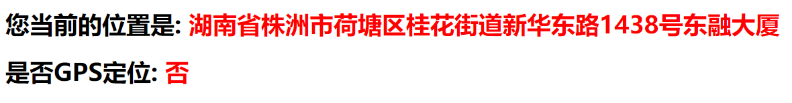

# 课后练习_ajax-day04

## 1. 题号：SHQS_01

**训练目标**：强化对防抖机制和节流阀的理解；

**试题难度**：☆☆☆

**问题**：说说你对节流阀和防抖机制的认识，说说它们应用场景有何不同，能尝试手写出其核心代码吗？

**参考答案**

[01.防抖机制和节流阀对比答案]( /downloads/ajax/day04/02.after_class_material/01.防抖和节流阀对比_答案.zip)


## 2. 题号：CODE_01

### 获取当前所在地址，并显示在网页中。

**训练目标**：掌握如何应用JSONP；

**案例效果**：



**试题难度**：☆

**案例素材**：

[02.JSONP获取当前位置_素材](  /downloads/ajax/day04/02.after_class_material/02.JSONP获取当前位置_素材.zip)

**接口说明**：

- 接口地址: `https://api.asilu.com/geo/`

- 请求方式：JSONP

- 请求参数：无

- 返回值:

  | 属性    | 数据类型 | 说明                               |
  | ------- | -------- | ---------------------------------- |
  | `gps`   | 布尔值   | 是否gps定位,  是:true    否: false |
  | address | 字符串   | 定位地址                           |

- 示例：

  请求：[https://api.asilu.com/geo/?callback=doSomething](https://api.asilu.com/geo/?callback=doSomething)

  返回：

  ```json
  dosomething({
      "status":1,
      "exact":1.6,
      "gps":false,
      "gcj":{"lng":113.174219,"lat":27.85635},
      "bd09":{"lng":113.1806722,"lat":27.8626033},
      "url":"https://cdn.asilu.com/map/#lng=113.174219&lat=27.85635",
      "address":"湖南省株洲市荷塘区桂花街道新华东路1438号东融大厦",
      "ip":"113.222.185.174",
      "cache":1
  })
  ```


**试题难度**：☆
**案例要求**：
1. 页面加载完后自动调用接口，拿到地理位置
2. 把当前地理位置和是否gps定位显示在网页上

**训练提示**：

1. 使用jquery的ajax函数实现
2. 指定 dataType为jsonp

**参考方案**：

**操作步骤**：

1. 定义入口函数。
2. 在入口函数中，发起JSONP请求，拿到响应数据。
3. 利用响应数据渲染页面。

**参考答案**：

[03.JSONP获取当前位置_答案](/downloads/ajax/day04/02.after_class_material/02.JSONP获取当前位置_答案.zip)

```javascript
$(function () {
    $.ajax({
        url: 'https://api.asilu.com/geo/',
        dataType: 'jsonp',
        success: function (res) {
            $("#address").text(res.address);
            $("#gps").text(res.gps ? '是' : '否');
        }
    })
})
```


## 3. 题号：CODE_02

### 封装一个JSONP的函数。

**训练目标**：深刻理解JSONP的原理；

**案例效果**：


**试题难度**：☆☆☆☆

**案例素材**：

[04.封装JSONP函数_素材](/downloads/ajax/day04/02.after_class_material/03.封装JSONP函数_素材.zip)

**案例要求**：

1. 调用的代码已经在`index.html`中已写好, 无需再写。

   ```js
   jsonp({
       url: 'https://api.asilu.com/geo/',
       success: function (res) {
           document.getElementById("address").innerText = res.address;
           var is_gps = res.gps ? '是' : '否';
           document.getElementById("gps").innerText = is_gps;
       }
   })
   ```

2. 需要在`lib.js`中实现一个jsonp的函数

   ```js
   function jsonp(options) {
       // write code here...
   }
   ```
   
3. 使用原生js实现

**训练提示**：

1.  可以参考上课时封装itheima函数的过程来实现。

2.  在深刻理解JSOPN原理的基础上来实现。

3.  通过如下手段可以在函数中定义全局函数。

   ```js
   window['全局函数名'] = function (){}
   ```

**参考方案**：

**操作步骤**：

1. 得到随机函数名如：Function0032206，防止可能产生的函数名冲突。

2. 构造script标签src属性的属性值。

3. 创建用于实际发起请求的script的DOM对象。

4. 声明一个可以全局回调函数，函数名为：Function0032206

   在函数中要做如下几件事情。

   4.1 调用用户在参数中声明的回调函数，完成业务逻辑。

   4.2 完成扫尾工作，移除为了实现jsonp而创建的script的DOM对象，及全局函数。

5. 通过对script标签的src属性进行设置，及把script标签追加到body尾部从而实现真正发起请求。

**参考答案**：

[05.封装JSONP函数_答案](/downloads/ajax/day04/02.after_class_material/03.封装JSONP函数_答案.zip)

```javascript
function jsonp(options) {
    // 1. 得到随机函数名
    // 1.1 获得随机小数后转换成字符串并去掉小数点，得到字符串类似：0032206
    var randomStr = Math.random().toString().replace('.', '');
    // 1.2 拼接回调函数名如：Function0032206
    var globalFunctionName = 'Function' + randomStr;
    
    // 2. 构造src的url地址类似: https://api.asilu.com/geo/?callback=Function0032206
    var url = `${options.url}?callback=${globalFunctionName}`;

    // 3. 创建用于实际发起请求的script的DOM对象
    var scriptDom = document.createElement('script');
    // 4. 声明一个可以全局回调函数，函数名为：Function0032206
    window[globalFunctionName] = function callback(res) {
        // 4. 在发起请求后会回调的函数和执行的代码
        // 4.1 调用用户在参数中声明的回调函数，完成业务逻辑
        options.success(res);
        // 4.2 扫尾工作
        // 4.2.1 移除为了实现jsonp请求而临时创建的script DOM对象
        document.body.removeChild(scriptDom);
        // 4.2.2 移除为了实现jsonp请求而临时创建的全局回调函数
        window[globalFunctionName] = null;
    }
    
	// 5. 真正发起请求
    // 5.1 设置script的src属性
    scriptDom.setAttribute('src', url);
    // 5.2 把scriptDOM对象添加到body尾部
    document.body.appendChild(scriptDom);
}
```


