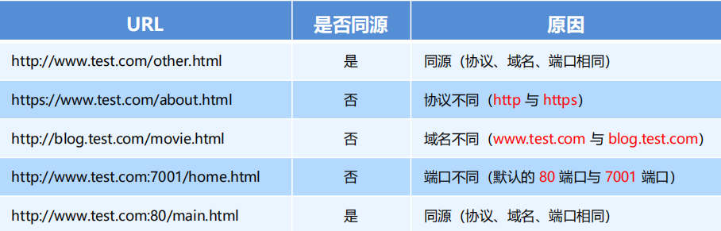
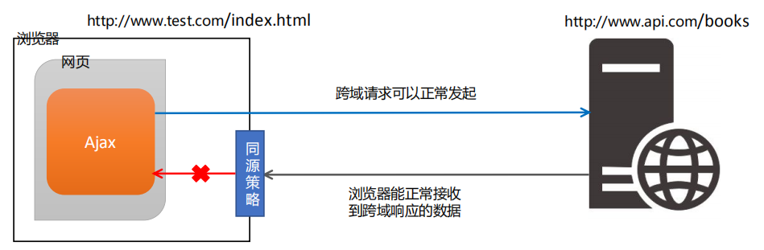
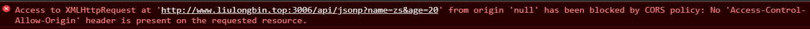
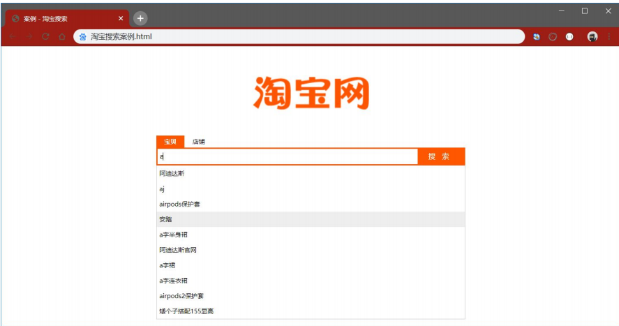
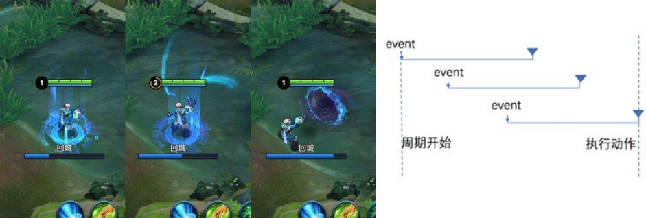
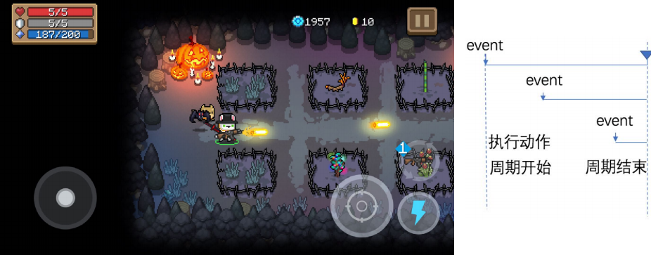
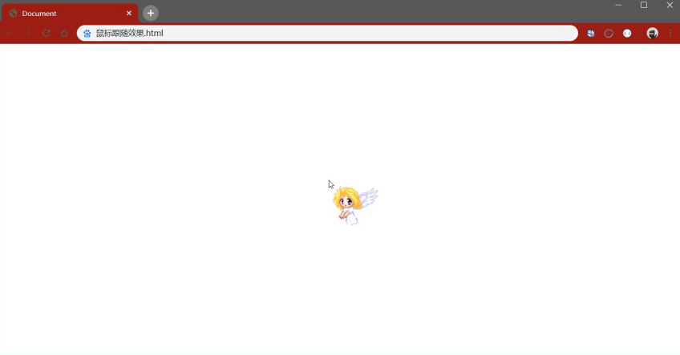

# Ajax第04天-Ajax高级

课程资料下载地址： [Ajax第04天](/downloads/ajax/day04/03.course_material/ajax-day04.zip)

## 能力目标

1. 能够**说出** 如何计算上传进度
2. 能够**说出**利用**jQuery实现文件上传**的思路并通过**代码实现**
3. 能够**说出**什么是axios并**使用**axios**发起**Ajax请求
4. 能够**说出**什么是**同源策略**，什么是**跨域**，为什么会**产生跨域行为**
5. 能够**说出**什么是JSONP并通过代码**解决跨域**问题
6. 能够**说出**JSONP的**实现原理**
7. 能够**说出防抖**和**节流**，通过代码实现实现**防抖和节流案例**

## 1. XHR Level2 的新特性

### ☆1.1 计算文件上传进度

> 第 1 节课 / 07'19''

#### 1.1.1 实现步骤

1. 通过监听 `xhr.upload.onprogress` 事件，可以获取到上传的进度
2. 通过 `e.lengthComputable` 判断是否有可计算的长度
3. 计算进度
   1. 通过 `e.loaded` 获取到已传输的字节
   2. 通过 `e.total` 获取需传输的总字节
   3. 公式： 已传输字节 / 总字节 * 100%

#### 1.1.2 示例代码

```javascript
// 创建 XHR 对象
var xhr = new XMLHttpRequest()
// 监听 xhr.upload 的 onprogress 事件
xhr.upload.onprogress = function(e) {
     // e.lengthComputable 是一个布尔值，表示当前上传的资源是否具有可计算的长度
     if (e.lengthComputable) {
         // e.loaded 已传输的字节
         // e.total 需传输的总字节
         var percentComplete = Math.ceil((e.loaded / e.total) * 100)
     }
 }
```

### 1.2 基于bootstrap绘制进度条效果

> 第 1 节课 / 04'54''

#### 1.2.1 实现步骤

1. 导入需要的库

```html
<link rel="stylesheet" href="./lib/bootstrap.css" />
<script src="./lib/jquery.js"></script>
```

2. 基于`Bootstrap`渲染进度条

```html
 <!-- 进度条 -->
 <div class="progress" style="width: 500px; margin: 10px 0;">
     <div class="progress-bar progress-bar-info progress-barstriped active" id="percent" style="width: 0%">
     0%
     </div>
 </div>
```

### 1.3 动态设置到进度条上

> 第 1 节课 / 02'35''

#### 1.3.1 实现步骤

1. 计算出当前上传进度的百分比
2. 设置进度条的宽度
3. 显示当前的上传进度百分比

#### 1.3.2 示例代码

```javascript
xhr.upload.onprogress = function(e) {
     if (e.lengthComputable) {
         // 1. 计算出当前上传进度的百分比
         var percentComplete = Math.ceil((e.loaded / e.total) * 100)
         $('#percent')
         // 2. 设置进度条的宽度
         .attr('style', 'width:' + percentComplete + '%')
         // 3. 显示当前的上传进度百分比
         .html(percentComplete + '%')
     }
}
```

### 1.4 监听上传完成的事件

> 第 1 节课 / 02'07''

#### 1.4.1 实现步骤

1. 通过 `xhr.upload.onload` 监听上传完成事件
2. 在函数里面 移除上传中的类样式
3. 添加上传完成的类样式

#### 1.4.2 示例代码

```javascript
xhr.upload.onload = function() {
     $('#percent')
     // 移除上传中的类样式
     .removeClass()
     // 添加上传完成的类样式
     .addClass('progress-bar progress-bar-success')
}
```

### ☆1.5 XHR Level2 新特性小结

1. 可以设置 HTTP 请求的时限

   1. 设置超时时间

   ```js
   // 设置 超时时间
   xhr.timeout = 30
   ```

   1. 监听超时的监听

   ```js
   // 设置超时以后的处理函数
   xhr.ontimeout = function () {
     console.log('请求超时了！')
   }
   ```

2. 可以使用 FormData 对象管理表单数据

   1. `FormData` 数据类型，用来管理表单内容的
   2. 初始化`FormData`
      - 如果初始化携带了`Form`表单元素对象的时候，能够快速获取到`Form`表单里面的数据
   3. 追加数据
      - 利用 `append` 方法可以进行添加

3. 上传文件

4. 可以获得数据传输的进度信息

   1. 传输过程的监听 `xhr.upload.onprogress`
      1. `e.lengthComputable` 获取到可计算长度，返回值是`bool`类型
      2. `e.loaded` 获取到已传输的字节
      3. `e.total` 需传输的总字节
   2. 传输完毕的监听 `xhr.upload.onload`

##  ☆2. jQuery高级用法

### 2.1 渲染页面结构并验证是否选择了文件

> 第 1 节课 / 04'14''

#### 2.1.1 实现步骤

1. 定义UI结构

```html
 <!-- 导入 jQuery -->
 <script src="./lib/jquery.js"></script>
 <!-- 文件选择框 -->
 <input type="file" id="file1" />
 <!-- 上传文件按钮 -->
 <button id="btnUpload">上传</button>
```

2. 绑定点击事件
3. 获取到文件域对象里面`files`属性，判断长度是否大于0

```javascript
$('#btnUpload').on('click', function() {
     // 1. 将 jQuery 对象转化为 DOM 对象，并获取选中的文件列表
     var files = $('#file1')[0].files
     // 2. 判断是否选择了文件
     if (files.length <= 0) {
     	return alert('请选择图片后再上传！‘)
     }
})
```

### 2.2 使用jQuery发起上传文件的请求

> 第 1 节课 / 04'46''

#### 2.2.1 实现步骤

1. 定义FormData对象，利用append添加文件对象

```javascript
// 向 FormData 中追加文件
var fd = new FormData()
fd.append('avatar', files[0])
```

2. 利用 `$.ajax()` 发起请求

> 注意：
>
> 1. 设置 `contentType: false`；意思：不修改 `Content-Type` 属性，使用 FormData 默认的 `Content-Type` 值
> 2. 设置 `processData: false`；意思：不对 FormData 中的数据进行 url 编码，而是将 FormData 数据原样发送到服务器

```javascript
$.ajax({
     method: 'POST',
     url: 'http://www.liulongbin.top:3006/api/upload/avatar',
     data: fd,
     // 不修改 Content-Type 属性，使用 FormData 默认的 Content-Type 值
     contentType: false,
     // 不对 FormData 中的数据进行 url 编码，而是将 FormData 数据原样发送到服务器
     processData: false,
     success: function(res) {
     	console.log(res)
     }
})
```

#### 2.2.2「使用jQuery发起上传文件的请求」 练习

> 练习时长：7分钟

1. 练习目标： 利用 jQuery 方式来实现文件上传
2. 素材：
   1. 上传地址：`http://www.liulongbin.top:3006/api/upload/avatar`
   2. 素材下载地址：[01.jQuery方式实现文件上传]( /downloads/ajax/day04/01.class_room_material/01.jQuery方式实现文件上传.zip)
3. 参考步骤：
   1. 是否选择文件判断
      1. 给上传按钮绑定点击事件
      2. 通过 `$('文件域选择器')[0].files` 获取文件列表，判断长度是否大于0
   2. 利用 FormData 封装上传的文件
      1. 初始化 `FormData`
      2. 利用 `append` 方法追加文件对象
   3. 利用 `$.ajax()` 发起请求
      1. 设置 `contentType: false`；不修改 Content-Type 属性，使用 FormData 默认的 Content-Type 值
      2. 设置 `processData: false`；不对 FormData 中的数据进行 url 编码，而是将 FormData 数据原样发送到服务器

### 2.3 通过jQuery实现loading效果

> 第 2 节课 / 05'38''

#### 2.3.1  「通过jQuery实现loading效果」 问题

1. 问题 1：如何监听Ajax请求开始前的函数？可以做什么事情？
2. 问题 2：如何监听Ajax请求结束后的函数？可以做什么事情？

#### 2.3.2  「通过jQuery实现loading效果」 问题

1. 问题 1：如何监听Ajax请求开始前的函数？

   1. `ajaxStart(callback) Ajax` 请求**开始**时，执行 `ajaxStart` 函数。
   2. 可以在 `ajaxStart` 的 `callback` 中显示 loading 效果

   ```js
   // 自 jQuery 版本 1.8 起，该方法只能被附加到文档
   $(document).ajaxStart(function() {
       $('#loading').show()
   })
   ```

   > Tips: **注意：** `$(document).ajaxStart()` 函数**会监听当前文档内所有的 Ajax 请求**。

2. 问题 2：如何监听Ajax请求结束后的函数？

   1. `ajaxStop(callback) Ajax` 请求**结束**时，执行 `ajaxStop` 函数。
   2. 可以在 `ajaxStop` 的 `callback` 中隐藏 loading 效果

   ```js
   // 自 jQuery 版本 1.8 起，该方法只能被附加到文档
   $(document).ajaxStop(function() {
       $('#loading').hide()
   })
   ```

### 2.4 jQuery高级用法-文件上传小结

> 注意事项：
>
> 1. 在调用 `$.ajax()` 方法进行请求的时候需要设置两个属性：
>    1. 设置 `contentType: false`；不修改 Content-Type 属性，使用 FormData 默认的 Content-Type 值
>    2. 设置 `processData: false`；不对 FormData 中的数据进行 url 编码，而是将 FormData 数据原样发送到服务器
> 2. 监听ajax开始和结束的监听
>    1.  `ajaxStart(callback)` 发起ajax请求之前调用
>    2.  `ajaxStop(callback)`  ajax请求结束之后调用

## ☆3. axios

### 3.1 什么是axios

> 第 2 节课 / 01'26''

#### 3.1.1 「什么是axios」 问题

1. 问题 1：axios是什么？好处？

#### 3.1.2 「什么是axios」 答案

1. 问题 1：axios是什么？它的作用？
   1. Axios 是专注于**网络数据请求**的库
   2. 相比于原生的 XMLHttpRequest 对象，axios **简单易用**。相比于 jQuery，axios 更加**轻量化**，只专注于网络数据请求

### 3.2 axios发起GET请求

> 第 2 节课 / 05'38''

#### 3.2.1 实现步骤

1. 导入 axios 文件
2. 调用 axios `get`方法的语法

```javascript
axios.get('url', { params: { /*参数*/ } }).then(callback)
```

#### 3.2.2 示例代码

```javascript
// 请求的 URL 地址
var url = 'http://www.liulongbin.top:3006/api/get'
// 请求的参数对象
var paramsObj = { name: 'zs', age: 20 }
// 调用 axios.get() 发起 GET 请求
axios.get(url, { params: paramsObj }).then(function(res) {
     // res.data 是服务器返回的数据
     var result = res.data
     console.log(res)
})
```

### 3.3 axios发起POST请求

> 第 2 节课 / 03'11

#### 3.3.1 实现步骤

1. 导入 axios 文件
2. 调用 `post` 请求语法

```javascript
axios.post('url', { /*参数*/ }).then(callback)
```

#### 3.3.2 示例代码

```javascript
// 请求的 URL 地址
var url = 'http://www.liulongbin.top:3006/api/post'
// 要提交到服务器的数据
var dataObj = { location: '北京', address: '顺义' }
// 调用 axios.post() 发起 POST 请求
axios.post(url, dataObj).then(function(res) {
     // res.data 是服务器返回的数据
     var result = res.data
     console.log(result)
})
```

### 3.4 直接使用axios发起请求

> 第 2 节课 / 06'57''

#### 3.4.1 实现步骤

1. 导入 axios 文件
2. 调用 `axios()` 方法，类似于 jQuery 中 `$.ajax()` 的函数

```javascript
axios({
 method: '请求类型',
 url: '请求的URL地址',
 data: { /* POST数据 */ },
 params: { /* GET参数 */ }
}).then(callback)
```

#### 3.4.2 示例代码

**发起get请求**

```javascript
document.querySelector('#btn3').addEventListener('click', function () {
      var url = 'http://www.liulongbin.top:3006/api/get'
      var paramsData = { name: '钢铁侠', age: 35 }
      axios({
        method: 'GET',
        url: url,
        params: paramsData
      }).then(function (res) {
        console.log(res.data)
      })
})
```

**发起post请求**

```javascript
document.querySelector('#btn4').addEventListener('click', function () {
  axios({
    method: 'POST',
    url: 'http://www.liulongbin.top:3006/api/post',
    data: {
      name: '娃哈哈',
      age: 18,
      gender: '女'
    }
  }).then(function (res) {
    console.log(res.data)
  })
})
```

#### 3.4.3「直接使用axios发起请求」 练习

> 练习时长：7分钟

1. 练习目标： 利用 axios 方式来进行GET和POST请求
2. 素材：
   1. GET请求地址：`http://www.liulongbin.top:3006/api/get`
   2. POST请求地址：`http://www.liulongbin.top:3006/api/post`
   3. 素材下载地址：[02.axios进行网络请求]( /downloads/ajax/day04/01.class_room_material/02.axios进行网络请求.zip)
3. 参考步骤：
   1. 调用 `axios()` 方法
   2. method 属性设置请求方式
   3. url 设置请求地址
   4. data里面携带参数
   5. 通过 `axios().then(function(*res*){})` 拿到服务器返回的数据

### ☆3.5 axios 小结

1. Axios 是专注于**网络数据请求**的库

   好处：相比于原生的 XMLHttpRequest 对象，axios **简单易用**。相比于 jQuery，axios 更加**轻量化**，只专注于网络数据请求

2. Axios 的 `GET` 请求

   语法：

   ```js
   axios.get('url', { params: { /*参数*/ } }).then(callback)
   ```

3. Axios 的 `POST` 请求

   语法：

   ```js
   axios.post('url', { /*参数*/ }).then(callback)
   ```

4. Axios 的 `axios` 请求

   语法：

   ```js
   axios({
    method: '请求类型',
    url: '请求的URL地址',
    data: { /* POST数据 */ },
    params: { /* GET参数 */ }
   }).then(callback)
   ```

## ☆4. 同源&跨域

### 4.1 什么是同源

> 第 2 节课 / 04'42''

#### 4.1.1 「什么是同源」 问题

1. 问题1：同源需要哪三个部分相同才是同源？

#### 4.1.2 「什么是同源」 答案

1. 问题1：同源需要哪三个部分相同才是同源？

   - 如果两个页面的协议，域名和端口都相同，则两个页面具有**相同的源**。

   - 例如，下表给出了相对于 http://www.test.com/index.html 页面的同源检测：



### 4.2 什么是同源策略

> 第 1 节课 / 02'33''

#### 4.2.1 「什么是同源策略」问题

1. 问题1： 同源策略指的是？

#### 4.2.2 「什么是同源策略」答案

1. **同源策略**（英文全称 Same origin policy）是**浏览器**提供的一个**安全功能**;

2. **`MDN` 官方给定的概念**：同源策略限制了从同一个源加载的文档或脚本如何与来自另一个源的资源进行交互。这是一个用于隔离潜在恶意文件的重要安全机制。通俗的理解：浏览器规定，A 网站的 JavaScript，不允许和非同源的网站 C 之间，进行资源的交互，例如：

   ① 无法读取非同源网页的 `Cookie`、`LocalStorage` 和 `IndexedDB`

   ② 无法接触非同源网页的 `DOM`

   ③ 无法向非同源地址发送 `Ajax` 请求

3. **思考**：那么`后台服务器`请求或者是`移动APP`请求会有同源策略限制吗？

### 4.3 什么是跨域

> 第 3 节课 / 02'02''

#### 4.3.1 「什么是跨域」问题

1. 问题 1：什么是跨域？
2. 问题 2：出现跨域的原因？

#### 4.3.2 「什么是跨域」答案

1. 问题 1：什么是跨域？ 

   **同源**指的是两个 URL 的协议、域名、端口一致，反之，则是**跨域**

2. 问题 2：出现跨域的原因？
   1. 出现跨域的根本原因：**浏览器的同源策略**不允许非同源的 URL 之间进行资源的交互
   2. 网页：`http://www.test.com/index.html`
   3. 接口：`http://www.api.com/userlist`

### 4.4 浏览器对跨域请求的拦截

> 第 3 节课 / 02'21''

#### 4.4.1 「浏览器对跨域请求的拦截」问题

1. 问题 1：如果请求跨域了，那么这个请求到达服务器了吗？如果到达了，那么浏览器在什么时候进行的拦截？

#### 4.4.2 「浏览器对跨域请求的拦截」答案

1. 问题 1：如果请求跨域了，那么这个请求到达服务器了吗？如果到达了，那么浏览器在什么时候进行的拦截？

   浏览器允许发起跨域请求，也就是说**请求真实到达了服务器**，但是，跨域请求回来的数据，会被浏览器拦截，无法被页面获取到！



### 4.5 如何实现跨域数据请求

> 第 3 节课 / 03'03''

#### 4.5.1 「如何实现跨域数据请求」问题

1. 问题 1：常见的解决跨域问题的方案有几种？
2. 问题 2：分别有什么特点？

#### 4.5.2 「如何实现跨域数据请求」答案

1. 问题 1：常见的解决跨域问题的方案有几种？

   现如今，实现跨域数据请求，最主要的**两种**解决方案，分别是 `JSONP` 和 `CORS`。

2. 问题 2：分别有什么特点？
   1. **`JSONP`**：出现的早，**兼容性好**（兼容低版本IE）。是前端程序员为了解决跨域问题，被迫想出来的一种临时解决方案。**缺点**是只支持 `GET` 请求，**不**支持 `POST` 请求。
   2. **`CORS`：**出现的较**晚**，它是 `W3C` 标准，属于跨域 `Ajax` 请求的**根本解决方案**。支持 `GET` 和 `POST` 请求。**缺点**是不兼容某些低版本的浏览器

### ☆4.6 同源策略&跨域小结

1. 同源策略：是浏览器的安全防范功能，如果两个页面的**协议**，**域名**和**端口**都**相同**，那么就是同源

2. 跨域： 非同源，产生原因就是因为浏览器的同源策略，如果非同源的`url`需要交互，就需要**解决跨域问题**

3. 跨域解决方式：

    ① `JSONP` 

    ② `CORS`

## 5.`JSONP`

### ☆5.1 了解`JSONP`的概念以及实现原理

> 第 3 节课 / 01'27''

#### 5.1.1 「了解`JSPNP`的概念以及实现原理」问题

1. 问题 1：什么是`JSONP`？
2. 问题 2：`JSONP`实现原理是怎样的？

#### 5.1.2 「了解`JSPNP`的概念以及实现原理」答案

1. 问题 1：什么是`JSONP`？

   `JSONP` (`JSON with Padding`) 是 `JSON` 的一种“使用模式”，可用于解决主流浏览器的跨域数据访问的问题。

2. 问题 2：`JSONP`实现原理是怎样的？
   1. 由于浏览器**同源策略**的限制，网页中无法通过 Ajax 请求非同源的接口数据。但是 `<script>` 标签不受浏览器同源策略的影响，可以通过 `src` 属性，请求非同源的 `js` 脚本。
   2. `JSONP` 的**实现原理**，就是通过 `<script>` 标签的 `src` 属性，请求跨域的数据接口，并通过**函数调用**的形式，接收跨域接口响应回来的数据

### 5.2 演示跨域Ajax数据请求存在的问题

> 第 3 节课 / 03'12''

#### 5.2.1 「演示跨域Ajax数据请求存在的问题」问题

1. 问题 1：如果出现跨域请求，浏览器会报什么错误？

#### 5.2.2 「演示跨域Ajax数据请求存在的问题」答案

1. 问题 1：如果出现跨域请求，浏览器会报什么错误？

> `Access to XMLHttpRequest at 'http://www.liulongbin.top:3006/api/jsonp?name=zs&age=20' from origin 'null' has been blocked by CORS policy: No 'Access-Control-Allow-Origin' header is present on the requested resource.`



### 5.3 剖析`JSONP`实现原理-1

> 第 3 节课 / 02'39''

#### 5.3.1 「剖析`JSONP`实现原理-1」问题

1. 问题 1：函数定义和调用分别在两个script标签中能否正常运行？

#### 5.3.2 「剖析`JSONP`实现原理-1」答案

1. 问题 1：函数定义和调用分别在两个script标签中能否正常运行？

   可以正常运行的，虽然在不同的script标签中，但是`JS`引擎解析完之后同属于一个作用域

### 5.4 剖析`JSONP`实现原理-2

> 第 3 节课 / 03'19''

#### 5.4.1 「剖析`JSONP`实现原理-2」问题

1. 问题 1：如果把函数定义抽取到一个`js`文件中，还能正常调用吗？

#### 5.4.2 「剖析`JSONP`实现原理-2」答案

1. 问题 1：如果把函数定义抽取到一个`js`文件中，还能正常调用吗？

   可以正常调用，虽然单独定义在一个`js`文件中，只要我们在页面引入了，浏览器在解析的时候，会把这个`js`文件里面的内容放在当前作用域中

### 5.5 剖析`JSONP`实现原理-3

> 第 3 节课 / 04'02''

#### 5.5.1 「剖析`JSONP`实现原理-3」问题

1. 问题 1：为什么通过callback指定回调函数名称就能调用函数？

#### 5.5.2 「剖析`JSONP`实现原理-3」答案

1. 问题 1：为什么通过callback指定回调函数名称就能调用函数？
   1. 发送请求的时候，通过callback请求参数，把我们定义的函数名称传递给了后台服务器：例如`http://xxx.xxx.xxx/api?callback=success`
   2. 后台接收到这个参数之后，会返回函数调用的语法给浏览器：例如 `success()`
   3. 最终返回的结果会被浏览器解析执行，从而调用了我们定义的函数

### 5.6 自己实现一个简单的`JSONP`

> 第 3 节课 / 03'59''

#### 5.6.1 「自己实现一个简单的`JSONP`」问题

1. 问题 1：实现简单`JSONP`需要几个步骤？分别做了什么事情？

#### 5.6.2 「自己实现一个简单的`JSONP`」答案

1. 问题 1：实现简单`JSONP`需要几个步骤？分别做了什么事情？

   1. 一共需要两步

   2. 第一步

      定义一个`success`回调函数：

```html
 <script>
     function success(data) {
     console.log('获取到了data数据：')
     console.log(data)
     }
 </script>
```

   3. 第二步
   
      通过 `<script>` 标签，请求接口数据：

```html
<script src="http://ajax.frontend.itheima.net:3006/api/jsonp?callback=success&name=zs&a
ge=20"></script>
```

### 5.7 `JSONP`的缺点

> 第 3 节课 / 02'11''

#### 5.7.1 「`JSONP`的缺点」问题

1. 问题 1：`JSONP` 有什么缺点？
2. 问题 2： `JSONP` 跟 `ajax` 有什么关系吗？为什么？

#### 5.7.2 「`JSONP`的缺点」答案

1. 问题 1：`JSONP` 有什么缺点？

   由于 `JSONP` 是通过 `<script>` 标签的 `src` 属性，来实现跨域数据获取的，所以，`JSONP` **只**支持 `GET` 数据请求，**不**支持 POST 请求。

2. 问题 2：  `JSONP` 跟 `ajax` 有什么关系吗？为什么？

   `JSONP` 和 Ajax 之间**没有任何关系**，不能把 `JSONP` 请求数据的方式叫做 Ajax，因为 `JSONP` 没有用到`XMLHttpRequest` 这个对象

### ☆5.8  使用`jQuery`发起`JSONP`数据请求

> 第 3 节课 / 06'30''

#### 5.8.1 「使用`jQuery`发起`JSONP`数据请求」问题

1. 问题 1： 利用`jQuery`方式发送 `JSONP` 请求需要设置什么属性？
2. 问题 2： 默认情况下，`jQuery` 方式发送 `JSONP` 会携带什么参数？

#### 5.8.2 「使用`jQuery`发起`JSONP`数据请求」答案

1. 问题 1： 利用`jQuery`方式发送 `JSONP` 请求需要设置什么属性？

   需要在 `$.ajax()`函数的**参数对象**里面添加 `dataType`的属性，值是 `jsonp`

   例子:

```javascript
$.ajax({
     url: 'http://ajax.frontend.itheima.net:3006/api/jsonp?name=zs&age=20',
     // 如果要使用 $.ajax() 发起 JSONP 请求，必须指定 datatype 为 jsonp
     dataType: 'jsonp',
     success: function(res) {
     console.log(res)
     }
})
```

2. 问题 2： 默认情况下，`jQuery` 方式发送 `JSONP` 会携带什么参数？

   默认情况下，会自动携带一个 `callback=jQueryxxx` 的参数，`jQueryxxx` 是随机生成的一个回调函数名称

#### 5.8.2 「使用`jQuery`发起`JSONP`数据请求」练习

> 练习时长：7分钟

1. 练习目标： 自己利用`jQuery`方式发起一个`JSONP`请求，在浏览器打印返回数据
2. 素材：
   1. 请求的地址：`http://ajax.frontend.itheima.net:3006/api/jsonp?name=zs&age=20`
   2. 素材下载地址：[03.jQuery发起jsonp请求]( /downloads/ajax/day04/01.class_room_material/03.jQuery发起jsonp请求.zip)
3. 参考步骤：
   1. 调用 `$.ajax()` 函数，在参数对象里面添加 `dataType`属性，属性的值是 `jsonp`
   2. 在成功回调 `success` 函数里面接收服务器返回数据，并且进行打印

### 5.9 自定义参数及回调函数名称

> 第 4 节课 / 03'21''

#### 5.9.1 「自定义参数及回调函数名称」问题

1. 问题 1：设置什么属性来自定义请求参数名称？
2. 问题 2：设置什么属性来自定义回调函数名称？

#### 5.9.2 「自定义参数及回调函数名称」答案

1. 问题 1：设置什么属性来自定义请求参数名称？

   通过设置 `jsonp` 属性来自定义请求参数名称

2. 问题 2：设置什么属性来自定义回调函数名称？

   通过设置 `jsonpCallback` 属性来设置自定义回调函数名称

**示例代码：**

```javascript
$.ajax({
     url: 'http://ajax.frontend.itheima.net:3006/api/jsonp?name=zs&age=20',
     dataType: 'jsonp',
     // 发送到服务端的参数名称，默认值为 callback
     jsonp: 'callback',
     // 自定义的回调函数名称，默认值为 jQueryxxx 格式
     jsonpCallback: 'abc',
     success: function(res) {
     console.log(res)
     }
})
```

###  5.10 `jQuery`中`JSONP`的实现过程

> 第 4 节课 / 04'58''

#### 5.10.1 「`jQuery`中`JSONP`的实现过程」问题

1. 问题 1：`jQuery`方式发送`JSONP`请求是发起了`Ajax`请求吗？
2. 问题 2：`jQuery`方式发送`JSONP`是否和之前自己实现简单`JSONP`原理一致？
3. 问题 3： `jQuery` 方式发送 `JSONP` 原理是怎样的？

#### 5.10.2 「`jQuery`中`JSONP`的实现过程」答案

1. 问题 1：`jQuery`方式发送`JSONP`请求是发起了`Ajax`请求吗？

   不是发起的`Ajax`请求

2. 问题 2：`jQuery`方式发送`JSONP`是否和之前自己实现简单`JSONP`原理一致？

   **是一致的**；`jQuery` 中的 `JSONP`，也是通过 `<script>` 标签的 `src` 属性实现跨域数据访问的，只不过，`jQuery` 采用的是**动态创建和移除标签**的方式，来发起 `JSONP` 数据请求。

3. 问题 3： `jQuery` 方式发送 `JSONP` 原理是怎样的？
   1. 在发起 `JSONP` 请求的时候，动态向 `<header>` 中 `append` 一个 `<script>` 标签；
   2. 在 `JSONP` 请求成功以后，动态从 `<header>` 中移除刚才 `append` 进去的 `<script>` 标签；

### ☆5.11 `JSONP` 小结

1. `JSONP` 实现原理就是通过 `script` 标签的 `src` 属性来实现，在地址的后面传递回调函数的名称；

2. `JSONP`特点：只支持 `GET` 请求，不支持 `POST` 请求

3. 自己实现一个简单的`JSONP`

   1. 定义一个函数，例如：函数名称叫做 `success`

   2. 页面上定义`script`标签，设置`src`属性

      ```html
      <script src="http://xxx.xxx.xxx/api/callback=success"></script>
      ```

   3. 在success函数里面通过形参接收服务器返回的数据

4. `jQuery`中发起`JSONP`请求

   1. 调用`jQuery`的`ajax`方法

   2. 设置 `dataType` 的属性

   3. 在success回调函数里面获取服务器返回数据

      ```js
      $.ajax({
         url:'',
         dataType: 'jsonp'
         success:function(res){...}
      })
      ```

5. `jQuery`发起`JSONP`原理：

   1. 在发起 `JSONP` 请求的时候，动态向 `<header>` 中 `append` 一个 `<script>` 标签；
   2. 在 `JSONP` 请求成功以后，动态从 `<header>` 中移除刚才 `append` 进去的 `<script>` 标签；

## 6. 案例 **–** 淘宝搜索

### 6.1 介绍案例效果

> 第 4 节课 / 02'23''

#### 6.1.1 案例目标

1. 真实开发中搜索建议列表模块的实现思路
2. 利用`JSONP`解决跨域问题
3. 为防抖优化处理做铺垫



### ☆6.2 获取用户输入的搜索关键词

> 第 4 节课 / 04'19''

#### 6.2.1 监听文本框 `keyup` 事件

```js
// 监听文本框的 keyup 事件
$('#ipt').on('keyup', function() {...}
```

#### 6.2.2 获取用户输入的内容

```js
// 获取用户输入的内容
var keywords = $(this).val().trim()
```

#### 6.2.3 判断内容是否为空

```js
...
 // 判断用户输入的内容是否为空
if (keywords.length <= 0) {
   return
}
```

#### 6.2.4 示例代码如下

```javascript
// 监听文本框的 keyup 事件
$('#ipt').on('keyup', function() {
     // 获取用户输入的内容
     var keywords = $(this).val().trim()
     // 判断用户输入的内容是否为空
     if (keywords.length <= 0) {
     return
     }
     // TODO：获取搜索建议列表
})
```

### ☆6.3 封装`getSuggestList`函数

> 第 4 节课 / 03'20''

#### 6.3.1 定义一个函数，名称叫做 `getSuggestList`

```js
// 接收一个参数，搜索关键字
function getSuggestList(kw){
}
```

#### 6.3.2 调用 `$.ajax()` 函数发送请求

```js
// 设置必要请求的属性 url 和 success
$.ajax({
   // 指定请求的 URL 地址，其中，q 是用户输入的关键字
   url: 'https://suggest.taobao.com/sug?q='+kw,\
   // 成功的回调函数
   success: function(res){console.log(res)}
})
```

#### 6.3.3 设置`dataType`属性，解决跨域问题

```js
$.ajax({
  // 指定请求的 URL 地址，其中，q 是用户输入的关键字
  url: 'https://suggest.taobao.com/sug?q=' + kw,
  // 指定要发起的是 JSONP 请求
  dataType: 'jsonp',
  // 成功的回调函数
  success: function(res) { console.log(res) }
})
```

#### 6.3.4 在`keyup`事件函数里面调用

```js
// 监听文本框的 keyup 事件
$('#ipt').on('keyup', function() {
     // 获取用户输入的内容
     var keywords = 获取输入内容;
     ...
     // TODO：获取搜索建议列表
     getSuggestList(keywords)
})
```

#### 6.3.5 示例代码如下

```javascript
function getSuggestList(kw) {
     $.ajax({
     // 指定请求的 URL 地址，其中，q 是用户输入的关键字
     url: 'https://suggest.taobao.com/sug?q=' + kw,
     // 指定要发起的是 JSONP 请求
     dataType: 'jsonp',
     // 成功的回调函数
     success: function(res) { console.log(res) }
     })
 }
```

#### 6.3.6 「封装`getSuggestList`函数」练习

> 练习时长：7分钟

1. 练习目标：根据用户在输入框输入的内容获取搜索建议列表数据

2. 素材：

   1. 素材下载地址：[04.淘宝搜索案例]( /downloads/ajax/day04/01.class_room_material/04.淘宝搜索案例.zip)

3. 参考步骤：

   1. 获取输入框元素对象，绑定`keyup`事件

   2. 在事件处理函数里面，通过 $(this).val().trim() 获取输入内容，进行非空判断

   3. 定义`getSuggestList`函数，接收查询关键字参数

   4. 调用 `$.ajax()` 发起 `JSONP`的请求，在`success`成功回调里面打印返回数据

      请求路径: `https://suggest.taobao.com/sug?q=搜索关键字`

### 6.4 在页面中定义搜索建议列表

> 第 4 节课 / 01'26''

#### 6.4.1 在搜索区域下面定义盒子，存放搜索建议列表

```html
 <div class="box">
     <!-- tab 栏区域 -->
     <div class="tabs"></div>
     <!-- 搜索区域 -->
     <div class="search-box"></div>
     <!-- 搜索建议列表 -->
     <div id="suggest-list"></div>
 </div>
```

### ☆6.5 定义模板结构

> 第 4 节课 / 04'47''

#### 6.5.1 创建 `script` 标签，设置相应属性

```html
<!-- 设置type属性，设置模板id -->
<script type="text/html" id="tpl-suggestList"></script>
```

#### 6.5.2 利用模板语法 `each` 遍历结构

```html
{{each result}}
<div class="suggest-item">{{$value[0]}}</div>
{{/each}}
```

#### 6.5.3 示例代码

```html
<!-- 模板结构 -->
<script type="text/html" id="tpl-suggestList">
     {{each result}}
     <div class="suggest-item">{{$value[0]}}</div>
     {{/each}}
</script>
```

### ☆6.6 定义渲染模板结构的函数

> 第 4 节课 / 03'18''

#### 6.6.1 定义函数，接收服务器返回的数据

```js
// 渲染建议列表
function renderSuggestList(res) {...}
```

#### 6.6.2 判断返回数据是否为空

```js
// 如果没有需要渲染的数据，则直接 return，并且清空列表，进行隐藏
if (res.result.length <= 0) {
   return $('#suggest-list').empty().hide()
}
```

#### 6.6.3 调用模板 `template` 函数，传入`id`和渲染的数据

```js
// 渲染模板结构
var htmlStr = template('tpl-suggestList', res)
```

#### 6.6.4 渲染到容器中

```js
$('#suggest-list').html(htmlStr).show()
```

#### 6.6.5 示例代码

```javascript
 // 渲染建议列表
function renderSuggestList(res) {
     // 如果没有需要渲染的数据，则直接 return
     if (res.result.length <= 0) {
     return $('#suggest-list').empty().hide()
     }
     // 渲染模板结构
     var htmlStr = template('tpl-suggestList', res)
     $('#suggest-list').html(htmlStr).show()
}
```

#### 6.6.6「定义渲染模板结构的函数」 练习

> 练习时长：7分钟

1. 练习目标： 根据服务器返回的数据，渲染UI结构

2. 素材：

   1. 素材下载地址：[05.淘宝搜索案例-渲染模板数据]( /downloads/ajax/day04/01.class_room_material/05.淘宝搜索案例-渲染模板数据.zip)

3. 参考步骤：

   1. 定义函数，接收服务器返回的数据 `renderSuggestList`

   2. 判断返回数据是否为空

   3. 定义好模板结构

   4. 调用模板 template 函数，传入id和渲染的数据

   5. 渲染到容器中

### 6.7 搜索关键词为空时隐藏搜索建议列表

> 第 5 节课 / 02'04''

#### 6.7.1 在`keyup`事件里面进行非空判断

```javascript
$('#ipt').on('keyup', function() {
     // 获取用户输入的内容
     var keywords = $(this).val().trim()
     // 判断用户输入的内容是否为空
     if (keywords.length <= 0) {
     // 如果关键词为空，则清空后隐藏搜索建议列表
     return $('#suggest-list').empty().hide()
     }
     getSuggestList(keywords)
})
```

### 6.8. 美化搜索建议列表

> 第 5 节课 / 02'47''

#### 6.8.1 给 `suggest-list` 和 `suggest-item` 绑定样式

```css
#suggest-list {
  border: 1px solid #ccc;
  display: none;
}

.suggest-item {
  line-height: 30px;
  padding-left: 5px;
}

.suggest-item:hover {
  cursor: pointer;
  background-color: #eee;
}
```

### ☆6.9 淘宝搜索栏案例小结

1. 获取用户输入搜索关键字：
   1.  绑定`keyup`事件；
   2.  获取输入内容，进行非空判断
2. 封装 `getSuggestList` 函数
   1. 定义函数，在函数内部调用 `$.ajax()` 发起`JsonP`的请求，在`success`函数里面获取服务器返回数据
   2. 定义好函数之后，在`keyup`事件里面进行调用，传递用户输入的搜索关键字
3.  在页面中定义模板结构
4.  获取到服务器数据之后，调用 `template` 方法，生成模板字符串
5.  渲染到页面中

## 7. 防抖&节流

### ☆7.1 什么是防抖

> 第 5 节课 / 04'10''

#### 7.1.1 「什么是防抖」问题

1. 问题 1：什么是防抖？
2. 问题 2：防抖好处？

#### 7.1.2 「什么是防抖」答案

1. 问题 1：什么是防抖？

   **防抖策略**（`debounce`）是当事件被触发后，延迟 `n` 秒后再执行回调，如果在这 `n` 秒内事件又被触发，则重新计时。

   

2. 问题 2：防抖好处?

   能够保证用户在**频繁触发**某些事件的时候，**不会频繁**的执行回调，**只会被执行一次**

### ☆7.2 防抖的应用场景

> 第 5 节课 / 02'28''

#### 7.2.1 「防抖的应用场景」问题

1. 问题 1：防抖的应用场景？

#### 7.2.2 「防抖的应用场景」答案

1. 问题 1：防抖的应用场景？

   用户在输入框中连续输入一串字符时，可以通过防抖策略，只在输入完后，才执行查询的请求，这样可以有效减少请求次数，节约请求资源；

### ☆7.3 实现输入框的防抖

> 第 5 节课 / 04'59''

> 核心思路： 利用定时器来实现防抖优化，把请求放在定时器中，每次触发请求的时候把上一次定时器移除掉

#### 7.3.1 定义防抖的timer

```js
var timer = null // 1. 防抖动的 timer
```

#### 7.3.2 定义防抖的函数

```js
function debounceSearch(keywords) { // 2. 定义防抖的函数
     // 开启定时器，在定时器里面调用请求函数
     timer = setTimeout(function() {
     // 发起 JSONP 请求
     getSuggestList(keywords)
     }, 500)
}
```

#### 7.3.3 `keyup`事件中，先清空定时器，再调用防抖函数

```js
$('#ipt').on('keyup', function() { // 3. 在触发 keyup 事件时，立即清空 timer
 clearTimeout(timer)
 // ...省略其他代码
 debounceSearch(keywords)
})
```

#### 7.3.4 「输入框防抖」练习

> 练习时长：7分钟

1. 练习目标：运用开始所学，给淘宝搜索框案例添加防抖效果
2. 素材：
   1. 素材下载地址：[06.淘宝案例-防抖处理]( /downloads/ajax/day04/01.class_room_material/06.淘宝案例-防抖处理.zip)
3. 参考步骤：
   1. 定义防抖的 timer
   2. 定义防抖的函数，在函数里面开启定时器，请求函数在定时器里面进行调用
   3. `keyup`事件里面，先利用 `clearTimeout`清除定时器，然后调用防抖函数

### ☆7.4 缓存搜索的建议列表

> 第 5 节课 / 06'46''

> 优化处理，避免多次重复请求，减轻服务器压力

##### 7.4.1 定义全局缓存对象

```javascript
 // 缓存对象
 var cacheObj = {}
```

##### 7.4.2 将搜索结果保存到缓存对象中

- 键就是用户输入的关键字，值就是服务器返回的value

```javascript
// 渲染建议列表
function renderSuggestList(res) {
     // ...省略其他代码
     // 将搜索的结果，添加到缓存对象中
     var k = $('#ipt').val().trim()
     cacheObj[k] = res
}
```

##### 7.4.3 优先从缓存中获取搜索建议

- 在发起请求之前，先判断缓存中是否有数据

```javascript
// 监听文本框的 keyup 事件
$('#ipt').on('keyup', function() {
     // ...省略其他代码
     // 优先从缓存中获取搜索建议
     if (cacheObj[keywords]) {
     return renderSuggestList(cacheObj[keywords])
     }
     // 获取搜索建议列表
     debounceSearch(keywords)
 })
```

### ☆7.5 什么是节流

> 第 6 节课 / 02'27''

#### 7.5.1 「什么是节流」问题

1. 问题 1：对比防抖，节流有什么不同？

#### 7.5.2 「什么是节流」答案

1. 问题 1：对比防抖，节流有什么不同？

   - **节流策略**（`throttle`），顾名思义，可以减少一段时间内事件的触发频率。

   - **节流**是单位时间内**触发第一次**任务，后面任务都不会触发；**防抖**是**触发最新**的任务，一旦后面有任务就会把前面的**忽略**

   

### ☆7.6 节流的应用场景

> 第 6 节课 / 01'15''

#### 7.6.1 「节流的应用场景」问题

1. 问题 1：节流应用场景有哪些？

#### 7.6.2 「节流的应用场景」答案

1. 问题 1：节流应用场景有哪些？
   1. 鼠标连续不断地触发某事件（如点击），只在单位时间内只触发一次；
   2. 懒加载时要监听计算滚动条的位置，但不必每次滑动都触发，可以降低计算的频率，而不必去浪费 CPU 资源；

### 7.7 节流案例 **–** 渲染`UI`效果

> 第 6 节课 / 01'15''



##### 7.7.1 渲染`UI`结构并美化样式

```html
<!-- UI 结构 -->

/* CSS 样式 */
html, body {
 margin: 0;
 padding: 0;
 overflow: hidden; }
#angel {
 position: absolute; }
```

### 7.8 不使用节流时实现鼠标跟随效果

> 第 6 节课 / 03'58''

#### 7.8.1 获取图片元素

```js
// 获取图片元素
var angel = $('#angel')
```

#### 7.8.2 注册 `mousemove`事件

```js
// 监听文档的 mousemove 事件
$(document).on('mousemove', function(e) {...}
```

#### 7.8.3 设置图片的位置

```js
// 设置图片的位置
$(angel).css('left', e.pageX + 'px').css('top', e.pageY + 'px')
```

#### 7.8.4 示例代码

```javascript
$(function() {
     // 获取图片元素
     var angel = $('#angel')
     // 监听文档的 mousemove 事件
     $(document).on('mousemove', function(e) {
     // 设置图片的位置
     $(angel).css('left', e.pageX + 'px').css('top', e.pageY + 'px')
     })
})
```

### 7.9 节流阀的概念

> 第 6 节课 / 03'25''

1. 举例😝
   - 高铁卫生间是否被占用，由红绿灯控制，红灯表示被占用，绿灯表示可使用。
   - 假设每个人上卫生间都需要花费5分钟，则五分钟之内，被占用的卫生间无法被其他人使用。
   - 上一个人使用完毕后，需要将红灯**重置**为绿灯，表示下一个人可以使用卫生间。
   - 下一个人在上卫生间之前，需要**先判断控制灯**是否为绿色，来知晓能否上卫生间。
2. 实现思路
   - 节流阀为空，表示可以执行下次操作；不为空，表示不能执行下次操作。
   - 当前操作执行完，必须将节流阀**重置**为空，表示可以执行下次操作了。
   - 每次执行操作前，必须**先判断节流阀是否为空**。

### 7.10 使用节流优化鼠标跟随效果

> 第 6 节课 / 05'30''

#### 7.10.1 预定义一个 timer **节流阀**

```js
var timer = null // 1.预定义一个 timer 节流阀
```

#### 7.10.2 开启定时器

- 把图片移动的代码放在定时器中，设置延迟时间
- 在图片移动代码后面把 `timer` 置空，方便下次开启

```js
timer = setTimeout(function() {
     $(angel).css('left', e.pageX + 'px').css('top', e.pageY + 'px')
     timer = null // 2.当设置了鼠标跟随效果后，清空 timer 节流阀，方便下次开启延时器
}, 16)
```

#### 7.10.3 执行事件的时候判断**节流阀**是否为空

```js
$(function() {
   ...
   $(document).on('mousemove', function(e) {
     if (timer) { return } // 3.判断节流阀是否为空，如果不为空，则证明距离上次执行间隔不足16毫秒
     timer = setTimeout(function() {
       ...
     }, 16)
   })
})
```

#### 7.10.4 示例代码

```javascript
$(function() {
   var angel = $('#angel')
   var timer = null // 1.预定义一个 timer 节流阀
   $(document).on('mousemove', function(e) {
     if (timer) { return } // 3.判断节流阀是否为空，如果不为空，则证明距离上次执行间隔不足16毫秒
     timer = setTimeout(function() {
       $(angel).css('left', e.pageX + 'px').css('top', e.pageY + 'px')
       timer = null // 2.当设置了鼠标跟随效果后，清空 timer 节流阀，方便下次开启延时器
     }, 16)
   })
})
```

#### 7.10.5 「节流阀案例」练习

> 练习时长：7分钟

1. 练习目标：利用节流阀来优化案例效果
2. 素材：[07.跟随鼠标的天使]( /downloads/ajax/day04/01.class_room_material/07.跟随鼠标的天使.zip) 
3. 参考步骤
   1. 定义一个 `timer` 节流阀
   2. 开启定时器，把设置图片移动的代码放在定时器里面，同时把`timer`置空
   3. 开启定时器之前，先判断`timer`是否为空，如果不为空 `return` 回去

### ☆7.11 总结防抖和节流的区别

> 第 6 节课 / 00'54''

- **防抖**：如果事件被频繁触发，防抖能保证只有最有一次触发生效！前面 N 多次的触发都会被忽略！
- **节流**：如果事件被频繁触发，节流能够减少事件触发的频率，因此，节流是有选择性地执行一部分事件！

## 8. 课后练习

[课后练习(共三道题)]( ./day04-afterclass.md)

