# Git第01天-Git基础

课程资料下载地址： [Git第01天](/downloads/git/day01/03.course_material/git-day01.zip)

## 能力目标

- 能够**说出**版本控制软件好处以及版本控制系统的分类
- 能够**说出**Git的工作流程以及Git中三种状态
- 能够**安装下载**Git并且能够打开Git命令行用**命令配置**用户信息
- 能够**说出**Git提交的流程并且通过**命令**把文件**提交**到Git仓库
- 能够**说出**Git更新的流程并且通过**命令**把**更新后**的文件**提交**到Git仓库
- 能够**说出**Git忽略清单的作用并且能够**配置**简易的gitignore文件
- 能够**使用命令**查看git的log日志并且**通过命令**跳到指定版本
- 能够在GitHub上面**创建仓库**并且利用HTTPS的方式把**本地仓库推送到远程仓库**

## 1. 关于版本控制概念

### 1.1 使用版本控制软件的好处

> 第 1 节课 / 05'39''

#### 1.1.1「使用版本控制软件的好处」问题

1. 问题 1：理解什么是文件的版本？有什么弊端？
2. 问题 2：什么是版本控制软件？
3. 问题 3：使用版本控制软件好处？

#### 1.1.2「使用版本控制软件的好处」答案

1. 问题 1：理解什么是文件的版本？有什么弊端

   1. 回忆一下大学写毕业论文的时候，每次修改都会备份之前的内容，然后进行修改，这个过程就是版本的迭代过程；而每次备份的文件为了区分，都会给它取一个名字用来标识，这个名字就是版本号
   2. 弊端：操作麻烦，命名不规范，容易丢失，协作困难

   

2. 问题 2：什么是版本控制软件？

   1. **版本控制软件**是一个用来记录文件变化，以便将来查阅特定；版本修订情况的系统，因此有时也叫做“**版本控制系统**”
   2. 把**手工管理**文件版本的方式，改为由**软件管理**文件的版本；这个**负责管理文件版本的软件**，叫做“版本控制软件”

3. 问题 3：使用版本控制软件好处？

   1. **操作简便**：只需**识记几组简单的终端命令**，即可快速上手常见的版本控制软件
   2. **易于对比**：基于版本控制软件提供的功能，能够方便地比较文件的变化细节，从而查找出导致问题的原因
   3. **易于回溯**：可以将选定的文件回溯到之前的状态，甚至将整个项目都回退到过去某个时间点的状态
   4. **不易丢失**：在版本控制软件中，被用户误删除的文件，可以轻松的恢复回来
   5. **协作方便**：基于版本控制软件提供的分支功能，可以轻松实现多人协作开发时的代码合并操作

### ☆1.2 版本控制系统的分类

> 第 1 节课 / 01'25''

#### 1.2.1「版本控制系统的分类」问题

1. 问题 1：版本控制系统分为几类？

#### 1.2.2「版本控制系统的分类」答案

1. 问题 1：版本控制系统分为几类？

   1. 本地版本控制系统：**单机运行**，使维护文件版本的操作工具化

   2. 集中化的版本控制系统：联网运行，支持多人协作开发；**性能差、用户体验不好**

   3. 分布式版本控制系统：**联网运行，支持多人协作开发；性能优秀、用户体验好**

### 1.3 了解三大类版本控制系统各自的特点

> 第 1 节课 / 07'54''

#### 1.3.1「了解三大类版本控制系统各自的特点」问题

1. 问题 1：三大类中每一类有什么优缺点？
2. 问题 2：哪种是你感觉最好用的？
3. 问题 3：Git版本控制系统的优点有哪些？

#### 1.3.2「了解三大类版本控制系统各自的特点」答案

1. 问题 1：三大类中每一类有什么优缺点？

   1. **本地版本控制系统**

      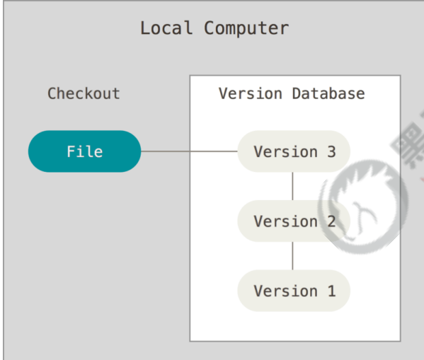

      - 特点：使用软件来记录文件的不同版本，提高了工作效率，降低了手动维护版本的出错率
      - 缺点：
        1. **单机运行**，不支持多人协作开发
        2. 版本数据库故障后，所有历史更新记录会丢失

   2. **集中化的版本控制系统**

      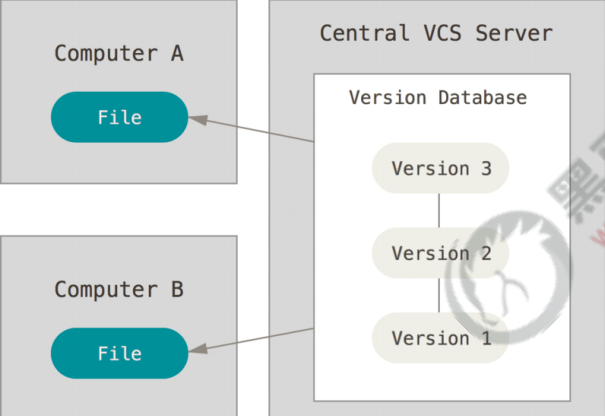

      - **典型代表**：SVN
      - 特点：
        1. 服务器保存文件的所有更新记录
        2. 客户端**只保留最新的文件版本**
        3. 联网运行，支持多人协作开发
      - 缺点：
        1. 不支持离线提交版本更新
        2. 中心服务器崩溃后，所有人无法正常工作
        3. 版本数据库故障后，所有历史更新记录会丢失

   3. **分布式版本控制系统**

      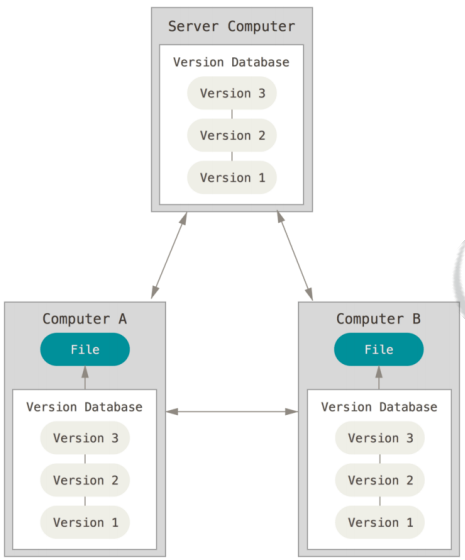

      - **典型代表**：Git
      - 特点：
        1. 基于**服务器、客户端**的运行模式
        2. 服务器保存文件的所有更新版本
        3. **客户端是服务器的完整备份**，并不是只保留文件的最新版本

2. 问题 2：哪种是你感觉最好用的？

   - Git，分布式，既是客户端，又是服务器，就算远程服务器挂掉，也能从任意一个客户端进行备份恢复
   - Git也是目前最主流的版本控制软件

3. 问题 3：Git版本控制系统的优点有哪些？

   1. 联网运行，支持多人协作开发
   2. 客户端**断网**后**支持离线本地提交**版本更新
   3. 服务器故障或损坏后，可使用任何一个客户端的备份进行恢复

#### 1.3.2「了解三大类版本控制系统各自的特点」答案

1. 问题 1：三大类中每一类有什么优缺点？
2. 问题 2：哪种是你感觉最好用的？
3. 问题 3：Git版本控制系统的优点有哪些？

### ☆1.4 关于版本控制概念 小结

1. 版本控制软件：是一个用来记录文件变化，以便将来查阅特定
2. 版本控制系统分类：①本地版本控制系统；②集中式版本控制系统-SVN；③分布式版本控制系统-GIT
3. 目前最主流的版本控制系统：Git

## 2. Git基础概念&安装并配置Git

### ☆2.1 什么是 Git

> 第 1 节课 / 01'11''

#### 2.1.1「什么是 Git」问题

1. 问题 1：Git是什么？
2. 问题 2：Git特点是什么？
3. 问题 3：Git特性？

#### 2.1.2「什么是 Git」答案

1. 问题 1：Git是什么？
   - 是一个**开源的分布式版本控制系统**，是目前世界上**最先进**、**最流行**的版本控制系统。可以快速高效地处理从很小到非常大的项目版本管理。
2. 问题 2：Git特点是什么？
   - 项目越大越复杂，协同开发者越多，越能体现出 Git 的**高性能**和**高可用性**！
3. 问题 3：Git特性？
   1. 直接记录快照，而非差异比较
   2. 近乎所有操作都是本地执行

### ☆2.2 Git直接记录快照而非差异比较

> 第 1 节课 / 07'28''

#### 2.2.1「Git直接记录快照而非差异比较」问题

1. 问题 1：什么是SVN的差异比较？
2. 问题 2：什么是Git记录快照？

#### 2.2.1「Git直接记录快照而非差异比较」答案

1. 问题 1：什么是SVN的差异比较？

   1. 传统的版本控制系统（例如 `SVN`）是**基于差异**的版本控制，它们存储的是**一组基本文件**和**每个文件随时间逐步累积的差异**

      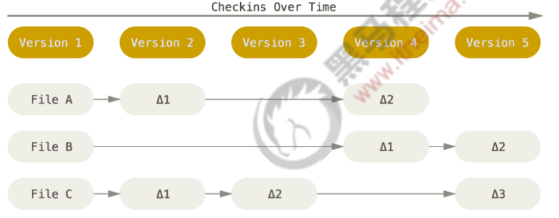

   2. **好处**：节省磁盘空间

   3. **缺点**：耗时、效率低

      -  在每次切换版本的时候，都需要在基本文件的基础上，应用每个差异，从而生成目标版本对应的文件

2. 问题 2：什么是Git记录快照？

   1. **快照**是在原有文件版本的基础上重新生成一份新的文件，**类似于备份**。为了效率，如果文件没有修改，Git 

      不再重新存储该文件，而是只保留一个链接指向之前存储的文件。

      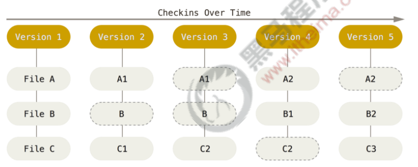

   2. **缺点**：占用磁盘空间较大

   3. **优点**： **版本切换时非常快**，因为每个版本都是完整的文件快照，切换版本时直接恢复目标版本的快照即可。

   4. **特点**：空间换时间

### 2.3 近乎所有操作都是本地执行的

> 第 1 节课 / 03'07''

#### 2.3.1「近乎所有操作都是本地执行的」问题

1. 问题 1：操作的特性是什么？

#### 2.3.2「近乎所有操作都是本地执行的」答案

1. 问题 1：操作的特性是什么？
   1. 在 Git 中的绝大多数操作都**只需要访问本地文件和资源**，一般不需要来自网络上其它计算机的信息
   2. 断网后依旧可以在本地对项目进行版本管理
   3. 联网后，把本地修改的记录同步到云端服务器即可

### ☆2.4 Git 中的三个区域

> 第 2 节课 / 02'34''

#### 2.4.1「Git 中的三个区域」问题

1. 问题 1：Git管理的项目，分为哪三个区域？

#### 2.4.2「Git 中的三个区域」答案

1. 问题 1：Git管理的项目，分为哪三个区域？

   1. 工作区
   2. 暂存区
   3. Git仓库

   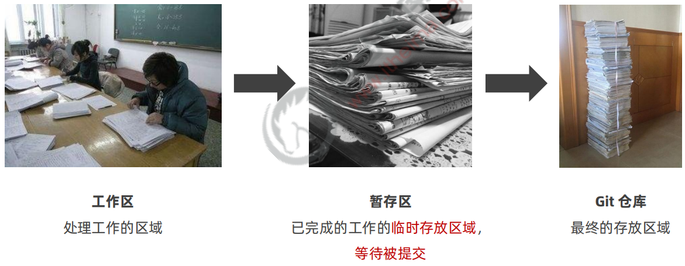

### ☆2.5 Git 中的三种状态

> 第 2 节课 / 02'24''

#### 2.5.1「Git 中的三种状态」问题

1. 问题 1：Git中有哪三种状态，分别对应标识是什么？
2. 问题 2：Git中每个状态代表什么意思？

#### 2.5.2「Git 中的三种状态」答案

1. 问题 1：Git中有哪三种状态，分别对应标识是什么？
   1. **已修改** modified
   2. **已暂存** staged
   3. **已提交** committed
2. 问题 2：Git中每个状态代表什么意思？
   1. modified：表示修改了文件，但还没将修改的结果放到**暂存区**
   2. staged：表示对已修改文件的当前版本做了标记，使之包含在**下次提交的列表中**
   3. committed：表示文件已经安全地保存在本地的 **Git 仓库中**

> **注意**：
>
> 1. 工作区的文件被修改了，但还没有放到暂存区，就是**已修改**状态。
> 2. 如果文件已修改并放入暂存区，就属于**已暂存**状态。
> 3. 如果 Git 仓库中**保存着特定版本**的文件，就属于**已提交**状态。

### 2.6 基本的 Git 工作流程

> 第 2 节课 / 01'57''

#### 2.6.1「基本的 Git 工作流程」问题

1. 问题 1：Git工作流程分为几步？

#### 2.6.2「基本的 Git 工作流程」答案

1. 问题 1：Git工作流程分为几步？

   1. 在工作区中修改文件
   2. 将你想要下次提交的更改进行暂存
   3. 提交更新，找到暂存区的文件，将快照永久性存储到 Git 仓库

   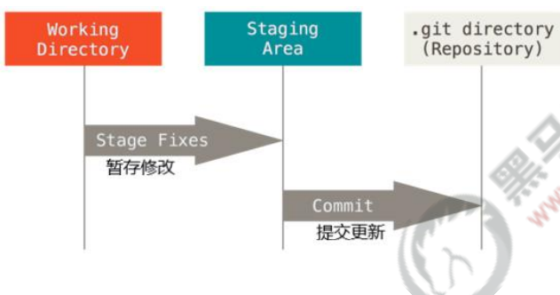

### 2.7 在 Windows 中下载并安装 Git

> 第 2 节课 / 02'44''

#### 2.7.1 安装步骤

1. 在开始使用 `Git` 管理项目的版本之前，需要将它安装到计算机上。可以使用浏览器访问如下的网址，根据自己

   的操作系统，选择下载对应的 `Git` 安装包：[https://git-scm.com/downloads](https://git-scm.com/downloads)

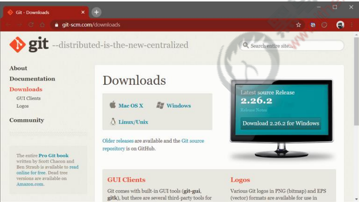

### ☆2.8 配置用户信息

> 第 2 节课 / 03'42''

#### 2.8.1「配置用户信息」问题

1. 问题 1：为什么需要配置用户信息？
2. 问题 2：通过什么命令来配置？

#### 2.8.2「配置用户信息」答案

1. 问题 1：为什么需要配置用户信息？

   - 因为通过 Git 对项目进行版本管理的时候，Git 需要使用这些基本信息，来记录是谁对项目进行了操作

2. 问题 2：通过什么命令来配置？

   ```shell
   git config --global user.name "itheima"
   git config --global user.email "itheima@itcast.cn"
   ```

> Tips：如果使用了 `--global` 选项，那么该命令只需要运行一次，即可永久生效。

### ☆2.9 Git 的全局配置文件

> 第 2 节课 / 01'48''

#### 2.9.1「Git 的全局配置文件」问题

1. 问题 1：配置好的信息会保存在电脑哪个地方？

#### 2.9.2「Git 的全局配置文件」答案

1. 问题 1：配置好的信息会保存在电脑哪个地方？
   - 全局配置的信息会被写入到 `C:/Users/用户名文件夹/.gitconfig` 文件中。这个文件是 Git 的**全局配置文件**，**配置一次即可永久生效**

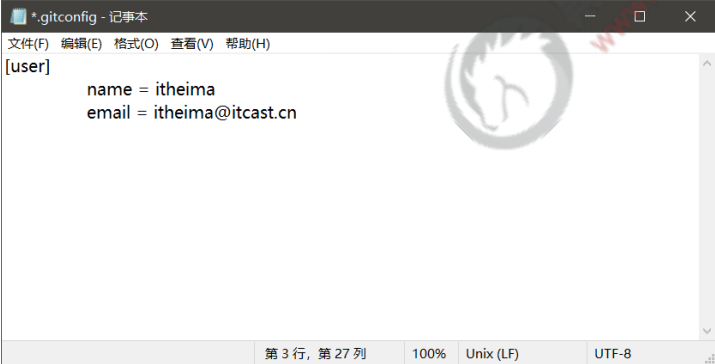

### 2.10 检查配置信息

> 第 2 节课 / 02'38''

#### 2.10.1「检查配置信息」问题

1. 问题 1：通过什么命令查看所有全局配置项？
2. 问题 2：通过什么命令查看指定的全局配置项？

#### 2.10.1「检查配置信息」答案

1. 问题 1：通过什么命令查看所有全局配置项？

   ```shell
   # 查看所有的全局配置项
   git config --list --global
   ```

2. 问题 2：通过什么命令查看指定的全局配置项？

   ```shell
   # 查看指定的全局配置项
   git config user.name
   git config user.email
   ```

#### 2.10.3「检查配置信息」练习

> 练习时长：3分钟

1. 练习目标：利用git命令来检查一下配置好的全局信息

2. 素材：无

3. 参考步骤：

   1. 在任意目录中`右键` > `Git Bash Here` 打开Git命令窗口。或者 `Windows + r `打开运行窗口, 输入cmd回车，打开DOS命令行工具。

   2. 设置全局配置信息：

      ```shell
      # 设置用户名
      git config --global user.name ""
      # 设置邮箱
      git config --global user.email ""
      ```

   3. 查看全局配置信息

      ```shell
      git config --list --global
      ```

### 2.11 获取帮助信息

> 第 2 节课 / 02'40''

#### 2.11.1「获取帮助信息」问题

1. 问题 1：如果git常用命令不记得了，或者想查看一下git还有什么其他命令，改怎么办？

#### 2.11.2「获取帮助信息」答案

1. 问题 1：如果git常用命令不记得了，或者想查看一下git还有什么其他命令，改怎么办？

   - 可以使用 `git help <verb>` 命令，无需联网即可在浏览器中打开帮助手册，例如：

     ```shell
     # 打开 git config 命令的帮助手册
     git help config
     # 想要获取 git config 命令的快速参考
     git config -h
     ```

### ☆2.12 Git基础概念&安装并配置Git

1. Git基础概念
   1. **什么是Git**：Git是一个**开源的分布式版本控制系统**，是目前世界上**最先进**、**最流行**的版本控制系统。可以快速高效地处理从很小到非常大的项目版本管理
   2. **Git特点**：项目越大越复杂，协同开发者越多，越能体现出 Git 的**高性能**和**高可用性**！
   3. **Git快照**：**快照**是在原有文件版本的基础上重新生成一份新的文件，**类似于备份**
   4. **Git三个区域**：
      1. 工作区
      2. 暂存区
      3. Git仓库
   5. **Git三种状态**：
      1. **已修改** modified
      2. **已暂存** staged
      3. **已提交** committed
2. 安装并配置Git
   1. 如何快速打开git命令窗口？
      1. 在工作目录中`右键>Git Bash Here` 打开Git命令窗口
   2. 为什么要设置全局配置信息？如何设置？
      1. 因为通过 Git 对项目进行版本管理的时候，Git 需要使用这些基本信息，来记录是谁对项目进行了操作
      2. `git config --global user.name ""` `git config --global user.email ""`
   3. 全局配置信息保存在哪个文件中？
      1. `C:/Users/用户名文件夹/.gitconfig`中
   4. 如何命令方式查看全局配置？
      1. `git config --list --global`
   5. 如何查阅Git帮助手册？
      1. `git help config`  或者 `git config -h`

## 3. Git 的基本操作

### 3.1 获取 Git 仓库的两种方式

> 第 2 节课 / 01'33

#### 3.1.1「获取 Git 仓库的两种方式」问题

1. 问题 1：通过哪两种方式能获取Git仓库？

#### 3.1.2「获取 Git 仓库的两种方式」问题

1. 问题 1：通过哪两种方式能获取Git仓库？
   1. 将尚未进行版本控制的本地目录**转换**为 `Git` 仓库
   2. 从其它服务器**克隆**一个已存在的 `Git` 仓库

### ☆3.2 在现有目录中初始化仓库

> 第 2 节课 / 03'08''

#### 3.2.1「在现有目录中初始化仓库」问题

1. 问题 1：怎样把本地现有目录初始化成Git仓库？

#### 3.2.2「在现有目录中初始化仓库」答案

1. 问题 1：怎样把本地现有目录初始化成Git仓库？
   1. 在项目目录中，通过鼠标右键打开“`Git Bash`” 
   2. 执行 `git init` 命令将当前的目录转化为 `Git` 仓库

> Tips：`git init` 命令会创建一个名为 .git 的隐藏目录，**这个 .git 目录就是当前项目的 Git 仓库**，里面包含了**初始的必要文件**，这些文件是 Git 仓库的**必要组成部分**

#### 3.2.3「在现有目录中初始化仓库」练习

> 练习时长：3分钟

1. 练习目标：利用 `git init` 来创建仓库

2. 素材：无

3. 参考步骤：
   1. 在桌面新建项目文件夹 `project_demo` 来管理所有项目代码

   2. 在项目目录`project_demo` 空白处，通过鼠标右键打开`Git Bash`”

      > 这一步的目的是为了保证，命令行所处的工作目录就是project_demo
      >
      
   3. 执行 `git init` 命令将当前的目录转化为 `Git` 仓库
   
   4. 观察`project_demo` 是否多了一个隐藏的文件夹`.git`, 代表仓库创建成功。
   
   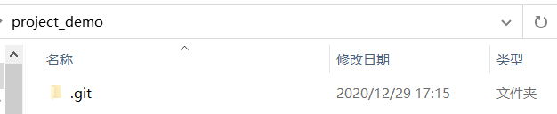
   
   >部分同学看不到是因为在`文件` >`查看` >`详细信息`中没有勾选隐藏的项目，需参照下图勾选


### 3.3 工作区中文件的 4 种状态

> 第 2 节课 / 03'46''

#### 3.3.1「工作区中文件的 4 种状态」问题

1. 问题 1：有哪4种状态？分为几大类？
2. 问题 2：Git操作终极目标是什么？

#### 3.3.2「工作区中文件的 4 种状态」答案

1. 问题 1：有哪4种状态？分为几大类？

   1. 未跟踪，未修改，已修改，已暂存

   2. 2大类：

      1. 未被Git管理： 未跟踪
      2. 已被Git管理：未修改，已修改，已暂存

      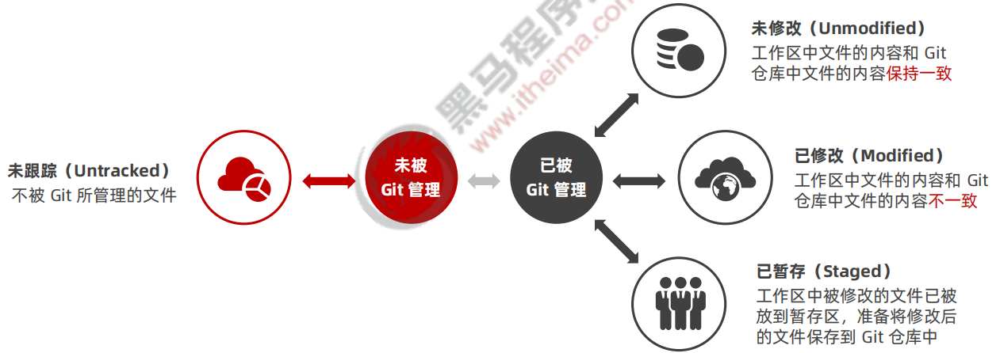

2. 问题 2：Git操作终极目标是什么？

   - 让工作区中的文件都处于**“未修改”**的状态

### ☆3.4 检查文件的状态

> 第 3 节课 / 02'21''

#### 3.4.1「检查文件的状态」问题

1. 问题 1：通过什么命令可以查看文件状态？

#### 3.4.2「检查文件的状态」答案

1. 问题 1：通过什么命令可以查看文件状态？

   - 可以使用 `git status` 命令查看文件处于什么状态

   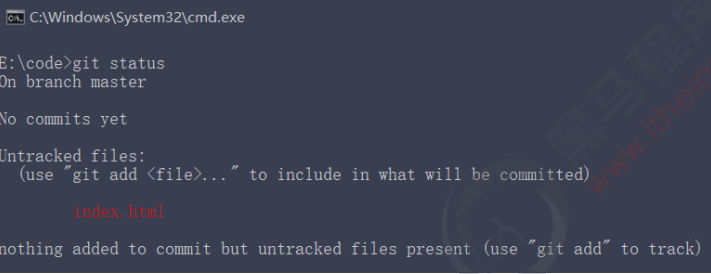

> Tips：
>
> 在状态报告中可以看到新建的 `index.html` 文件出现在 `Untracked files`（未跟踪的文件） 下面。
>
> 未跟踪的文件意味着 **`Git` 在之前的快照（提交）中没有这些文件**；`Git` 不会自动将之纳入跟踪范围，除非明确
>
> 地告诉它“我需要使用 Git 跟踪管理该文件”。

### ☆3.5 以精简的方式显示文件状态

> 第 3 节课 / 01'53''

#### 3.5.1「以精简的方式显示文件状态」问题

1. 问题 1：精简方式显示是在`git status` 命令后跟什么参数？
2. 问题 2：精简方式显示，未跟踪文件前面会显示什么？

#### 3.5.2「以精简的方式显示文件状态」答案

1. 问题 1：精简方式显示是在`git status` 命令后跟什么参数？

   - `git status` 命令后面跟 **-s** 或者 **--short** 都可以，**-s** 是 --short 的简写方式

     ```shell
     # 以精简的方式显示文件状态
     git status -s
     git status --short
     ```

2. 问题 2：精简方式显示，未跟踪文件前面会显示什么？

   - 未跟踪文件前面有红色的 **??** 标记，例如：

     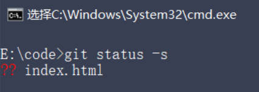

#### 3.5.3「以精简的方式显示文件状态」练习

> 练习时长：2分钟

1. 练习目标：利用 `git status` 来查看git仓库中文件状态
2. 素材：无
3. 参考步骤：
   1. 新建文件目录
   2. 在工作目录中`右键>Git Bash Here` 打开Git命令窗口
   3. 在工作目录下创建一个`index.html`文件
   4. 输入 `git status` 和 `git status -s` 来分别看打印的信息

### ☆3.6 跟踪新文件

> 第 3 节课 / 03'14''

#### 3.6.1「跟踪新文件」问题

1. 问题 1：利用什么命令跟踪新文件？
2. 问题 2：添加成功之后，如何看文件状态？显示是什么颜色？

#### 3.6.2「跟踪新文件」答案

1. 问题 1：利用什么命令跟踪新文件？

   - 使用命令 `git add` 开始跟踪一个文件

     ```shell
     git add index.html
     # 如果文件过多，你项跟踪目录下所有文件
     git add .
     ```

2. 问题 2：添加成功之后，如何看文件状态？显示是什么颜色？

   1. 此时再运行 `git status` 命令，会看到 index.html 文件在 `Changes to be committed` 这行的下面，说明已被跟踪，并处于暂存状态

   2. 添加成功之后，会显示绿色

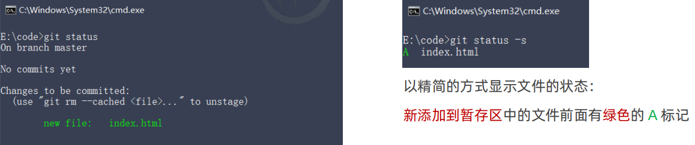

### ☆3.7 提交更新

> 第 3 节课 / 04'00''

#### 3.7.1「提交更新」问题

1. 问题 1：什么状态下才允许提交更新？
2. 问题 2：提交更新的命令是什么？
3. 问题 3：如何确保提交成功？

#### 3.7.2「提交更新」问题

1. 问题 1：什么状态下才允许提交更新？

   - 当文件处于暂存状态的时候才允许被提交

2. 问题 2：提交更新的命令是什么？

   - 执行 `git commit` 命令进行提交,其中 `-m` 选项后面是本次的提交消息，用来对提交的内容做进一步的描述

     ```shell
     git commit -m "新建了index.html 文件"
     ```

3. 问题 3：如何确保提交成功？

   - 提交成功之后，会显示如下的信息：

     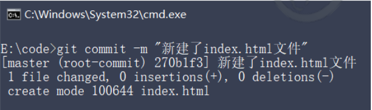

> Tips：
>
> 提交成功之后，再次检查文件的状态，得到提示如下：
>
> 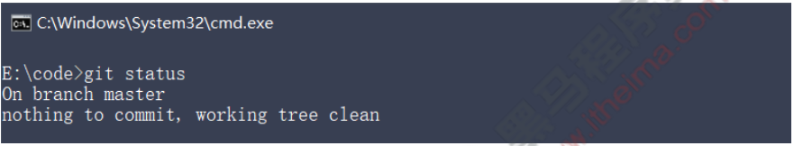
>
> commit的流程说明：
>
> 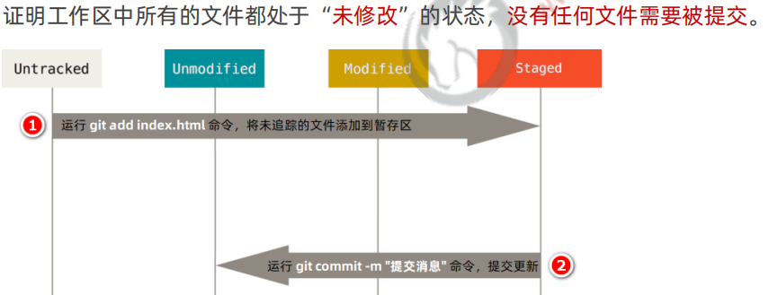
>
> 

#### 3.7.3「提交更新」练习

> 练习时长：2分钟

1. 练习目标：利用 所学的命令来提交一次文件到Git仓库吧
2. 素材：无
3. 参考步骤：
   1. 新建文件目录
   2. 在工作目录中`右键>Git Bash Here` 打开Git命令窗口
   3. 输入 `git init` 初始化本地仓库
   4. 创建一个index.html文件
   5. 输入 `git status` 和 `git status -s` 来分别看打印的信息
   6. 输入 `git add index.html`，改变文件状态为缓存状态
   7. 输入 `git commit -m '日志信息'` 提交文件
   8. 输入 `git status` 查看是否还有未提交的文件

### 3.8 对已提交的文件进行修改

> 第 3 节课 / 02'56''

#### 3.8.1「对已提交的文件进行修改」问题

1. 问题 1：修改了已提交文件，文件状态会变成什么样？

#### 3.8.2「对已提交的文件进行修改」答案

1. 问题 1：修改了已提交文件，文件状态会变成什么样？

   - 当我们修改了工作区中 `index.html` 的内容之后，再次运行 `git status` 和 `git status -s` 命令，会看到如下的内容

   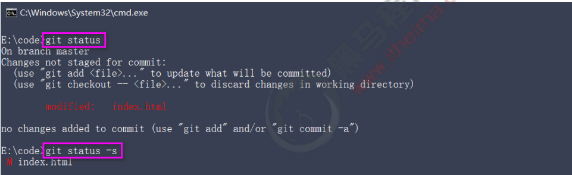

> Tips：
>
> 文件 `index.html` 出现在 `Changes not staged for commit` 这行下面，说明**已跟踪文件的内容发生了变化，但还没有放到暂存区**
>
> **注意：**修改过的、没有放入暂存区的文件前面有红色的 **M** 标记

### 3.9 暂存已修改的文件

> 第 3 节课 / 03'53''

#### 3.9.1「暂存已修改的文件」问题

1. 问题 1：如何暂存已修改的文件？
2. 问题 2：add 命令的功效有哪些？

#### 3.9.2「暂存已修改的文件」答案

1. 问题 1：如何暂存已修改的文件？
   - 利用 `git add` 命令
2. 问题 2：add 命令的功效有哪些？
   1. 可以用它**开始跟踪新文件**
   2. 把**已跟踪的**、**且已修改**的文件放到暂存区
   3. 把有冲突的文件标记为已解决状态

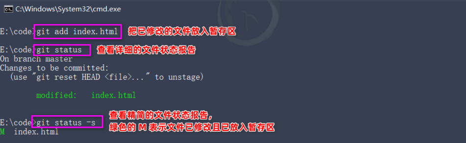

### 3.10 提交已暂存的文件

> 第 3 节课 / 03'16''

#### 3.10.1「 提交已暂存的文件」问题

1. 问题 1：如何对暂存的文件进行提交？

#### 3.10.2「 提交已暂存的文件」答案

1. 问题 1：如何对暂存的文件进行提交？

   - 再次运行 `git commit -m "提交消息"` 命令，即可将暂存区中记录的 index.html 的快照，提交到 `Git` 仓库中进行保存

   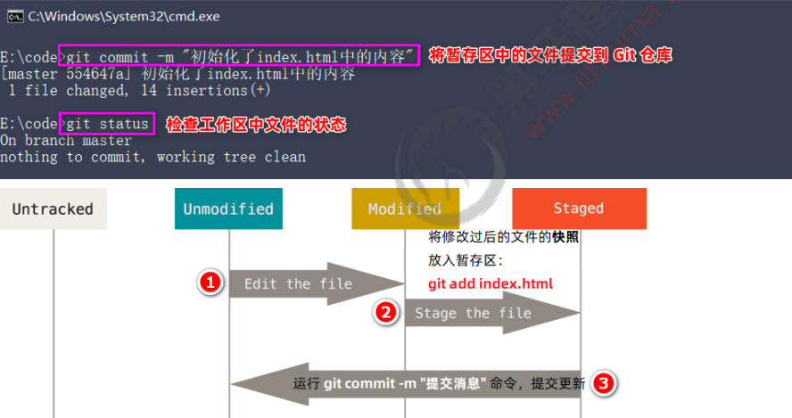

#### 3.10.3「 提交已暂存的文件」练习

> 练习时长：3分钟

1. 练习目标：修改已经提交的文件，然后把更新后的文件提交到Git仓库吧
2. 素材：无
3. 参考步骤：
   1. 新建文件目录
   2. 在工作目录中`右键>Git Bash Here` 打开Git命令窗口
   3. 输入 `git init` 初始化本地仓库
   4. 创建一个index.html文件
   5. 输入 `git status` 和 `git status -s` 来分别看打印的信息
   6. 输入 `git add index.html`，改变文件状态为缓存状态
   7. 输入 `git commit -m '日志信息'` 提交文件
   8. 输入 `git status` 查看是否还有未提交的文件
   9. 修改 index.html 里面的内容
   10. 输入 `git status` 查看文件状态
   11. 输入 `git add index.html` 把修改好的文件提交到暂存区
   12. 输入 `git commit -m` 日志信息 提交文件

### 3.11 撤销对文件的修改

> 第 3 节课 / 03'39''

#### 3.11.1「 撤销对文件的修改」问题

1. 问题 1：撤销动作是代表什么意思？结果会怎样？
2. 问题 2：撤销操作的本质是？
3. 问题 3：撤销的命令是？

#### 3.11.2「 撤销对文件的修改」答案

1. 问题 1：撤销动作是代表什么意思？结果会怎样？
   1. 撤销：把对工作区中对应文件的修改，**还原**成 Git 仓库中所保存的版本
   2. 结果：所有的修改会丢失，且无法恢复！**危险性比较高，请慎重操作！**
2. 问题 2：撤销操作的本质是？
   - 用 Git 仓库中保存的文件，覆盖工作区中指定的文件
3. 问题 3：撤销的命令是？
   - `git checkout -- index.html`


### ☆3.12 向暂存区中一次性添加多个文件

> 第 3 节课 / 03'53''

#### 3.12.1「 向暂存区中一次性添加多个文件」问题

1. 问题 1：有个命令能一次性把所有新增和修改的文件加入暂存区，这个命令是？

#### 3.12.2「 向暂存区中一次性添加多个文件」答案

1. 问题 1：有个命令能一次性把所有新增和修改的文件加入暂存区，这个命令是？

   - `git add .`

   > Tips：**今后在项目开发中，会经常使用这个命令，将新增和修改过后的文件加入暂存区**

### ☆3.13 取消暂存的文件

> 第 4 节课 / 04'53''

#### 3.13.1「 取消暂存的文件」问题

1. 问题 1：什么命令能够把文件移除暂存区？

#### 3.13.2「 取消暂存的文件」答案

1. 问题 1：什么命令能够把文件移除暂存区？

   ```shell
   git reset HEAD 要移出的文件名称
   ```

#### 3.13.3「 取消暂存的文件」练习

> 练习时长：2分钟

1. 练习目标：把错误的修改文件提交到暂存区，然后通过命令取消暂存的文件
2. 素材：无
3. 参考步骤：
   1. 利用之前使用命令的目录
   2. 模拟对index.html错误的修改，然后通过 `git add .` 添加到暂存区
   3. 利用 `git reset HEAD index.html`，移除暂存区

### 3.14 跳过使用暂存区域

> 第 4 节课 / 04'01''

#### 3.14.1「 跳过使用暂存区域」问题

1. 问题 1：Git标准工作流程是怎样？
2. 问题 2：通过什么命令能够跳过暂存区域？

#### 3.14.2「 跳过使用暂存区域」答案

1. 问题 1：Git标准工作流程是怎样？

   - 标准的工作流程是`工作区 → 暂存区 → Git 仓库`

2. 问题 2：通过什么命令能够跳过暂存区域？

   - 要在提交的时候，给 `git commit` 加上 `-a` 选项，Git 就会自动把所有已经跟踪过的文件暂存起来一并提交，从而跳过 `git add` 步骤

     ```shell
     git commit -a -m "日志信息"
     ```

### 3.15 移除文件

> 第 4 节课 / 04'29''

#### 3.15.1「 移除文件」问题

1. 问题 1：Git仓库移除文件有几种方式？
2. 问题 2：分别的命令是什么？

#### 3.15.2「 移除文件」问题

1. 问题 1：Git仓库移除文件有几种方式？

   1. 从 Git 仓库和工作区中**同时移除**对应的文件
   2. 只从 Git 仓库中移除指定的文件，但保留工作区中对应的文件

2. 问题 2：分别的命令是什么？

   ```shell
   # 从 Git仓库和工作区中同时移除 index.js 文件
   git rm -f index.js
   # 只从 Git 仓库中移除 index.css，但保留工作区中的 index.css 文件
   git rm --cached index.css
   ```

#### 3.15.3「 移除文件」练习

> 练习时长：2分钟

1. 练习目标：不小心创建了一个txt文件，并且进行了上传，现在需要利用删除命令来移除这个文件
2. 素材：无
3. 参考步骤：
   1. 利用之前使用命令的目录
   2. 创建一个 1.txt 文件，随便输入内容，模拟不上小上传到Git仓库
      1. `git add .` 
      2. `git commit -m 提交了错误文件`
   3. 利用 `git rm -f 1.txt` 来把仓库和工作区间文件同时移除

### ☆3.16 Git忽略文件和glob匹配模式

> 第 4 节课 / 03'40''

#### 3.16.1「 Git忽略文件和glob匹配模式」问题

1. 问题 1：Git忽略文件的作用？
2. 问题 2： `.gitignore` 的格式规范是怎样的？

#### 3.16.2「 Git忽略文件和glob匹配模式」答案

1. 问题 1：Git忽略文件的作用？
   - 一般我们总会有些文件无需纳入 `Git` 的管理，也不希望它们总出现在未跟踪文件列表。 在这种情况下，我们可以创建一个名为 `.gitignore` 的配置文件，列出要忽略的文件的匹配模式
2. 问题 2： `.gitignore` 的格式规范是怎样的？
   1.  以 **# 开头**的是注释
   2. 以 **/ 结尾**的是目录
   3. 以 **/ 开头**防止递归
   4.  以 **! 开头**表示取反
   5. 可以使用 **glob 模式**进行文件和文件夹的匹配（glob 指简化了的正则表达式）
      - **星号 \*** 匹配**零个或多个任意字符**
      - **`[abc]`** 匹配**任何一个列在方括号中的字符** （此案例匹配一个 a 或匹配一个 b 或匹配一个 c） 
      - **问号 ?** 只匹配**一个任意字符**
      - **两个星号 \**** 表示匹配**任意中间目录**（比如 a/**/z 可以匹配 a/z 、 a/b/z 或 a/b/c/z 等）
      - 在方括号中使用**短划线**分隔两个字符， 表示所有在这两个字符范围内的都可以匹配（比如 [0-9] 表示匹配所有 0 到 9 的数字）

### ☆3.17 `.gitignore` 使用示例

> 第 4 节课 / 07'14''

#### 3.17.1 使用方式

1. 在git仓库根目录创建 `.gitignore` 文件（在有`.git`文件夹的同级目录下）
2. 在`.gitignore` 目录下写入以下内容即可

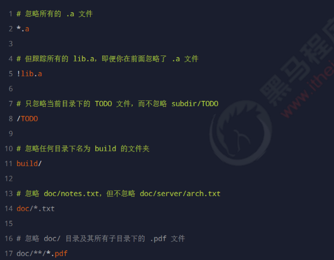

### ☆3.18 查看提交历史

> 第 5 节课 / 06'49''

#### 3.18.1「 查看提交历史」问题

1. 问题 1：这个命令能带给我们什么好处？
2. 问题 2：查看历史记录有哪些命令？
3. 问题 3：我们常用的是哪一条

#### 3.18.2「 查看提交历史」问题

1. 问题 1：这个命令能带给我们什么好处？

   - 能够看到当前分支下提交的所有记录，方便追溯

2. 问题 2：查看历史记录有哪些命令？

   ```shell
   # 按时间先后顺序列出所有的提交历史，最近的提交在最上面
   git log
   
   # 只展示最新的两条提交历史，数字可以按需进行填写
   git log -2
   
   # 在一行上展示最近两条提交历史的信息
   git log -2 --pretty=oneline
   
   # 在一行上展示最近两条提交历史信息，并自定义输出的格式
   # %h 提交的简写哈希值  %an 作者名字  %ar 作者修订日志  %s 提交说明
   git log -2 --pretty=format:"%h | %an | %ar | %s"
   ```

3. 问题 3：我们常用的是哪一条
  
   - `git log --pretty=oneline`

#### 3.18.3「 查看提交历史」练习

> 练习时长：2分钟

1. 练习目标：查看之前操作Git仓库的记录
2. 素材：无
3. 参考步骤：
   1. 利用之前使用命令的目录
   2. 输入 `git log --pretty=oneline` 查看日志
      - 如果日志过多会以翻页形式，利用上下箭头即可
      - 退出按  q
   3. 输入 `git log --pretty=formart: %h | %an | %ar | %s` 过滤的形式查看历史记录

### ☆3.19 回退到指定的版本

> 第 5 节课 / 05'00''

#### 3.19.1「 回退到指定的版本」问题

1. 问题 1：什么情况下需要回退指定版本？
2. 问题 2：利用什么命令回退？
3. 问题 3：如果回退到历史版本，如何查看所有历史记录？

#### 3.19.2「 回退到指定的版本」答案

1. 问题 1：什么情况下需要回退指定版本？

   - 如果我们提交的代码出现了问题，需要返回之前比较稳定的版本，就需要使用到这个命令

2. 问题 2：利用什么命令回退？

   ```shell
   # 使用 git reset --hard 命令，根据指定的提交 ID 回退到指定版本
   git reset --hard <CommitID>
   ```

3. 问题 3：如果回退到历史版本，如何查看所有历史记录？

   ```shell
   # 在旧版本中使用 git reflog --pretty=oneline 命令，查看命令操作的历史
   git reflog --pretty=onelone
   ```

#### 3.19.3「 回退到指定的版本」练习

> 练习时长：2分钟

1. 练习目标：回退到上一个版本
2. 素材：无
3. 参考步骤：
   1. 利用之前使用命令的目录
   2. 输入 `git log --pretty=oneline` 查看日志
   3. 输入 `git reset --head <CommitID>` 退回到指定版本
   4. 输入 `git reflog --pretty=oneline` 在旧版本中暂时所以有记录
   5. 输入  `git reset --head <CommitID>` 切换到最新版本

### ☆3.20 Git的基本操作 小结

1. 提交操作
   1. Git仓库的初始化： `git init`
   2. 工作区中文件4种状态：
      1. 未跟踪
      2. 未修改
      3. 已修改
      4. 已暂存
   3. Git的终极目标：让工作区中的文件都处于**“未修改”**的状态
   4. 检查文件状态： `git status`，精简方式显示： `git status -s`
   5. 跟踪新文件： `git add 文件名`
   6. 提交更新： `git commit -m 日志信息`
2. 修改操作
   1. 暂存已修改的文件： `git add 文件名`
   2. 提交已暂存的文件： `git commit -m 日志信息`
   3. 撤销对文件的修改： `git checkout -- 文件名`
      - 注意：**撤销有风险，谨慎使用**
   4. 一次性添加多个文件： `git add .`
3. 移除操作
   1. 如何取消暂存文件： `git reset HEAD 文件名称`
   2. Git忽略清单的作用：不想被Git管理起来的文件或者文件夹可以配置在忽略清单中
   3. Git忽略清单 `.gitignore` 使用
      1. 在Git仓库根目录创建 `.gitignore` 文件
      2. 在里面配置忽略规整即可
4. 历史记录
   1. 查看历史记录： `git log --pretty=oneline`
   2. 回退或者前进到某个历史版本： `git reset --head <CommitID>`
   3. 在历史版本中查看最全历史记录： `git reflog --pretty=onelone` 

## 4. 开源相关的概念

### 4.1 了解开源和闭源的概念

> 第 5 节课 / 01'19''

#### 4.1.1「 了解开源和闭源的概念」问题

1. 问题 1：什么是开源？

#### 4.1.2「 了解开源和闭源的概念」答案

1. 问题 1：什么是开源？什么是闭源?

   1. **开源**是指不仅提供程序还提供程序的源代码
   2. **闭源**是只提供程序，不提供源代码

   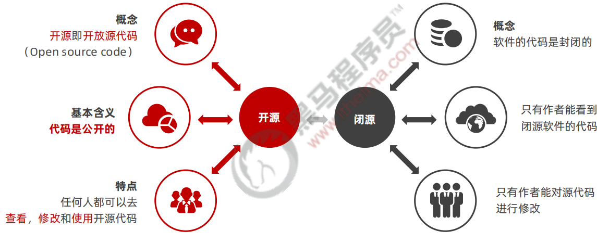

### 4.2 开源许可协议

> 第 5 节课 / 03'19''

#### 4.2.1「 开源许可协议」问题

1. 问题 1：什么是开源许可协议？
2. 问题 2：常见的5中开源许可协议是哪些？

#### 4.2.2「 开源许可协议」问题

1. 问题 1：什么是开源许可协议？

   - 开源并不意味着完全没有限制，为了**限制使用者的使用范围**和**保护作者的权利**，每个开源项目都应该遵守开源

     许可协议（ `Open Source License` ）

2. 问题 2：常见的5中开源许可协议是哪些？

   1. `BSD`（Berkeley Software Distribution） 

   2. `Apache Licence 2.0`

   3. **`GPL`**（GNU General Public License） 

      - 具有传染性的一种开源协议，不允许修改后和衍生的代码做为闭源的商业软件发布和销售

      - 使用 `GPL` 的最著名的软件项目是：Linux

   4. `LGPL`（GNU Lesser General Public License） 

   5. **`MIT`**（Massachusetts Institute of Technology, MIT）

      - 是目前限制最少的协议，唯一的条件：在修改后的代码或者发行包中，必须包含原作者的许可信息

      - 使用 MIT 的软件项目有：`jquery`、`Node.js`

### 4.3 为什么要拥抱开源

> 第 5 节课 / 01'50''

#### 4.3.1「 为什么要拥抱开源」问题

1. 问题 1：拥抱开源的好处？

#### 4.3.2「 为什么要拥抱开源」问题

1. 问题 1：拥抱开源的好处？
   - 开源的核心思想是“**我为人人，人人为我**”，人们越来越喜欢开源大致是出于以下 3 个原因：
     1.  开源给使用者更多的控制权
     2. 开源让学习变得容易
     3. 开源才有真正的安全

> Tips：开源是软件开发领域的大趋势，**拥抱开源就像站在了巨人的肩膀上**，不用自己重复造轮子，让开发越来越容易

### 4.4 了解什么是开源项目托管平台

> 第 5 节课 / 01'45''

#### 4.4.1「了解什么是开源项目托管平台」问题

1. 问题 1：什么是开源项目托管平台？
2. 问题 2：主要的有几个平台？

#### 4.4.1「了解什么是开源项目托管平台」答案

1. 问题 1：什么是开源项目托管平台？
   - 专门用于免费存放开源项目源代码的网站，叫做**开源项目托管平台**
2. 问题 2：目前世界上比较出名主要的有几个平台？
   1. `Github`（全球最牛的开源项目托管平台，没有之一）
   2. `Gitlab`（对代码私有性支持较好，因此企业用户较多）
   3. `Gitee`（又叫做码云，是国产的开源项目托管平台。访问速度快、纯中文界面、使用友好）

> **注意**：以上 3 个开源项目托管平台，只能托管以 Git 管理的项目源代码，因此，它们的名字都以 Git 开头

### 4.5 什么是GitHub

> 第 5 节课 / 04'30''

#### 4.5.1「什么是GitHub」问题

1. 问题 1：什么是GitHub？GitHub主要作用？
2. 问题 2：我们能在GitHub上做什么？

#### 4.5.2「什么是GitHub」答案

1. 问题 1：什么是GitHub？GitHub主要作用？
   1. Github 是全球最大的**开源项目**托管平台。因为只支持 `Git` 作为唯一的版本控制工具，故名 GitHub
   2. 能够帮我们托管代码在GitHub上面，还能提供一些优秀的开源项目给到我们
2. 问题 2：我们能在GitHub上做什么？
   1.  关注自己喜欢的开源项目，为其点赞打 `call` 
   2.  为自己喜欢的开源项目做贡献（`Pull Request`） 
   3.  和开源项目的作者讨论 Bug 和提需求 （`Issues`） 
   4.  把喜欢的项目复制一份作为自己的项目进行修改（`Fork`） 
   5.  创建属于自己的开源项目
   6.  etc…

### ☆4.6 开源相关的概念 小结

1. 什么是开源&闭源？
   1. **开源**是指不仅提供程序还提供程序的源代码
   2. **闭源**是只提供程序，不提供源代码
2. 常见的开源许可协议
   1. **`GPL`**（GNU General Public License） 
   2. **`MIT`**（Massachusetts Institute of Technology, MIT）
3. 全球出名的开源项目托管平台有哪些
   1. `Github`（全球最牛的开源项目托管平台，没有之一）
   2. `Gitlab`（对代码私有性支持较好，因此企业用户较多）
   3. `Gitee`（又叫做码云，是国产的开源项目托管平台。访问速度快、纯中文界面、使用友好）

## 5. GitHub

### 5.1 注册GitHub账号

> 第 6 节课 / 04'28''

#### 5.1.1 注册步骤

1.  访问 Github 的官网首页 https://github.com/

2.  点击“Sign up”按钮跳转到注册页面

3.  填写可用的用户名、邮箱、密码

4.  通过点击箭头的形式，将验证图片摆正

5.  点击“Create account”按钮注册新用户

6.  登录到第三步填写的邮箱中，点击激活链接，完成注册

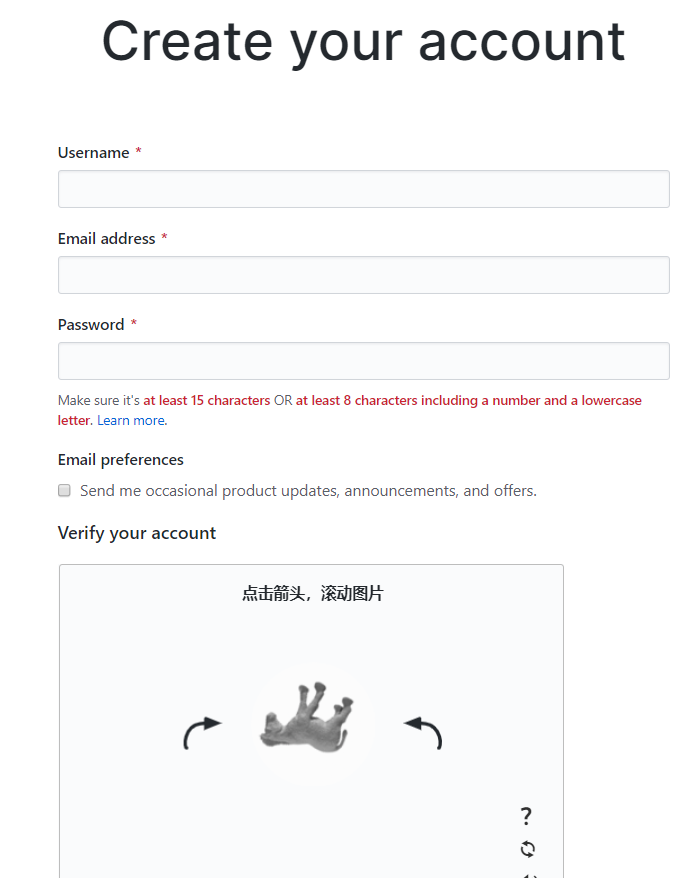

激活 Github 账号

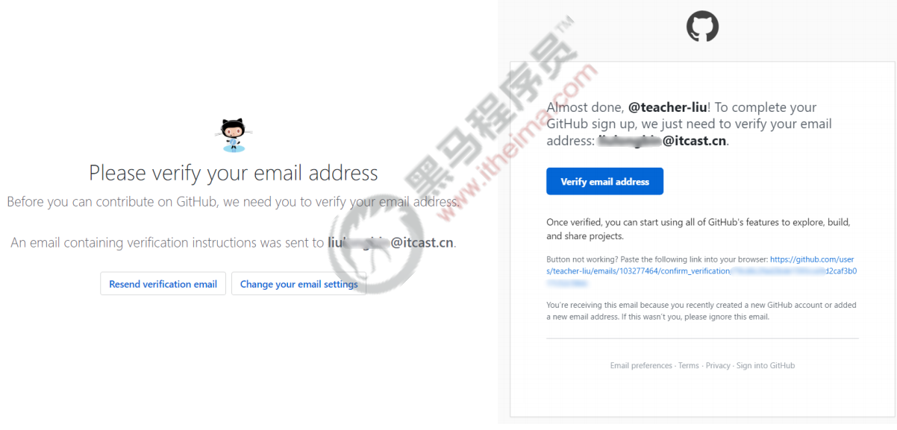

完成注册

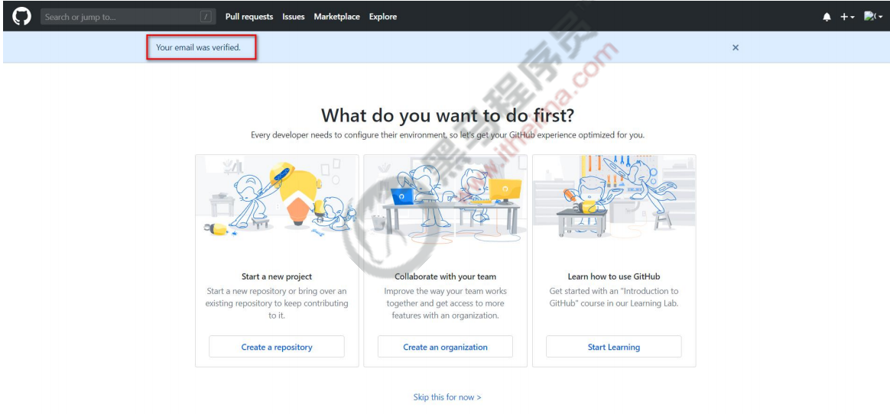

### 5.2 新建空白远程仓库

> 第 6 节课 / 04'08''

#### 5.2.1 新建步骤

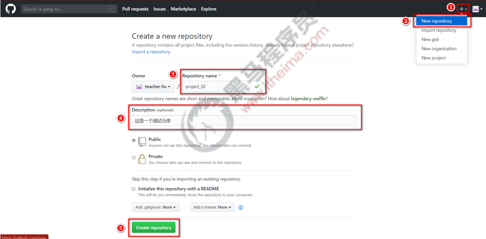

创建成功

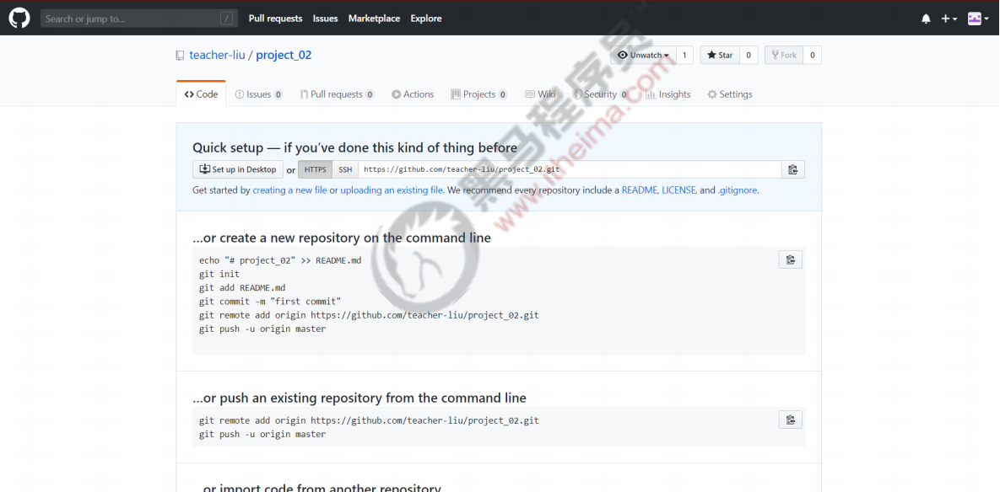

#### 5.2.2「新建空白远程仓库」练习

> 练习时长：5分钟

1. 练习目标：熟悉GitHub平台的使用

2. 素材：无

3. 参考步骤：

   1. 访问GitHub并使用邮箱注册一个账号

   2. 登录邮箱激活该账号

   3. 利用邮箱账号登录GitHub

   4. 创建一个远程空白仓库

      

### 5.3 远程仓库的两种访问方式

> 第 6 节课 / 02'43''

#### 5.3.1「 远程仓库的两种访问方式」问题

1. 问题 1：远程仓库有哪两种访问方式？

#### 5.3.2「 远程仓库的两种访问方式」答案

1. 问题 1：远程仓库有哪两种访问方式？

   1. HTTPS：**零配置**；但是每次访问仓库时，需要重复输入 Github 的账号和密码才能访问成功

   2.  SSH：**需要进行额外的配置**；但是配置成功后，每次访问仓库时，不需重复输入 Github 的账号和密码

      > Tips：在实际开发中，**推荐使用 SSH 的方式访问远程仓库**

### 5.4 基于HTTPS将本地仓库上传到GitHub

> 第 6 节课 / 06'29''

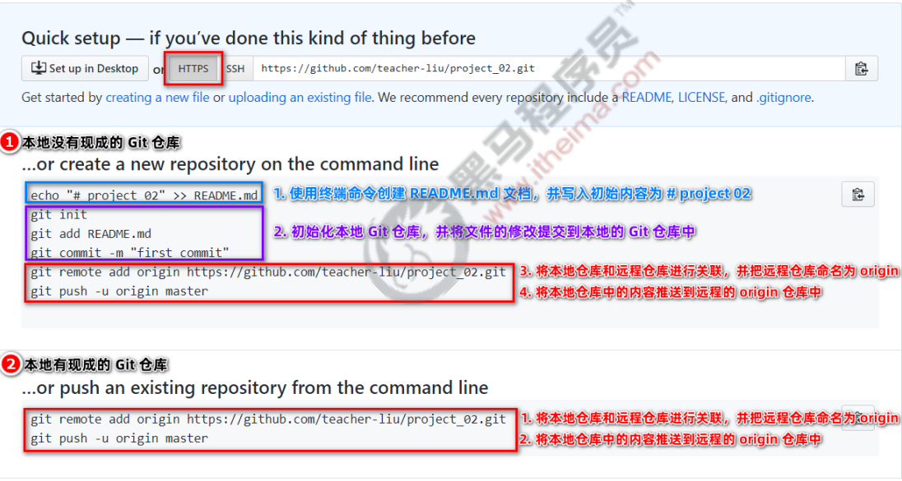

### 5.5 了解 git push命令的作用

> 第 6 节课 / 04'22

#### 5.5.1「 了解 git push命令的作用」问题

1. 问题 1：push命令有什么作用？

#### 5.5.2「 了解 git push命令的作用」答案

1. 问题 1：push命令有什么作用？
   - push命令能够把我们本地的git仓库推送到远程的git仓库

基于HTTPS推送的注意事项：

> Tips：第一次链接的时候有可能账号密码输入错误，可以通过以下方式清空
>
> 如果第一次输入用户名密码错误，我们可以通过如下命令来进行清除
>
> - 运行一下命令缓存输入的用户名和密码
>
> ```shell
> git config --global credential.helper wincred
> ```
>
> - 清除掉缓存在git中的用户名和密码
>
> ```shell
> git credential-manager uninstall
> ```
>

### 5.6 GitHub 小结

1. 远程仓库的两种访问方式：
   1. HTTPS
   2. SSH
2. push命令的作用
   1. push命令能够把我们本地的git仓库推送到远程的git仓库

## 6. 课后练习

[实操两道题](./day01-afterclass.md)