# Git第02天-Git进阶

课程资料下载地址：

 [Git第02天](/downloads/git/day02/03.course_material/git-day02.zip)

[大事件第01天](/downloads/git/day02/03.course_material/bigevents-day01.zip)

## 能力目标

- 能够参照文档**配置**远程仓库的**SSH的访问方式**
- 能够**说出**Git的**分支的作用**
- 能够**使用命令**创建、查看、切换、合并和删除**分支**
- 能够**说出**那种情况下会产生冲突
- 能够**说出**冲突后的代码形式
- 能够**说出**如何**解决冲突**
- 能够**搭建**大事件项目结构
- 能够**使用`Git`管理**大事件项目代码

## 1. GitHub

### 1.1 生成SSH key

> 第 1 节课 / 04'03''

#### 1.1.1 「生成SSH key」问题

1. 问题 1：使用 SSH的传输方式有什么好处？
2. 问题 2：如何生成 SSH key？
3. 问题 3：SSH key由哪两部分组成？
4. 问题 4：如果记不住生成 SSH key的命令怎么办？

#### 1.1.2「 生成SSH key」答案

1. 问题 1：使用 SSH的传输方式有什么好处？

   - 免登录身份认证
   - 数据加密传输。
   - 是git的原生传输方式，更稳定, 更快。
   
2. 问题 2：如何生成 SSH key？

   1. 打开 Git Bash

   2. 执行如下命令

      > 把邮箱替换成自己的邮箱

      `ssh-keygen -t rsa -b 4096 -C "your_email@example.com"` 

   3. 连续输入 3 次回车，即会在 `C:\Users\用户名文件夹\.ssh` 目录下生成 SSH key

3. 问题 3：SSH key由哪两部分组成？

   - id_rsa（私钥文件，存放于客户端的电脑中即可）

   - id_rsa.pub（公钥文件，**需要配置到 Github 中**）

4. 问题 4:   如果记不住生成 SSH key的命令怎么办？

   - 在github和码云上都有如何生成SSH key的说明文档，找到入口点进去即可。
   
     - 码云： 个人头像 -> 设置 -> SSH公钥  - [怎样生成SSH公钥](https://gitee.com/help/categories/38)
   
     - GitHub: 个人头像 -> `Settings` -> `SSH and GPG Keys` -> [generating SSH keys](https://docs.github.com/en/free-pro-team@latest/github/authenticating-to-github/connecting-to-github-with-ssh)
   
   - 通过搜索引擎搜索

### 1.2 配置SSHkey	

> 第 1 节课 / 04'27''

#### 1.2.1 配置步骤

1. 使用记事本打开 id_rsa.pub文件，复制里面的文本内容
2. 在浏览器中登录 Github，点击头像 -> Settings -> SSH and GPG Keys -> New SSH key
3. 将 id_rsa.pub文件中的内容，粘贴到 Key对应的文本框中
4. 在 Title 文本框中给 Key 取一个名字

### 1.3 检查SSH key是否配置成功

> 第 1 节课 / 02'22''

#### 1.3.1「检查SSH key是否配置成功」问题

1. 问题 1：如何检测SSH key是否配置成功？
2. 问题 2：配置Git的SSH的通讯方式需要配置多次吗？
3. 问题 3：配置Git的SSH的通讯方式需要经过哪几大步骤？

#### 1.3.2「 检查SSH key是否配置成功」答案

1. 问题 1：如何检测SSH key是否配置成功？

   - 打开 Git Bash，输入如下的命令并回车执行：

     ```shell
     ssh -T git@github.com  # GitHub
     ssh -T git@gitee.com   # 码云
     ```

   - 上述的命令执行成功后，可能会看到如下的提示消息：

     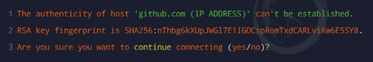

   - 输入 `yes` 之后，如果能看到类似于下面的提示消息，证明 SSH key 已经配置成功了：

     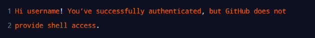

2. 问题 2：配置Git的SSH的通讯方式需要配置多次吗？

   一次配置即可，只要不删改电脑上的公钥和私钥，永久生效。

3. 问题 2：配置Git的SSH传输方式需要经过哪几大步骤？

   1. 生成SSH Key
   2. 配置SSH公钥到代码托管平台
   3. 检验是否配置成功

#### 1.3.3「 检查SSH key是否配置成功」练习

> 练习时长：5分钟
>
> 所有练习前后都是衔接的，所以大家务必及时认真的完成每一个练习哦​ :smile:

1. 练习目标：能够参考文档完成Git的SSH传输方式的配置

2. 素材：无

3. 参考步骤：

   1. 生成SSH Key

      1. 打开 Git Bash

      2. 执行如下命令

         > 记得把邮箱替换成自己的邮箱
         >
         > 如果之前已经执行类似命令生成过，执行该命令后会询问是否覆盖，可以选择覆盖，然后使用新的。也可以选择不覆盖，直接使用已经生成的。

         `ssh-keygen -t rsa -b 4096 -C "your_email@example.com"` 

      3. 连续输入 3 次回车，即会在 `C:\Users\用户名文件夹\.ssh` 目录下生成 SSH key

   2. 配置SSH公钥到代码托管平台
      1. 使用记事本打开 id_rsa.pub文件，复制里面的文本内容
      2. 在浏览器中登录 Github，点击头像 -> Settings -> SSH and GPG Keys -> New SSH key
      3. 将 id_rsa.pub文件中的内容，粘贴到 Key对应的文本框中
      4. 在 Title 文本框中给 Key 取一个名字

   3. 检查配置是否成功

      - 打开 Git Bash，输入如下的命令并回车执行：

        ```shell
        ssh -T git@github.com  # GitHub
        ssh -T git@gitee.com   # 码云
        ```

      - 上述的命令执行成功后，可能会看到如下的提示消息：

        

      - 输入 `yes` 之后，如果能看到类似于下面的提示消息，证明 SSH key 已经配置成功了：

        

   

### ☆1.4 基于SSH将本地仓库推送到GitHub

> 第 1 节课 / 06'19''

#### 1.4.1 推送步骤

1. 关联本地仓库和远程仓库，将关联到的远程仓库命令为origin

   ```bash
   git remote add origin 远程仓库SSH地址
   ```

2. 将当前所在主分支master重命名为main分支（非必须）

   > 由于最近爆发的美国的黑人事件，master有奴隶主的意思，GitHub为了避嫌，因此在文档中会建议用户把master分支重命名为main分支

   ```bash
   git branch -M main
   ```

3. 将本地分支推送到远程仓库

   ```bash
   # 如果没有执行第2步
   git push -u origin master
   
   # 如果执行了第2步
   git push -u origin main
   ```

#### 1.4.2「基于SSH将本地仓库推送到GitHub」练习

> 练习时长：5分钟

1. 练习目标：能够把本地仓库托管到远程空白仓库上

2. 素材：无

3. 参考步骤：

   1. 准备本地仓库，并产生一次提交历史

      > 没有历史的仓库是没有意义的，不能被托管

      1. 创建项目文件夹`project_demo`

      2. 进入项目文件夹的命令行，执行命令`git init`, 把当前工作目录转换为Git仓库

      3. 添加一个`README.md`的文件, 内容为
   
         `# project_demo`
      
      4. 执行 `git add README.md` 添加暂存

      5. 执行 `git commit -m "初始化仓库"` 提交仓库

   2. 创建远程空白仓库`project_demo`

      > 可以换成其他名字

   3. 托管本地仓库到远程非空白仓库

      1. 关联本地仓库和远程仓库，给关联到的远程仓库取一个别名origin

         ```shell
         git remote add origin 远程仓库SSH传输方式的地址
         ```

      2. 推送本地master分支到远程仓库origin上

         ```bash
         git push -u origin master
         ```

   4. 观察GitHub上远程仓库的变化

### ☆1.5 将远程仓库克隆到本地

> 第 1 节课 / 03'45''

#### 1.5.1「将远程仓库克隆到本地」问题

1. 问题 1：克隆远程仓库到本地的命令是？

#### 1.5.2「 将远程仓库克隆到本地」答案

1. 问题 1：克隆远程仓库到本地的命令是？

   ```bash
   git clone 远程仓库的地址
   ```

## 2. 分支

### 2.1 了解分支的概念以及分支在实际开发中的作用

> 第 1 节课 / 03'44''

#### 2.1.1「了解分支的概念以及分支在实际开发中的作用」问题

1. 问题 1：什么是分支(可以打比方)？
2. 问题 2：分支有什么作用？

#### 2.1.2「 了解分支的概念以及分支在实际开发中的作用」答案

1. 问题 1：什么是分支(可以打比方)？

   - 分支类似科幻电影里面的平行宇宙，两个平行宇宙互不干扰。

     

     

2. 问题 2：分支有什么作用？

   使用分支意味着你可以把你的工作从开发主线上分离开来，以免影响开发主线。

   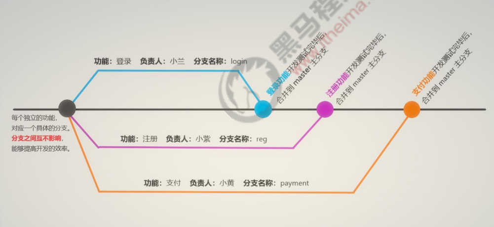

   

### 2.2 master主分支
> 第 1 节课 / 02'05''

#### 2.2.1「了解分支的概念以及分支在实际开发中的作用」问题

1. 问题 1：什么是主分支？
2. 问题 2：使用主分支有什么注意事项？
3. 问题 3：主分支和其他分支有本质区别吗？

#### 2.2.2「 了解分支的概念以及分支在实际开发中的作用」答案

1. 问题 1：什么是主分支？

   在初始化本地 Git 仓库的时候，Git默认已经帮我们创建了一个名字叫做 `master`的分支。通常我们把这个`master`分支叫做主分支。

2. 问题 2：使用主分支有什么注意事项？

   按照约定，在团队开发中，不要直接在主分支上改代码。

3. 问题 3：主分支和其他分支有本质区别吗？

   没有本质区别，所有分支的特性都是一样的, `master`也只是分支的名字而已。

### 2.3 功能分支
> 第 2 节课 / 03'20''

#### 2.3.1「功能分支」问题

1. 问题 1：什么是功能分支？
2. 问题 2：功能分支是怎样产生的？
3. 问题 3：在功能分支上完成开发后需要做什么处理？

#### 2.3.2「 功能分支」答案

1. 问题 1：什么是功能分支？

   功能分支指的是专门用来开发新功能的分支。

2. 问题 2：功能分支是怎样产生的？

   从 `master` 主分支或其他分支上上分叉出来的

3. 问题 3：在功能分支上完成开发后需要做什么处理？

   把功能分支合并到 `master` 主分支上

### ☆2.4 查看分支列表
> 第 2 节课 / 01'58''

#### 2.4.1「查看分支列表」问题

1. 问题 1：通过什么命令查看本地分支？
2. 问题 2：查看本地分支的时候*号代表什么？
3. 问题 3：如何查看所有分支和远程分支？

#### 2.4.2「 查看分支列表」答案

1. 问题 1：通过什么命令查看本地分支？

   ```shell
   git branch
   ```

   结果：

   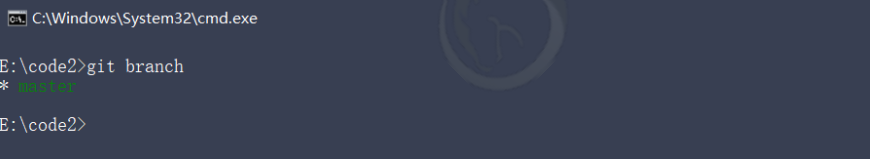

2. 问题 2：查看本地分支的时候*号代表什么？

   分支名字前面的 *号表示当前所处的分支。

3. 问题 3：如何查看所有分支和远程分支？

   - 查看所有分支

     ```bash
     git branch -a
     ```

   - 查看本地分支

     ```bash
     git branch -r
     ```

### 2.5 创建新分支
> 第 2 节课 / 03'51''

#### 2.5.1「创建新分支」问题

1. 问题 1：通过什么命令创建分支？
2. 问题 2：创建分支的时候是基于哪个分支创建的新分支？
3. 问题 3：通过该命令创建分支后，当前会处于哪个分支上？

#### 2.5.2「 创建新分支」答案

1. 问题 1：通过什么命令创建分支？

   ```
   git branch 新分支名
   ```

   图示：

   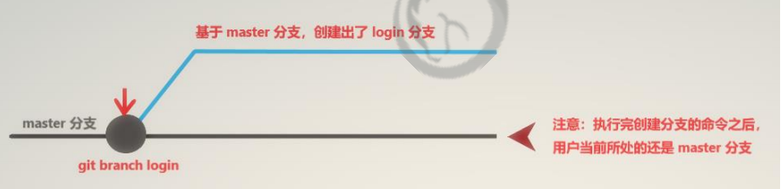

2. 问题 2：创建分支的时候是基于哪个分支，创建的新分支？

   基于当前所在分支创建新分支

3. 问题 3：通过该命令创建分支后，当前会处于哪个分支上？

   还是处于原来分分支上，并不会切换到新分支上


#### 2.5.3「创建新分支」练习

> 练习时长：3分钟

1. 练习目标：能够利用`git branch 新分支名` 创建新的分支

2. 素材：无

3. 参考步骤：

   1. 准备工作

      1. 打开之前建好的项目文件夹`project_demo`

      2. 在工作目录中右键选择 `Git Bash here` 打开命令行工具

         > 确保命令行工作目录为Git仓库所在目录

   2. 创建新的login分支

      1. 执行`git branch` 查看本地分支及所在分支
   
      2. 执行`git branch login` 基于master分支创建一个login分支
   
      3. 再次执行`git branch` 查看本地分支及所在分支

### ☆2.6 切换分支

> 第 2 节课 / 02'44''

#### 2.6.1「切换分支」问题

1. 问题 1：通过什么命令切换分支？

#### 2.6.2「 切换分支」答案

1. 问题 1：通过什么命令切换分支？

   使用如下的命令，可以**切换到指定的分支上**进行开发：

   ```shell
   git checkout 要切换到的分支名
   ```

   图示：

   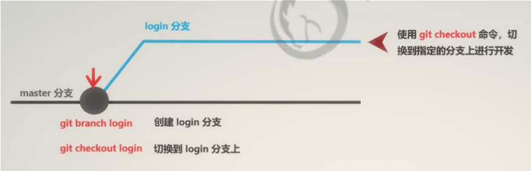

### ☆2.7 快速创建和切换分支
> 第 2 节课 / 04'23''

#### 2.7.1「快速创建和切换分支」问题

1. 问题 1：通过什么命令快速创建新分支并同时切换到新分支上？
2. 问题 1：这个命令和之前我们学的哪两条命令合在一起的效果一样？

#### 2.7.2「 快速创建和切换分支」答案

1. 问题 1：通过什么命令快速创建新分支并同时切换到新分支上？

   ```shell
   # -b 表示创建一个新分支
   git checkout -b 新分支名
   ```

   图示：

   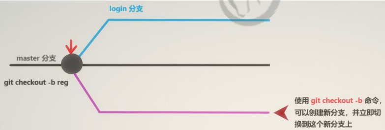

2. 问题 1：这个命令和之前我们学的哪两条命令合在一起的效果一样？

   ```shell
   git branch 新分支名称
   git checkout 新分支名称
   ```

#### 2.7.3「快速创建和切换分支」练习

> 练习时长：3分钟

1. 练习目标：能够利用`git checkout -b 新分支名` 快速创建和切换到新的分支

2. 素材：无

3. 参考步骤：

   1. 准备工作

      1. 打开之前建好的项目文件夹`project_demo`

      2. 在工作目录中右键选择 `Git Bash here` 打开命令行工具

         > 确保命令行工作目录为Git仓库所在目录

      3. 检查当前所处分支是不是master分支，如果不是在master分支上，则先切换到master分支上

   2. 快速创建和切换到reg分支

      1. 执行`git branch` 查看本地分支及所在分支

      2. 执行`git checkout -b reg` 基于master创建reg分支，并切换到reg分支上

      3. 再次执行`git branch` 查看本地分支及所在分支

### ☆2.8 合并分支

> 第 2 节课 / 07'55''

#### 2.8.1「合并分支」问题

1. 问题 1：什么场景下需要合并分支？
2. 问题 2：如何把b分支合并到a分支上？

#### 2.8.2「 合并分支」答案

1. 问题 1：什么场景下需要合并分支？

   功能分支的代码开发测试完毕之后，可以把功能分支的代码合并到主分支上。

2. 问题 2：如何把b分支合并到a分支上？

   1. 先切换到a分支上

      ```bash
      git chekout a
      ```

   2. 站在a分支上，把b分支合并过来

      ```shell
      git merge b
      ```

#### 2.8.3「合并分支」练习

> 练习时长：6分钟

1. 练习目标：能够利用`git merge 分支名` 合并分支代码

2. 素材：无

3. 参考步骤：

   1. 准备工作

      1. 打开之前建好的项目文件夹`project_demo`

      2. 在工作目录中右键选择 `Git Bash here` 打开命令行工具

         > 确保命令行工作目录为Git仓库所在目录

      3. 检查当前所处分支是不是master分支，如果不是在master分支上，则先切换到master分支上

   2. 创建`index` 分支，开发首页功能

      1. 基于当前所在master分支创建`index`分支并切换到`index`分支上

      2. 在项目文件夹下新建文件 `index.txt`, 并修改内容为

         > 代表完成了首页的开发工作

         ```
         This is index
         ```

      3. 把完成的修改，添加暂存，并提交到仓库，开发工作完成。

      4. 观察项目文件夹下的文件，是有刚刚自己创建的`index.txt`的文件的

   3. 把`index` 分支上的代码合并到`master`分支上

      1. 通过`git checkout master` 切换到主分支上
      2. 观察项目文件夹下的文件，发现没有了`index.txt`的文件
      3. 通过 `git merge index` 把`index`分支上的改变合并到`master`分支上
      4. 观察项目文件夹下的文件，发现页有了`index.txt`的文件， 合并分支成功。

### ☆2.9 删除分支

> 第 3 节课 / 02'42''

#### 2.9.1「删除分支」问题

1. 问题 1：什么时候才能删除分支？
2. 问题 2：通过什么命令删除分支？
3. 问题 3：能删除当前所处分支吗？

#### 2.9.2「 删除分支」答案

1. 问题 1：什么时候才能删除分支？

   当在功能分支完成开发，并被合并到主分支上之后，功能分支就没用了，这时候可以被删除。

2. 问题 2：通过什么命令删除分支？

   ```shell
   git branch -d 要删除的分支名
   ```

3. 问题 3：能删除当前所处分支吗？

   不能删除当前所处分支（不能站在房子里把房子拆了，要不然会把自己砸死）

### ☆2.10 遇到冲突时的分支合并
> 第 3 节课 / 09'17''

#### 2.10.1「遇到冲突时的分支合并」问题

1. 问题 1：什么时候会产生冲突？

2. 问题 2：把b分支的合并到a分支时，产生冲突，

   ​               根据提示，打开冲突文件内容如下

   ```js
   <<<<<<< HEAD
   片段1
   =======
   片段2
   >>>>>>>
   ```

   尝试说出片段1和片段2分别有什么含义？

3. 问题 3：如何解决冲突？

#### 2.10.2「遇到冲突时的分支合并」答案

1. 问题 1：什么时候会产生冲突？

   如果在两个不同的分支中，对同一个文件进行了不同的修改，Git 可能没法干净的合并它们，这时候就会产生冲突。

2. 问题 2：把b分支的合并到a分支时，产生冲突，

   ​               根据提示，打开冲突文件内容如下
   
3. ```js
   <<<<<<< HEAD
   片段1
   =======
   片段2
   >>>>>>>
   ```

   尝试说说片段1和片段2分别有什么含义？

   - 片段1是自己写的代码，即a分支上的代码

   - 片段2是别人写的代码，即b分支上的代码

4. 问题 3：如何解决冲突？

   1. 根据git的提示，找到产生冲突的文件。
   2. 编辑该文件, 删除git生成的多余提示符号, 并根据具体业务需求修改好代码。
   3. 添加暂存和提交仓库，冲突解决。

#### 2.10.3「遇到冲突时的分支合并」练习

> 练习时长：8分钟

1. 练习目标：能够知道何种情况会产生冲突及如何解决冲突

2. 素材：无

3. 参考步骤：

   1. 准备工作

      1. 打开之前建好的项目文件夹`project_demo`

      2. 在工作目录中右键选择 `Git Bash here` 打开命令行工具

         > 确保命令行工作目录为Git仓库所在目录

      3. 检查当前所处分支是不是master分支，如果不是在master分支上，则先切换到master分支上

   2. 产生冲突

      > 在master分支和dev分支下修改了同一个文件，合并的时候就会产生冲突

      1. 在项目文件夹下新建`hello.txt`, 内容为

         > 当前在master分支下

         ```
         aaa
         ```

      2. 把修改添加暂存，并提交到仓库。

      3. 基于master分支，创建`dev`分支, 并切换到dev分支上

      4. 在项目文件夹下修改`hello.txt`的内容为

         > 当前在dev分支下

         ```
         aaa
         bbb
         ```

      5. 把修改添加暂存，并提交到仓库。

      6. 切换到master分支，先不合并，发现`hello.txt` 内容为

         ```
         aaa
         ```

         修改为

         ```
         aaa
         ccc
         ```

      7. 把修改添加暂存，并提交到仓库。

      8. 执行命令`git merge dev` 把`dev`分支合并到`master`分支上，会发现如下提示信息

         “hello.txt 自动合并失败” , 这里就产生了一个冲突

         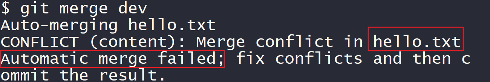

   3. 解决冲突

      1. 根据之前的提示，打开`hello.txt` 文件，发现内容如下

         ```
         aaa
         <<<<<<< HEAD
         ccc
         =======
         bbb
         >>>>>>> dev
         ```

      2. 删除Git自动生成的多余的提示符号，并根据业务调整代码如下

         ```
         aaa
         bbb
         ccc
         ```

      3. 添加暂存，并提交到仓库，在master分支上解决了冲突

      4. 切换到dev分支上，把master分支合并到dev分支上，冲突完全解决

### ☆2.11 将本地分支推送到远程分支
> 第 3 节课 / 05'00''

#### 2.11.1「将本地分支推送到远程分支」问题

1. 问题 1：说说以下命令有何含义及用途？

   ```shell
   git push -u origin a:b
   ```

2. 问题 2：如下命令可以怎样简化？

   ```bash
   git push -u origin a:a
   ```

3. 问题 3：第一次推送完之后，之后再需要将本地分支推送到远程仓库，需要执行的命令是？

#### 2.11.2「将本地分支推送到远程分支」答案

1. 问题 1：说说以下命令有何含义及用途？

   ```shell
   git push -u origin a:b
   ```

   将本地的分支a推送到远程仓库origin的分支b上，如果没有远程分支b，则会基于本地分支a创建新的远程分支b。

2. 问题 2：如下命令可以怎样简化？

   ```bash
   git push -u origin a:a
   ```

   由于本地分支和期望关联的远程分支名字都是a,因此可以简化成

   ```shell
   git push -u origin a
   ```

3. 问题 3：第一次推送完之后，之后再需要将本地分支推送到远程仓库，需要执行的命令是？

   ```shell
   git push
   ```

#### 2.11.3「将本地分支推送到远程分支」练习

> 练习时长：4分钟

1. 练习目标：能够使用`git push` 将本地分支推送到远程分支

2. 素材：无

3. 参考步骤：

   1. 准备工作

      1. 打开之前建好的项目文件夹`project_demo`

      2. 在工作目录中右键选择 `Git Bash here` 打开命令行工具

         > 确保命令行工作目录为Git仓库所在目录

   2. 首次推送dev分支

      1. 执行命令`git push -u origin dev` 把本地的dev分支推送到远程仓库上，建立同名的远程的dev分支
      2. 通过网页查看远程仓库时是不是多了一个dev的远程分支

   3. 修改内容

      1. 检查当前所处分支是不是dev分支，如果不是在dev分支上，则先切换到dev分支上

      2. 修改项目目录下的`hello.txt` 内容为

         ```
         aaa
         bbb
         ccc
         ddd
         ```

      3. 将修改添加暂存，并提交到仓库

   4. 再次推送dev分支

      1. 通过网页查看远程仓库下dev分支中`hello.txt` 文件的内容， 应该为

         ```
         aaa
         bbb
         ccc
         ```

      2. 执行命令`git push` 推送最新的代码到远程仓库

      3. 通过网页查看最新远程仓库下dev分支中`hello.txt` 文件的内容， 应该为

         ```
         aaa
         bbb
         ccc
         ddd
         ```

         本地仓库的dev分支和远程仓库的dev分支同步了。

### 2.12 查看远程分支列表

> 第 4 节课 / 01'30''

#### 2.12.1「查看远程分支列表」问题

1. 问题 1：查看远程分支的命令是？
2. 问题 2：之前我们还学过什么命令可以查看远程分支？
3. 问题 3：尝试对比两个查看远程分支的命令，看看有何不同？

#### 2.12.2「查看远程分支列表」答案

1. 问题 1：查看远程分支的命令是？

   ```shell
   git remote show origin
   ```

2. 问题 2：之前我们还学过什么命令可以查看远程分支？

   ```shell
   git branch -r
   ```

3. 问题 3：尝试对比两个查看远程分支的命令，看看有何不同？

   - `git branch -r `   展示信息更简洁
   - `git remote show origin  `  展示的内容更丰富

### ☆2.13 跟踪分支
> 第 4 节课 / 06'21''

#### 2.13.1「跟踪分支」问题

1. 问题 1：什么是跟踪分支？
2. 问题 2：远程仓库中有一个a分支，现希望基于远程分支a创建本地分支a，应执行的命令是？
3. 问题 3：远程仓库中有一个a分支，现希望基于远程分支a创建本地分支b，应执行的命令是？

#### 2.13.2「跟踪分支」答案

1. 问题 1：什么是跟踪分支？

   从远程仓库中，把远程分支下载到本地仓库中。

2. 问题 2：远程仓库origin中有一个a分支，现希望基于远程分支a创建本地分支a，应执行的命令是？

   ```shell
   git checkout a
   ```

3. 问题 3：远程仓库origin中有一个a分支，现希望基于远程分支a创建本地分支c，应执行的命令是？

   ```shell
   git checkout -b c origin/a
   ```

### ☆2.14 拉取远程分支的最新代码
> 第 4 节课 / 03'37''

#### 2.14.1「拉取远程分支的最新代码」问题

1. 问题 1：拉取远程分支的最新代码的命令是？
2. 问题 2：比较拉取和推送的命令和作用？

#### 2.14.2「拉取远程分支的最新代码」答案

1. 问题 1：拉取远程分支的最新代码的命令是？

   ```shell
   git pull
   ```

2. 问题 2：比较拉取和推送的命令和作用？

   - 拉取：把远程仓库上的最新代码拉取到本地分支

     ```shell
     git pull
     ```

   - 推送： 将本地分支上的最新代码推送到远程仓库

     ```shell
     git push
     ```

### ☆2.15 删除远程分支
> 第 4 节课 / 05'38''

#### 2.15.1「删除远程分支」问题

1. 问题 1：删除远程仓库orgin上分支a的命令是？

#### 2.15.2「删除远程分支」答案

1. 问题 1：删除远程仓库orgin上分支a的命令是？

   ```shell
   git push orgin --delete a
   ```

## ☆3. Git命令总结
> 第 4 节课 / 02'26''

### 3.1「Git命令总结」问题

> 主要列举必须要记住的命令

1. 问题 1：创建本地仓库有两种方式，直接创建和克隆，命令分别是？
2. 问题 2：git日常工作的全流程是？
3. 问题 3：分支相关的命令有哪些？
4. 问题 4：查看状态的命令是？
5. 问题 5：查看历史记录和跳转指定版本的命令是？

### 3.2「Git命令总结」答案

1. 问题 1：创建本地仓库有两种方式，直接创建和克隆，命令分别是？

   ```shell
   git init
   
   git clone 远程仓库地址
   ```

2. 问题 2：git日常工作的全流程是？
   1. 拉取最新代码

      ```shell
      git pull
      ```

   2. 修改代码文件

   3. 添加暂存

      ```shell
      git add .
      ```

   4. 提交仓库

      ```shell
      git commit -m "注释内容"
      ```

   5. 推送到远程仓库

      ```shell
      git push
      ```

3. 问题 3：分支相关的命令有哪些？
   - 查看分支

     ```shell
     git branch
     ```

   - 创建并切换到新分支

     ```shell
     git checkout -b 新分支名
     ```

   - 切换分支

     ```shell
     git checkout 分支名
     ```

   - 合并分支

     ```shell
     git merge 被合并的分支
     ```

4. 问题 4：查看状态的命令是？

   ```shell
   git status
   ```

5. 问题 5：查看历史记录和跳转指定版本的命令是？
   - 查看过去历史

     ```shell
     git log
     ```

   - 查看所有历史

     ```shell
     git reflog
     ```

   - 跳转指定版本

     ```shell
     git reset --hard 版本id
     ```

## 4. 大事件准备工作

### 4.1 项目介绍	0:06:35

> 第 4 节课 / 06'35''

#### 4.1.1「项目介绍」问题

1. 问题 1：项目的主要功能模块和功能有哪些？

#### 4.1.2「项目介绍」答案

1. 问题 1：项目的主要功能有哪些？
   - 注册
   - 登录
   - 后台主页
   - 个人信息编辑
   - 密码修改
   - 文章类别的管理（增删改查）
   - 文章管理

### 4.2 初始化项目结构

> 第 4 节课 / 03'06''

#### 4.2.1 初始化项目结构步骤

1. 新建项目文件夹code
2. 将 素材目录下的 assets 和 home 文件夹，拷贝到 code目录下
   - assets > css 文件夹 自己编写的`css`代码
   - assets > fonts 字体图标文件夹
   - assets > images 存放图标文件夹
   - assets > js 自己js代码的文件夹
   - assets > lib第三方依赖的文件夹
   - home > dashboard.html后台首页的页面效果
3. 在 code目录下新建 login.html和 index.html 页面

### ☆4.3 使用GitHub管理大事件的项目

> 第 5 节课 / 03'22''

#### 4.3.1 使用GitHub管理大事件的项目步骤

1. 创建文件夹code作为项目文件夹，来管理所有代码
2. 在 code 目录中运行 `git init` 命令，初始化仓库
3. 在 code目录中运行 `git add .` 命令，追踪要托管的文件
4. 在 code 目录下运行 `git commit -m "init project"` 命令，提交到本地仓库
5. 新建 Github仓库 `web_bigevent`
   - 登录Github官网
   - 点击左上角的 new 创建仓库，填写 `Repository name`，描述说明，点击 `Private` 选项，然后点击  `create repository`
6. 将本地仓库和Github仓库建立关联关系
7. 将本地仓库的代码推送到Github仓库中
8. 运行 `git checkout -b login` 命令，创建并切换到 login分支

#### 4.3.2 「使用GitHub管理大事件的项目步骤」练习

> 练习时长：7分钟

1. 练习目标：能够使用GitHub管理大事件的项目
2. 素材：无
3. 参考步骤：
   1. 参考 4.2.1 初始化项目结构
   2. 参考 4.3.1 使用GitHub管理项目

### 4.4 安装VSCode的Live Server插件辅助开发

> 第 5 节课 / 02'39''

#### 4.4.1「安装VSCode的Live Server插件辅助开发」问题

1. 问题 1：为什么要使用Live Server插件？
2. 问题 2：使用Live Server插件的步骤？

#### 4.4.2「安装VSCode的Live Server插件辅助开发」答案

1. 问题 1：为什么要使用Live Server插件？

   - 在修改完代码后，Live Server能够自动识别到代码的改动，并刷新网页，提高了开发效率

2. 问题 2：使用Live Server插件的步骤？

   1. 安装Live Server插件

   2. 找一个html文件

   3. 在空白出右键然后选择`open with Live Server`

      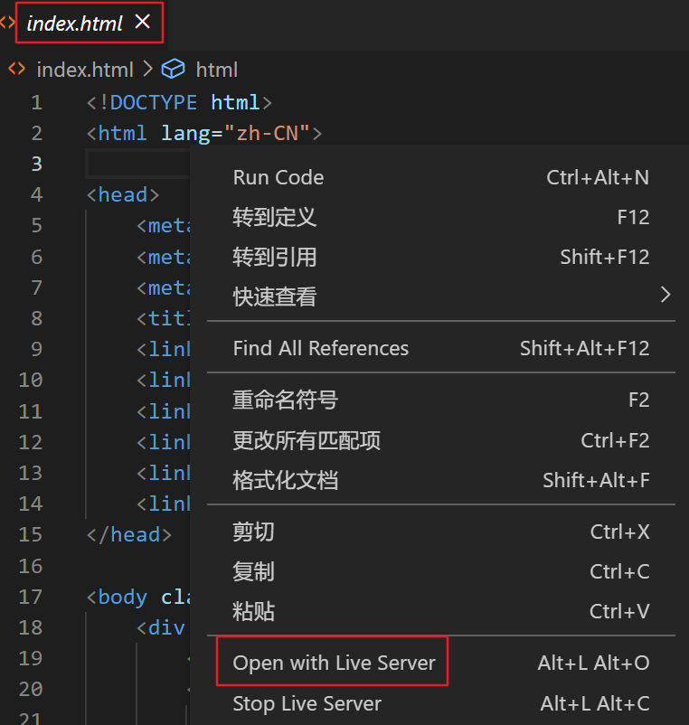


## 5. 登录注册

### 5. 1 绘制login页面的基本结构

> 第 5 节课 / 12'49''

#### 5. 1.1 「绘制login页面的基本结构」步骤

1. 引入 layui 的`css`文件  `layui.css`，先引入第三方的，再引入自己的`css`
2. 分为上下结构，上面头部的 `Logo` 区域
3. 下面是 登录注册区域
4. 修改一下对应样式，给body添加背景，给登录注册区域设置宽高，剧中显示，给里面title设置背景图片

**结构示例代码**

```html
<!DOCTYPE html>
<html lang="en">
  <head>
    <meta charset="UTF-8" />
    <meta name="viewport" content="width=device-width, initial-scale=1.0" />
    <title>大事件-登录/注册</title>
    <!-- 导入 LayUI 的样式 -->
    <link rel="stylesheet" href="/assets/lib/layui/css/layui.css" />
    <!-- 导入自己的样式表 -->
    <link rel="stylesheet" href="/assets/css/login.css" />
  </head>
  <body>
    <!-- 头部的 Logo 区域 -->
    <div class="layui-main">
      
    </div>

    <!-- 登录注册区域 -->
    <div class="loginAndRegBox">
      <div class="title-box"></div>
    </div>
  </body>
</html>
```

**`css`示例代码**

```css
html,
body {
  margin: 0;
  padding: 0;
  height: 100%;
  width: 100%;
  background: url('/assets/images/login_bg.jpg') no-repeat center;
  background-size: cover;
}

.loginAndRegBox {
  width: 400px;
  height: 310px;
  background-color: #fff;
  position: absolute;
  left: 50%;
  top: 50%;
  transform: translate(-50%, -50%);
}

.title-box {
  height: 60px;
  background: url('/assets/images/login_title.png') no-repeat center;
}
```

### ☆5. 2 实现登录和注册的按需切换

> 第 5 节课 / 07'56''

#### 5.2.1 「实现登录和注册的按需切换」核心逻辑

- 登录的div盒子里装载“去注册”的链接
- 注册的div盒子里装载了“去登录”的链接
- 默认展示的是登录的div盒子，默认隐藏注册的div盒子
- **点击“去注册”展示注册的div盒子，隐藏录的div盒子**
- **点击“去登录”展示登录的div盒子，隐藏注册的div盒子**

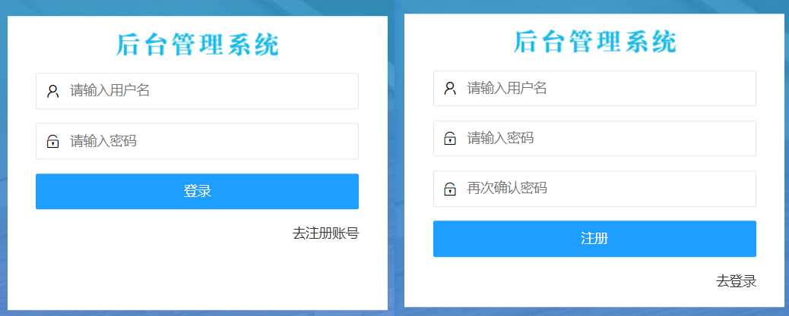

#### 5.2.2 「实现登录和注册的按需切换」步骤

1. 在登录注册区域里面（`loginAndRegBox`）定义两个div
2. 显然注册的div进行隐藏
3. 给两个div绑定点击事件，点击了对应按钮，让对应的div进行显示，另外一个进行隐藏

**结构示例代码**

```html
<!-- 登录注册区域 -->
<div class="loginAndRegBox">
      <div class="title-box"></div>
      <!-- 登录的div -->
      <div class="login-box"></div>
      <!-- 注册的div -->
      <div class="reg-box"></div>
</div>
```

**`css`示例代码**

```css
.reg-box {
  display: none;
}
```

**`js`示例代码**

```javascript
$(function() {
  // 点击“去注册账号”的链接
  $('#link_reg').on('click', function() {
    $('.login-box').hide()
    $('.reg-box').show()
  })

  // 点击“去登录”的链接
  $('#link_login').on('click', function() {
    $('.login-box').show()
    $('.reg-box').hide()
  })
})
```

### 5.3 绘制登录表单的基本结构

> 第 6 节课 / 09'56''

#### 5.3.1 「绘绘制登录表单的基本结构」步骤

- 找到 `layui` 文档的 `页面元素 -> 表单` 这一分类


- 拷贝 里面内容，不需要全部拷贝过来，我们拷贝第一行的输入框即可，注意：外面`form`表单域需要带上
- 删除里面的 `label` 提示内容，然后把`lable` 的父元素 `div` 进行删除，不然前面`label`删除了还有空隙在左侧
- 拷贝过来对应的 `button` 按钮，然后设置样式，让宽度填充整个父元素

**结构示例代码**

```html
  <!-- 登录的div -->
  <div class="login-box">
    <!-- 登录的表单 -->
    <form class="layui-form" action="">
      <!-- 用户名 -->
      <div class="layui-form-item">
        <i class="layui-icon layui-icon-username"></i>
        <input type="text" name="username" required lay-verify="required" placeholder="请输入用户名" autocomplete="off" class="layui-input" />
      </div>
      <!-- 密码 -->
      <div class="layui-form-item">
        <i class="layui-icon layui-icon-password"></i>
        <input type="password" name="password" required lay-verify="required" placeholder="请输入密码" autocomplete="off" class="layui-input" />
      </div>
      <!-- 登录按钮 -->
      <div class="layui-form-item">
        <!-- 注意：表单提交按钮和普通按钮的区别，就是 lay-submit 属性 -->
        <button class="layui-btn layui-btn-fluid layui-btn-normal" lay-submit>登录</button>
      </div>
      <div class="layui-form-item links">
        <a href="javascript:;" id="link_reg">去注册账号</a>
      </div>
    </form>
  </div>
```

### 5.4 美化登录表单的样式

> 第 6 节课 / 03'59''

#### 5.4.1 「美化登录表单的样式」步骤

1. 修改输入框的name和placeholder等属性
2. 通过css代码适当调整样式

**`css` 示例代码**

- 给 表单域设置内边距，左右留一点缝隙
- 给下面的 links 设置 flex 布局，让里面 a标签 居右边显示
- 修改 a 标签文字大小

```css
.layui-form {
  padding: 0 30px;
}

.links {
  display: flex;
  justify-content: flex-end;
}

.links a {
  font-size: 12px;
}
```

### 5.5 绘制文本框前面的小图标

> 第 6 节课 / 05'42''

#### 5.5.1 「绘制文本框前面的小图标」步骤

- 在 `layui` 中给我们提供了一些图标，我们直接使用即可

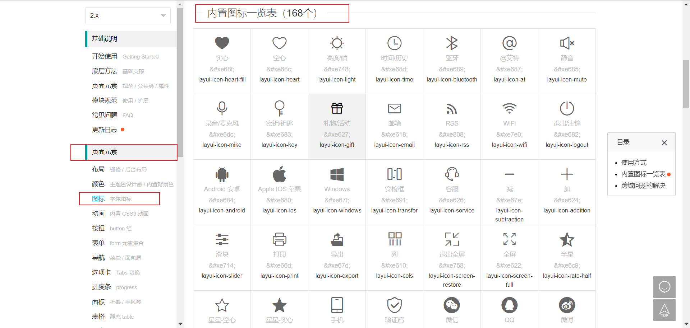

- 在用户名的文本框之前，添加如下的标签结构

```html
<i class="layui-icon layui-icon-username"></i>
```

- 在密码框之前，添加如下的标签结构

```html
<i class="layui-icon layui-icon-password"></i>
```

- 修改一下对应样式

```css
.layui-form-item {
  position: relative;
}

.layui-icon {
  position: absolute;
  left: 10px;
  top: 10px;
}

.layui-input {
  padding-left: 32px;
}
```

### 5.6 快速绘制注册的表单单

> 第 6 节课 / 03'21''

#### 5.6.1 「快速绘制注册的表单」步骤

- 注册表单与登录是差不多的，多了一个 输入框，我们把之前登录的结构直接拷贝过来
- 修改一下里面对应内容

**结构示例代码**

```html
  <!-- 注册的div -->
  <div class="reg-box">
    <!-- 注册的表单 -->
    <form class="layui-form" action="">
      <!-- 用户名 -->
      <div class="layui-form-item">
        <i class="layui-icon layui-icon-username"></i>
        <input type="text" name="username" required lay-verify="required" placeholder="请输入用户名" autocomplete="off" class="layui-input" />
      </div>
      <!-- 密码 -->
      <div class="layui-form-item">
        <i class="layui-icon layui-icon-password"></i>
        <input type="password" name="password" required lay-verify="required" placeholder="请输入密码" autocomplete="off" class="layui-input" />
      </div>
      <!-- 密码确认框 -->
      <div class="layui-form-item">
        <i class="layui-icon layui-icon-password"></i>
        <input type="password" name="repassword" required lay-verify="required" placeholder="再次确认密码" autocomplete="off" class="layui-input" />
      </div>
      <!-- 注册按钮 -->
      <div class="layui-form-item">
        <!-- 注意：表单提交按钮和普通按钮的区别，就是 lay-submit 属性 -->
        <button class="layui-btn layui-btn-fluid layui-btn-normal" lay-submit>注册</button>
      </div>
      <div class="layui-form-item links">
        <a href="javascript:;" id="link_login">去登录</a>
      </div>
    </form>
  </div>
```

## 6. 作业

[Git实操二道题](./day02-afterclass.md)

